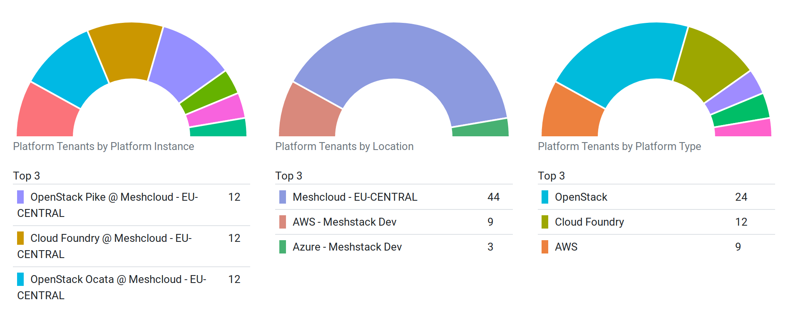
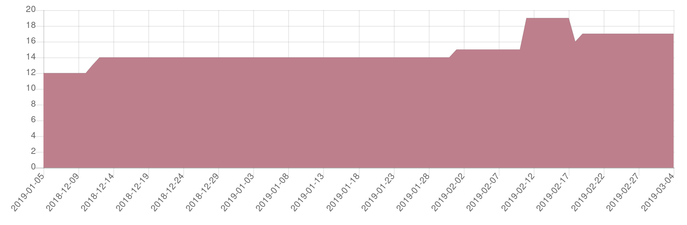
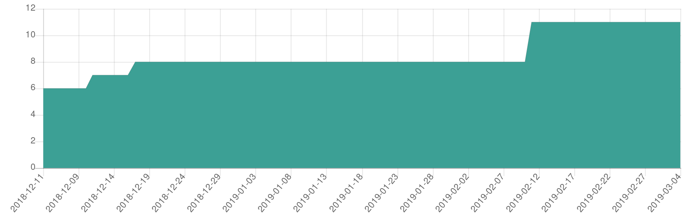
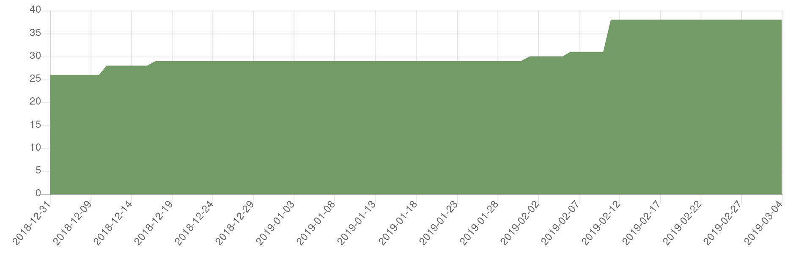

Administrators can access performance analytics to get an overview of platform usage, users and meshProjects.

**Platform tenants**
: These charts show the current number of platform tenants per *meshPlatform*, *location* and *platform type*. Platform tenants are platform specific representations of [meshProjects](meshcloud.project.md#manage-meshprojects). Hover your mouse over segments to see specific numbers.

**Active meshProjects**
: This graph shows the number of active [projects](meshcloud.project.md) over the last 90 days. Projects are considered active until they are queued for deletion.

**Active meshWorkspaces**
:  This graph shows the number of [managed workspaces](meshcloud.workspace.md) over the last 90 days.

**Users**
:  This graph shows the number of users over the last 90 days.

