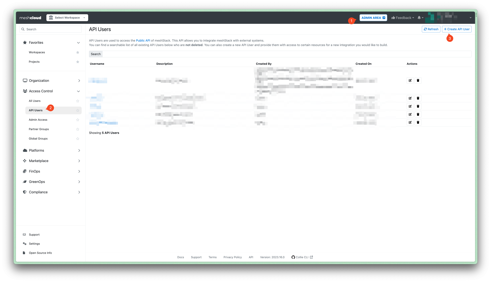

API Users can consume several APIs provided by meshStack. You can provide your API Users with access to certain resources for a new integration.

> Only users with the role [Organization Admin](administration.index.md) have access to the administrative functionality described in this section.

## API Key Limits

Default Quota: Can be configured in the settings in the admin area and is applied to all workspaces
Workspace Quota: Can be configured per workspace in the admin area

## Create API Users

1. Navigate to the **Administration** Area.
2. Click on **API Users** under **Access Control**.
3. Click on `+ Create API User` in the top right corner.
4. Fill in the form. Pick a username for API User and decide which resources you want to grant access by selecting the permissions. You can also provide a description. Keep in mind that a username cannot be changed afterwards.
5. Click on `Save`.

## Update API Users

1. Navigate to the **Administration** Area.
2. Click on **API Users** under **Access Control**.
3. Click on the pencil icon in the 'Actions' column of the API Users you want to update.
4. Update your description or the permissions, you want to grant that API User.
5. Click on `Save`.

## Delete API Users

1. Navigate to the **Administration** Area.
2. Click on **API Users** under **Access Control**.
3. Click on the trash icon in the 'Actions' column of the API Users you want to delete. A prompt will appear.
4. Confirm the deletion by entering the username in the input field of the prompt. After the deletion of your API User is finalized your list of active API Users will be updated.
