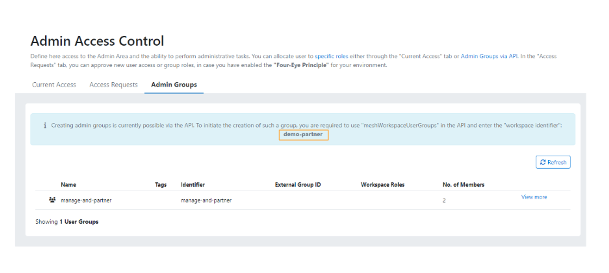

Partners Users have access to the so called **Administration Area**. The administration area enables partner users to manage their child [meshWorkspace](./meshcloud.workspace.md) accounts within the meshcloud platform.
Assigning Partner Users can only be done by Partner Admins.

Different groups of people may need access to the different administration area functionality. Therefore, the following administrative roles are currently
available to users of the administration area:

- **Partner Admin**: It's basically the account with administration rights. Has full access to all functionality and can manage users of the
  administrator/partner account.
- **Partner Employee**: Has full access to all administration functionality, but **cannot** manage policies, tag definitions or users of the administrator/partner account.
- **Platform Operator**: An operator of a cloud platform, that is managed by the meshcloud platform. This role can perform tasks related to
  platform operations in the administration area.
- **Ops Support**: Not all Ops operations must be executed by Platform Operators. E.g. setting quotas is a task that can also be done by
  a separate Ops Support team.
- **Controller**: A Controller has access to billing and usage information of workspace projects.
- **Onboarding Support**: A support team in place to help users who want to sign up may also need access to some administration
  functionality which is granted by this role.
- **Compliance Manager**: Has the rights to manage policies and tag definitions.
- **Replication Operator**: A supportive role that can assist by viewing tenants' replication status.
  This role is helpful for meshcloud employees to debug any potential issues with tenant replication.

See the [meshWorkspace](meshcloud.workspace.md) documentation for details about how you can manage the roles of your users. This set of roles is easily extendable by adding roles to reflect individual access requirements of your organization.

The following table provides details about the functionality available to the different roles by default. The Access rights can also be adapted individually
per meshcloud installation.

|                                                                                                                     | Partner Admin        | Partner Employee     | Platform Operator | Ops Support | Controller | Onboarding Support | Compliance Manager | Replication Operator |
|---------------------------------------------------------------------------------------------------------------------| :------------------: | :------------------: | :---------------: |:-----------:| :--------: | :----------------: | :----------------: | :------------------: |
| [Workspace&nbsp;List](administration.workspaces.md)                                                                 |       &#10003;       |       &#10003;       |     &#10003;      |  &#10003;   |  &#10003;  |      &#10003;      |      &#10003;      |         &#10003;     |
| &nbsp;&nbsp;Payment&nbsp;Methods&nbsp;List                                                                          |       &#10003;       |       &#10003;       |                   |             |  &#10003;  |                    |                    |                      |
| &nbsp;&nbsp;Manage&nbsp;Payment&nbsp;Methods                                                                        |       &#10003;       |       &#10003;       |                   |             |  &#10003;  |                    |                    |                      |
| &nbsp;&nbsp;[Project&nbsp;List](administration.projects.md)                                                         |       &#10003;       |       &#10003;       |     &#10003;      |  &#10003;   |  &#10003;  |      &#10003;      |      &#10003;      |         &#10003;     |
| &nbsp;&nbsp;&nbsp;&nbsp;[Manage&nbsp;Quota](administration.projects.md#set-project-quotas)                          |       &#10003;       |       &#10003;       |     &#10003;      |  &#10003;   |            |                    |                    |                      |
| &nbsp;&nbsp;&nbsp;&nbsp;Edit&nbsp;project&nbsp;tags                                                                 |       &#10003;       |       &#10003;       |     &#10003;      |             |  &#10003;  |                    |      &#10003;      |                      |
| &nbsp;&nbsp;&nbsp;&nbsp;[History](administration.projects.md#project-history)                                       |       &#10003;       |       &#10003;       |     &#10003;      |  &#10003;   |            |      &#10003;      |      &#10003;      |         &#10003;     |
| &nbsp;&nbsp;[List&nbsp;Workspace&nbsp;Users](administration.workspaces.md#access-managed-workspace-accounts)        |       &#10003;       |       &#10003;       |                   |             |            |                    |                    |                      |
| &nbsp;&nbsp;&nbsp;&nbsp;[Add&nbsp;yourself](administration.workspaces.md#access-managed-workspace-accounts)         |       &#10003;       |       &#10003;       |                   |             |            |                    |                    |                      |
| &nbsp;&nbsp;&nbsp;&nbsp;[Send&nbsp;message](administration.workspaces.md#send-messages-to-workspace-users)          |       &#10003;       |       &#10003;       |                   |             |            |                    |                    |                      |
| &nbsp;&nbsp;&nbsp;&nbsp;Pending&nbsp;role&nbsp;requests                                                             |       &#10003;       |       &#10003;       |                   |  &#10003;   |            |      &#10003;      |                    |                      |
| &nbsp;&nbsp;[Project&nbsp;Export](administration.projects.md#project-export)                                        |       &#10003;       |       &#10003;       |                   |             |  &#10003;  |                    |                    |                      |
| &nbsp;&nbsp;[Quota&nbsp;Export](administration.projects.md#quota-export)                                            |       &#10003;       |       &#10003;       |     &#10003;      |             |  &#10003;  |                    |                    |                      |
| Compliance                                                                                                          |       &#10003;       |       &#10003;       |                   |             |            |                    |      &#10003;      |                      |
| &nbsp;&nbsp; List [policies](administration.policies.md)                                                            |       &#10003;       |       &#10003;       |                   |             |            |                    |      &#10003;      |                      |
| &nbsp;&nbsp; Manage [policies](administration.policies.md)                                                          |       &#10003;       |                      |                   |             |            |                    |      &#10003;      |                      |
| &nbsp;&nbsp; List [Tags](meshstack.metadata-tags.md)                                                                |       &#10003;       |       &#10003;       |                   |             |            |                    |      &#10003;      |                      |
| &nbsp;&nbsp; Manage [Tags](meshstack.metadata-tags.md)                                                              |       &#10003;       |                      |                   |             |            |                    |      &#10003;      |                      |
| Project Management                                                                                                  |       &#10003;       |       &#10003;       |     &#10003;      |  &#10003;   |            |      &#10003;      |                    |                      |
| &nbsp;&nbsp;[Delete&nbsp;Tenants](administration.delete-tenants.md#delete-tenants)                                  |       &#10003;       |       &#10003;       |     &#10003;      |  &#10003;   |            |      &#10003;      |                    |                      |
| &nbsp;&nbsp;&nbsp;&nbsp;[History](administration.projects.md#project-history)                                       |       &#10003;       |       &#10003;       |     &#10003;      |  &#10003;   |            |      &#10003;      |                    |                      |
| &nbsp;&nbsp;[Chargeback&nbsp;Statements](meshcloud.project-metering.md#chargeback-statements)                       |       &#10003;       |       &#10003;       |                   |             |  &#10003;  |                    |                    |                      |
| [Platforms](administration.platforms.md)                                                                            |       &#10003;       |       &#10003;       |                   |             |            |                    |                    |                      |
| &nbsp;&nbsp;[Platform&nbsp;Notifications](administration.platforms.md#platform-notifications)                       |       &#10003;       |       &#10003;       |     &#10003;      |             |            |                    |                    |                      |
| &nbsp;&nbsp;[Platform&nbsp;Restrictions](administration.platforms.md#restrict-platform-access)                      |       &#10003;       |       &#10003;       |     &#10003;      |  &#10003;   |            |                    |                    |                      |
| &nbsp;&nbsp;[Landing&nbsp;Zones](administration.landing-zones.md)                                                   |       &#10003;       |       &#10003;       |     &#10003;      |             |            |                    |                    |                      |
| &nbsp;&nbsp;[Usage&nbsp;Reports](meshcloud.project-metering.md#tenant-usage-reports.md)                                |       &#10003;       |       &#10003;       |                   |             |  &#10003;  |                    |                    |                      |
| &nbsp;&nbsp;[Tenants](administration.tenants.md)                                                                    |       &#10003;       |       &#10003;       |     &#10003;      |  &#10003;   |            |                    |                    |         &#10003;     |
| &nbsp;&nbsp;View [Unmanaged Tenants](administration.unmanaged-tenants.md)                                           |       &#10003;       |       &#10003;       |     &#10003;      |             |            |                    |                    |         &#10003;     |
| &nbsp;&nbsp;Assign [Unmanaged Tenants](administration.unmanaged-tenants.md#assigning-unmanaged-tenants)             |       &#10003;       |             |           |             |            |                    |                    |             |
| [User&nbsp;List](administration.users.md)                                                                           |       &#10003;       |       &#10003;       |                   |             |            |                    |                    |                      |
| &nbsp;&nbsp;[Delete&nbsp;User](administration.users.md#delete-user)                                                 |       &#10003;       |       &#10003;       |                   |             |            |                    |                    |                      |
| &nbsp;&nbsp;[Download&nbsp;User&nbsp;Info](administration.users.md#download-user-information)                       |       &#10003;       |       &#10003;       |                   |             |            |                    |                    |                      |
| [API Users](administration.apiusers.md)                                                                             |       &#10003;       |            |                   |             |            |                    |                    |                      |
| [Service&nbsp;Broker](administration.service-brokers.md)                                                            |       &#10003;       |       &#10003;       |                   |             |            |                    |                    |                      |
| &nbsp;&nbsp;[Approve&nbsp;Service&nbsp;Broker](administration.service-brokers.md#approve-service-broker)            |       &#10003;       |       &#10003;       |                   |             |            |                    |                    |                      |
| [List Building&nbsp;Blocks&nbsp;&amp;&nbsp;Definitions](administration.building-blocks.md)                          | &#10003; | &#10003; | &#10003; |  &#10003;   | | | | &#10003; |
| &nbsp;&nbsp;&nbsp;[Manage&nbsp;Building&nbsp;Blocks&nbsp;&amp;&nbsp;Definitions](administration.building-blocks.md) | &#10003; | &#10003; | &#10003; |  &#10003;   | | | | &#10003;|
| &nbsp;&nbsp;&nbsp;[Delete&nbsp;Building&nbsp;Blocks&nbsp;&amp;&nbsp;Definitions](administration.building-blocks.md) | &#10003; | &#10003; | &#10003; |             | | | |                    

Please review [meshWorkspace roles](meshcloud.workspace.md#assign-meshworkspace-roles) for roles available to end-users of your meshStack implementation.

## Admin Groups

To avoid assigning multiple users individually, you can create Admin Groups. These groups can be assigned to roles in the same way as individual users.
You can view Admin Groups within your Administration Area by going to the **Admin Groups** section on the **Admin Access Control** page. Currently, the creation of Admin Groups is only possible via [meshObject API](./meshstack.api.md), namely [meshWorkspaceUserGroups API endpoint](/api/index.html#mesh_workspaceusergroup), and to create one you will need a unique identifier, which you can find in the Admin Group section. In the example provided, the identifier is named "demo-partner," but it is unique to every meshStack.

