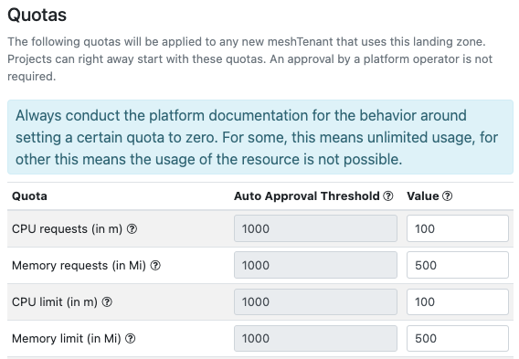

## Configuring Landing Zones

Platform Operators can configure the [Landing Zones](./meshcloud.landing-zones.md) available for each meshPlatform. The capabilities supported by meshcloud differ per platform type as we support "native" tooling provided by the different cloud platforms and vendors.

This ensures enterprises can seamlessly integrate existing operational capabilities and leverage the most powerful
and best-integrated tooling available for each platform. In most instances, this tooling follows an infrastructure-as-code paradigm that fits naturally with meshcloud's multi-cloud orchestration approach.

Please consult the [operator documentation](./meshstack.index.md) of the respective cloud platforms for more details.

## Disabling Landing Zones

Disabled Landing Zones can't be assigned to projects anymore. If the Landing Zone has already been assigned to a project,
this assignment will remain, but customer admins can no longer create new projects using this Landing Zone.

## Configure Landing Zone tags

Platform Operators can configure a custom Landing Zone [meshTag](./meshstack.metadata-tags.md). The schema is available during the Landing Zone creation and update. For each created Landing Zone different tags can be attached. You can tag or modify tags on a landing zone during creation and edit.

## Defining Quotas

Limiting access to private cloud platforms is an important tool to keep control over the load on your platform and providing a fair share of resources to your customers. Therefore private cloud platforms provide quotas to achieve this limitation. Defining these quotas is supported by meshStack per meshLandingZone. This provides maximum flexibility to Platform Operators to define quotas for their customers. meshPlatforms that support quota management will provide an according section when editing landing zones.

> Quotas that can be managed here currently have to be defined by meshcloud. They are defined per meshPlatform. A self-service screen will be available soon.
> Currently Quota Management is only supported for OpenShift platforms. More private cloud platforms will follow.

Quotas defined here will be applied as default quotas to newly created meshTenants. That way you can provide direct access to your customers with a limited scope. If customers require a higher quota, they can create a [Tenant Quota Request](./meshcloud.tenant-quota.md), which has to be [approved](./administration.tenants.md#tenant-quota-requests) by a Platform Operator.
