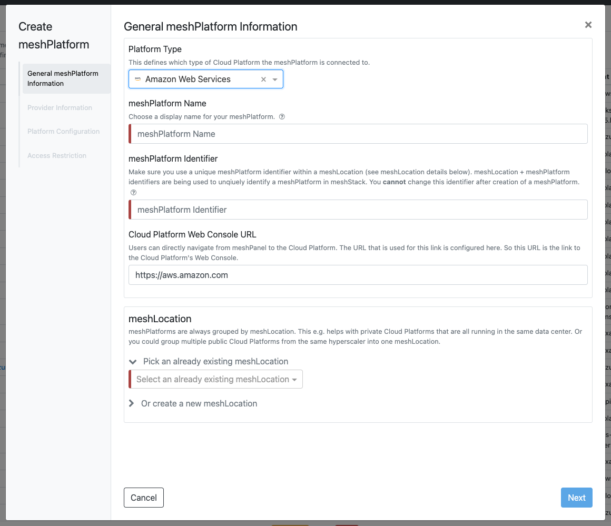
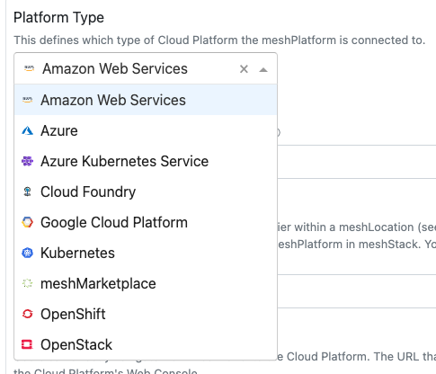
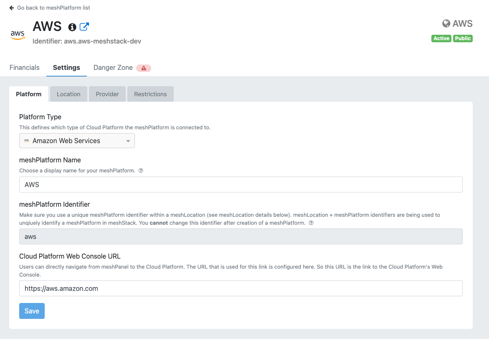
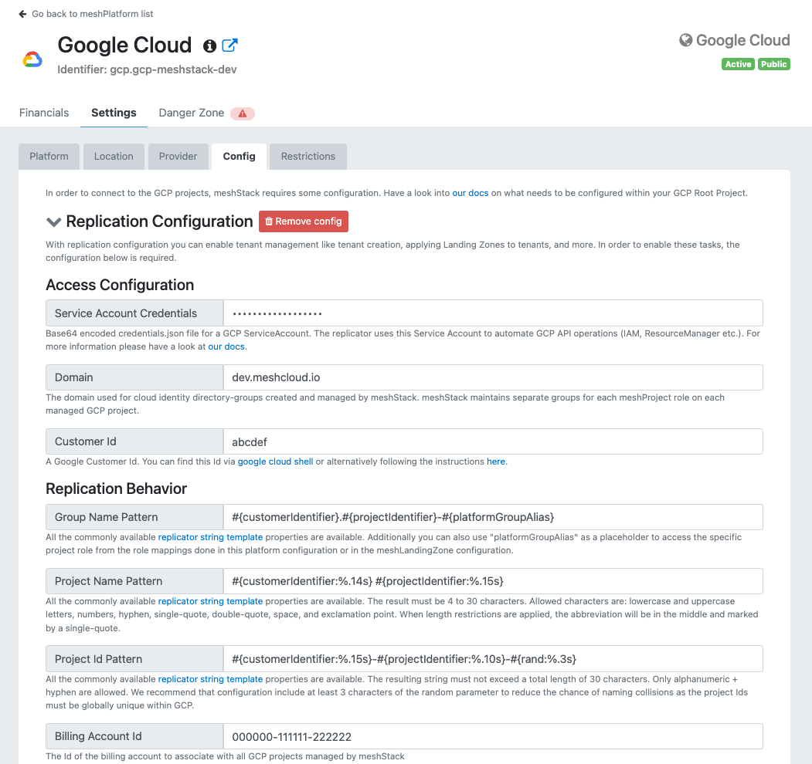
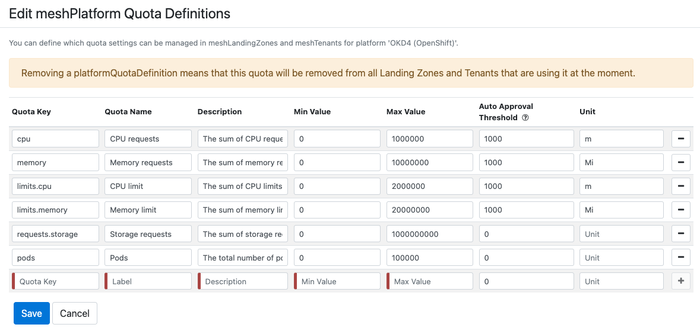

A meshPlatform is the integration of your Cloud Platform with several configurations into meshStack.
It enables the core functionality of meshStack such as tenant creation, replication and metering of your Cloud Platforms.

Besides integrating your cloud platform, the following functionality is also highly useful:

* Manage and create landing zones in the [landing zone administration screen](administration.landing-zones).
* View all your existing cloud tenants in the [tenant list](administration.tenants).

> All platform related maintenance like Landing Zones, Tenants, etc will be moved to the [Platform Control Plane](#platform-control-plane)
> in future.

## Platform Creation

You can integrate new meshPlatforms in self-service via a wizard in meshStack.

The following platform types are available for selection.

You have to assign a [meshLocation](#meshlocation) to your meshPlatform. Details about what a meshLocation is and how to use it can be found [here](#meshlocation).

Additionally you can directly [restrict](#restrict-platform-access) your meshPlatform to certain meshWorkspaces to e.g. first test a new meshPlatform integration
with a private meshWorkspace that only you have access to. Doing this during creation can prevent confusion of other users who may see the meshPlatform shortly if you would [restrict](#restrict-platform-access) it after creation.

You can always change the mutable information given during meshPlatform creation later in the [Settings](#settings) tab of the Platform Control Plane.

## Platform Control Plane

The Platform Control Plane is the central entry point for performing any tasks on your meshPlatform or insights you want to gather on it.

### Financials

In this tab you can get an overview about which kind of resources are being used in your Cloud Platform.

### Settings

This tab is mainly responsible for managing how your meshPlatform is shown and used inside meshStack. You can provide general information
about your Cloud Platform like a display name or the Web Console Url meshStack will link to when the user wants to actually access
the cloud platform. For public cloud platforms you can leave the Web Console Url as is because meshStack already provides the link to their Web Console.

#### meshLocation

The meshLocation is useful for grouping together multiple platforms. This is especially helpful for private cloud platforms that have an actual physical location. You may want to group all Cloud Platforms running in the same datacenter into one meshLocation.
For public cloud platforms, we recommend to name them according to the provider as public cloud platforms are not really tied to a physical location. E.g. name the meshLocation for Azure simply "Azure". This also fits well if you have multiple Azure Tenants for your different stages and want to group them into this "Azure" meshLocation.

Additionally you can provide some provider information of your meshLocation. You can describe how you operate your Cloud Platforms that belong to a meshLocation,
you can provide a link to a Wiki to provide further, more detailed information about your meshPlatforms within a meshLocation.

#### Platform Connection Config

When integrating a cloud platform into meshStack you have to enter some specific configuration so meshStack knows how to handle the platform. This relates to replication as well as metering configuration. A central aspect of it is defining how to connect to your cloud platform. For public cloud platforms you have to provide some kind of root account for all tenants managed by meshStack are living in. This is for example an AWS Root Account, a GCP Billing Account or an Azure Tenant. For private cloud platforms you usually have to provide an endpoint for the API. meshStack will communicate with it to manage tenants. In all cases you have to provide some kind of credentials so meshStack can perform the actions needed for replication and metering. You can find details about how to set up the cloud platform with credentials and more in the platform-specific [How to integrate a meshPlatform into meshStack](meshstack.how-to.integrate-meshplatform) guide.

The following list provides the most common configurations available for different cloud platform types:

* Credentials and connection attributes for replication and metering
* Role Mappings for mapping Project Roles in meshStack to specific roles in the cloud platform
* Naming of platform tenants (e.g. AWS Account or Azure Subscription) via [String Templates](meshstack.replication-configuration#string-templating)
* Naming via [String Templates](meshstack.replication-configuration#string-templating) of platform IAM groups created by meshStack to provide users access to their tenants
* [Tag Configuration](meshstack.metadata-tags#tags-in-cloud-tenants) for platform tenants and resources (e.g. add workspace and project identifier as a tag to the platform tenant)
* platform-specific additional configuration

As an example you can find a part of the GCP configuration in the following image:

#### Restrict Platform Access

Access to a specific meshPlatform can be restricted via the "Restrictions" tab. This feature is helpful
when a new meshPlatform shall be integrated, but initially only be visible to a few meshWorkspaces for integration testing.
Another use-case is having a dedicated Cloud Platform that shall only be available to certain meshWorkspaces in general.

To restrict the meshPlatform, search for the workspaces the platform shall be restricted to and add these workspaces via the *+* button.

#### Manage Quota Definitions

In order to provide quotas to meshTenants, the available quotas have to be defined first. A `Quota Key` that must match the quota key in the platform, can be defined. Additionally a speaking name for the Quota that is shown in meshPanel as well as a description and a unit can be defined. Min and Max values can also be set to restrict the quotas to a certain maximum or minimum. An [Auto Approval Threshold](meshcloud.tenant-quota#auto-approval-of-tenant-quota-requests) can also be defined. It can be set to 0, if no auto-approval of quota requests shall be applied.

**Removing Quotas**
If you want to remove quotas from a platform just click the "-" button on the right side of the table. If removed in the Platform Quota Definition, quotas will be removed from the Landing Zones and tenants belonging to the platform as well. The removal of quotas from the meshTenants will happen during next replication.

> Currently only OpenShift is supported for Quota Management

### Deprecate Platform

**Deprecation** will prevent the meshPlatform from being selected for new meshTenants. Existing meshTenants of this meshPlatform will still be replicated and can still be accessed via the meshPanel. Your users can recognize a meshTenant of a deprecated meshPlatform by a yellow bubble on the platform icon in the "Projects Overview" on the workspace control plane. If your users are on the tenant control plane, a yellow status label will appear in the header of the control plane. You can also **undo the deprecation**. This allows your users to select the meshPlatform for new meshTenants again.

1. Navigate to **Platforms** > **meshPlatforms**.
2. Select the meshPlatform.
3. Navigate to **Danger Zone**. Depending on the state of your meshPlatform, you can either see a `Deprecate meshPlatform` or `Reactivate meshPlatform` button.
4. Click on the button.

### Delete Platform

**Deletion** will make the meshPlatform not selectable for new meshTenants and existing meshTenants not accessible via meshPanel anymore. No more replication will be executed. Once you delete a meshPlatform, meshStack will automatically delete all meshTenants of the meshPlatform without deleting the platform tenants in the cloud platform. The deletion process of a meshPlatform will also remove the replicator and metering configurations. Therefore, your meshPlatform will be completely inaccessible via meshStack and can not be recovered. As meshStack does not delete or do any updates on platform tenants themselves when a meshPlatform is deleted, direct access in the cloud platform to the platform tenants is still possible.

1. Navigate to **Platforms** > **meshPlatforms**.
2. Select the meshPlatform.
3. Navigate to **Danger Zone**.
4. Click on `Delete meshPlatform` button and confirm the deletion with its identifier. A deletion **can not be reverted**.

## Platform Notifications

Administrators can inform users about platform specific events (updates, new features, service disruptions, etc.) by creating platform
notifications:

* **Platforms**: Select the platforms relevant to your notification so they can be shown on the affected platform's dashboards. Users
  can also [subscribe](meshcloud.profile#profile) to notifications by platform and [subscribed users](meshcloud.profile#platform-notification-subscriptions) will receive new notifications via email.
* **Message**: The message that will be shown to all users. You can enter valid HTML in this field (except for the `
` tag). This is useful for e.g. supplying links to support pages.
* **Severity**: The type of message (info, warning, critical).
  * Info: for new features, upcoming services updates and general information that is not expected to disrupt platform operation
  * Warning: best used to inform about partial platform outages or problems that may occur for some users
  * Critical: appropriate in case of complete platform failures or impending platform downtimes
* **Show From**: The earliest time the message will be shown. You can use this to create messages that will only be shown on at a later date. You can leave this empty if you want the message to be shown right away.
* **Show Until**: After this time the message will no longer be displayed. You can leave it empty if the notification shall never disappear automatically.

At the bottom of the screen, a preview is shown. This can give you an idea of how the message is presented to your end-users.
