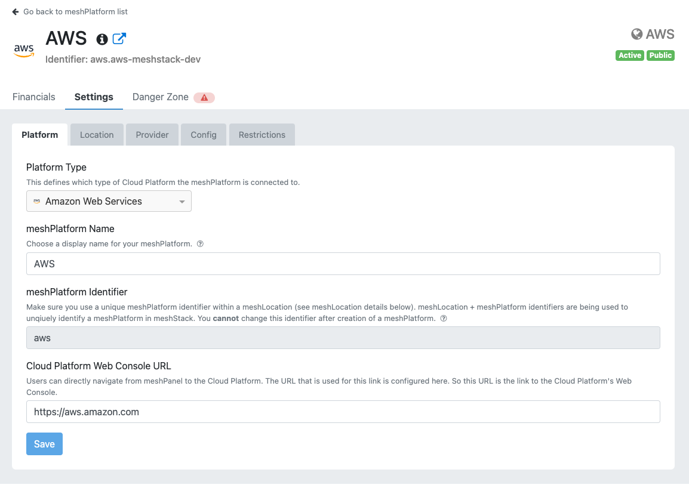

A key task for Platform Operators is integrating your Cloud Platforms as meshPlatforms into meshStack. This enables
tenant creation, replication and metering of your Cloud Platforms. The maintenance includes
general information about the Cloud Platform as well as structuring and configuring them.

A central part of it also includes the application of security and governance which is covered in the
[Landing Zone Administration](administration.landing-zones.md).

Getting an insight into all tenants that are being used in a certain Cloud Platform can be found in the
[Tenants](administration.tenants.md) section.

> All platform related maintenance like Landing Zones, Tenants, etc will be moved to the [Platform Control Plane](#platform-control-plane)
> in future.

## Platform Creation

You can integrate new meshPlatforms in self-service via a wizard in meshStack.

The following platform types are available for selection.

You have to assign a meshLocation to your meshPlatform and can provide additional provider information to the meshLocation if you
would like to. This is the same information you can provide in the [Settings](#settings) tab of the Platform Control Plane.

Additionally you can directly [restrict](#restrict-platform-access) your meshPlatform to certain meshCustomers to e.g. first test a new meshPlatform integration
with a meshCustomer you have access to. This can prevent confusion of other users who may see the meshPlatform otherwise
and would try to use it eventhough it is not working yet. Or you just have a dedicated Cloud Platform that shall only be available
to certain meshCustomers in general.

## Platform Control Plane

The Platform Control Plane is the central entry point for any tasks or insights you want to do or get about your meshPlatform.

### Financials

In this tab you can get an overview about which kind of resources are being used in your Cloud Platform.

### Settings

This tab is mainly responsible for managing how your meshPlatform is shown and used inside meshStack. You can provide general information
about your Platform like a display name or the Web Console Url meshStack will link to when the user wants to actually access the cloud platform.

You can also group your meshPlatforms into meshLocations to e.g. combine multiple private cloud platforms that are running in the same data center
into one meshLocation. Or you are using e.g. multiple Azure Tenants for your different stages and want to group them into an Azure meshLocation.

Additionally you can provide some Provider information of your meshLocation. You can describe how you operate your Cloud Platforms that belong to a meshLocation,
you can provide a link to a Wiki to provide further, more detailed information about your meshPlatforms within a meshLocation.

#### Restrict Platform Access

Access to a specific platform can be restricted via the "Restrictions" tab. This feature is helpful
when a new meshPlatform shall be integrated, but initially only be visible to a few customers for integration testing.
Or you have a dedicated Cloud Platform that shall only be available to certain meshCustomers in general.

To restrict the meshPlatform, search for the customers the platform shall be restricted to.
Add these customers via the *+* button.

#### Manage Quota Definitions

In order to provide quotas to meshTenants, the available quotas have to be defined first. A `Quota Key` that must match the quota key in the platform, can be defined. Additionally a speaking name for the Quota that is shown in meshPanel as well as a description and a unit can be defined. Min and Max values can also be set to restrict the quotas to a certain maximum or minimum. An [Auto Approval Threshold](meshcloud.tenant-quota.md#auto-approval-of-tenant-quota-requests) can also be defined. It can be set to 0, if no auto-approval of quota requests shall be applied.

**Removing Quotas**
If you want to remove quotas from a platform just click the "-" button on the right side of the table. If removed in the Platform Quota Definition, quotas will be removed from the Landing Zones and tenants belonging to the platform as well. The removal of quotas from the meshTenants will happen during next replication.

> Currently only OpenShift is supported for Quota Management

### Platform Deactivation

Via the "Danger Zone" tab you can deactivate or reactivate your meshPlatform.

Deactivation will make the meshPlatform not available anymore to new meshTenants, existing meshTenants won't be accessible via meshPanel anymore and no more replication will be executed. Metering instead will still be executed for non-deleted meshTenants of this meshPlatform for now. This will change in future. Direct access in the cloud platform itself to the platform tenants is still possible as meshStack does not delete or do any updates on platform tenants when a meshPlatform is deactivated.

A reactivation of meshPlatforms is also possible. This will allow reaccessing and replicating non-deleted meshTenants of this meshPlatform again and make the meshPlatform available again for new meshTenants.

## Platform Notifications

Administrators can inform users about platform specific events (updates, new features, service disruptions, etc.) by creating platform
notifications:

- **Platforms**: Select the platforms relevant to your notification so they can be shown on the affected platform's dashboards. Users
  can also [subscribe](meshcloud.profile.md#profile) to notifications by platform and [subscribed users](./meshcloud.profile.md#platform-notification-subscriptions) will receive new notifications via email.
- **Message**: The message that will be shown to all users. You can enter valid HTML in this field (except for the `
` tag). This is useful for e.g. supplying links to support pages.
- **Severity**: The type of message (info, warning, critical).
  - Info: for new features, upcoming services updates and general information that is not expected to disrupt platform operation
  - Warning: best used to inform about partial platform outages or problems that may occur for some users
  - Critical: appropriate in case of complete platform failures or impending platform downtimes
- **Show From**: The earliest time the message will be shown. You can use this to create messages that will only be shown on at a later date.
- **Show Until**: After this time the message will no longer be displayed.

At the bottom of the screen, a preview is shown. This can give you an idea of how the message is presented to your end-users.
