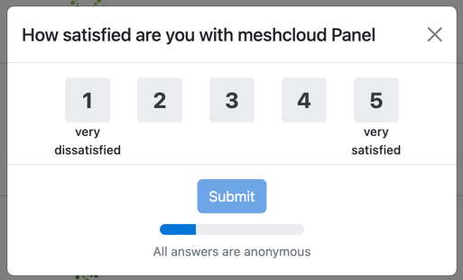

> We are happy to share any of the feedback and product usage data we collect with you for your meshStack.
> Reach out to your Customer Success representative to get the data.

## In-Product Satisfaction Survey

meshStack might show your users a short survey consisting of three questions:

1. How satisfied are you with {meshStack}*
2. When I perform an action in {meshStack}, it works as expected.
3. I was able to complete the tasks I needed to using {meshStack}.

*Please note that if you have your own rebranded name for meshStack, that will be shown instead.

Below you can see an example of what the survey looks like.



### When does the survey show up?

The satisfaction survey will show up under the following conditions:

- The user is **not** a user of the Admin Area.
- The user has logged in more than three times in the last 30 days.
- The user has not been shown the survey in the last 30 days. (If a user closes the survey it will only ever show up again after 30 days)
- The user did not do anything for the last 25 seconds (to prevent interrupting the user in important flows)

Note that the satisfaction survey is not configurable to be turned off. It is always turned on for each meshStack.

## Product Usage Data with Plausible

In order to continuously improve our product we collect product usage data and feedback.
Product usage data collection can be explicitly enabled by your Customer Success representative after your confirmation.

meshPanel uses the privacy-preserving and open source web-analytics library plausible.io for collecting anonymous usage data as described in the [plausible data policy](https://plausible.io/data-policy).
The system we use is operated by meshcloud and the data collected will remain within the secure meshcloud environment and will not be shared or processed externally.

### What data is collected?

Rest assured, the data we collect will not include any Personally Identifiable Information (PII).
Data that we collect includes the following:

- Satisfaction Ratings: To gauge user satisfaction, we will implement a star rating system. After completing an activity within the product, such as creating a meshProject, users will be prompted to provide a rating based on their experience.
- Usage Metrics: We will collect data on the frequency and manner in which functionalities are utilized within meshStack. This will help us identify patterns and understand how our product is being used, allowing us to make informed decisions for further improvement.

### Enabling Plausible data collection

<!--snippet:mesh.panel.environment#Plausible-->

The following configuration options are available at `mesh.panel.environment#Plausible`:
<!--DOCUSAURUS_CODE_TABS-->
<!--Dhall Type-->
```dhall
let Plausible =
    {-
        activatePlausibleTracking:
            Enable product usage analysis and telemetry using the plausible JavaScript library.
    -}
      { activatePlausibleTracking : Bool }
```
<!--Example-->
```dhall
let example = { activatePlausibleTracking = True } : Plausible
```
<!--END_DOCUSAURUS_CODE_TABS-->

When enabled, meshPanel will send usage data to this meshStack's meshPanel domain, which means there will be
no third-party domains accessed from user's browsers.
