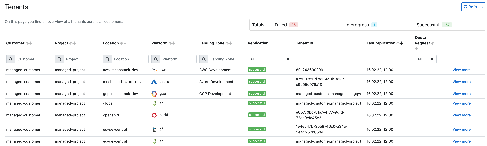

You can find a description of meshTenants [here](meshcloud.tenant.md).

## Viewing tenant status

You can see the full list of meshTenants with their replication status in the Administration area. Click on `Tenants` below the `Platforms` header. The list contains all tenants and their status, which is either:

- successful
- in progress
- failed

Additionally, the list can be filtered on workspace, project, location, platform, landing zone and replication status.

For more information, click on 'View more' in the tenant list and in this screen additional information is available. You can especially see detailed information about what happened during tenant replication to the cloud platform. You can see which steps have been executed and if errors or warnings occurred, you will also see them here.

### Trigger meshTenant replication

Via the button at the top right of the replication status mentioned in the section before you can trigger a replication for this meshTenant. If you e.g. resolved a problem in the platform, you can easily verify whether the issue for the meshTenant was actually solved.

### Tenant Quotas

In the tenant list you can filter in the `Quota Request` column to only get meshTenants with an open [Tenant Quota Request](meshcloud.tenant-quota.md). Platform engineers have to take action on these requests and either approve or decline them. They also have the option to change the quota before approval if the request cannot be approved as is.

It is also possible to change tenant quota proactively as a platform engineer, even if no tenant quota request exists. This is important, as meshStack will always make sure the defined quotas are applied in the platform. That means it is not possible to apply different quotas in the platform, as they will be overwritten on every replication by meshStack. If no quota request has been made yet by the workspace, default quotas defined in the [meshLandingZone](administration.landing-zones.md#defining-quotas) are applied.

When a quota request is active for a meshTenant you will see info about the quotas currently applied to the tenant, the requested quota and you have the option to overwrite requested quotas.

