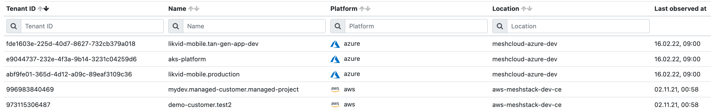
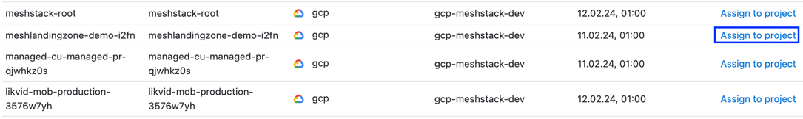

## What is an unmanaged tenant?

Workload that is running indefinitely without anyone's awareness can be an easy way to burn through cloud budget. This is otherwise
known as 'Shadow IT'. To make it easier to spot this kind of workload, meshStack offers a table view of all tenants that are unmanaged.

The definition of an unmanaged tenant is a cloud tenant that is not related to any meshWorkspace & meshProject. In other words, it does not
have any organizational metadata applied to it, and it is "unknown" who owns the tenant from a meshStack perspective.

> If you recently started using meshStack, you will most likely have a lot of unmanaged tenants. This is fine
> as you are still working on starting to manage these tenants via meshStack.

## Viewing unmanaged tenants

Viewing unmanaged tenants can be easily done within the administration area. In the sidebar on the left, navigate to 'Platforms' -> 'Unmanaged Tenants'.

A table will open up with all unmanaged tenants that are known to meshStack. This list is refreshed on a daily basis.

It is also recorded when the unmanaged tenant was last observed. If the unmanaged tenant has not been observed for a few days meshStack will
assume that it has been deleted in the cloud platform and will remove it from the list.

The screenshot below depicts how the unmanaged tenant list could look like.



## Assigning Unmanaged Tenants

It is recommended to manage all your tenants via meshStack, so they are assigned a clear ownership, and you benefit from the full Tenant Management
capabilities that meshStack has to offer.

You can easily assign an unmanaged tenant to a project in meshStack by doing the following:

- Click the "Assign to project" button as depicted in the screenshot
- In the prompt that opens up, select to which workspace & project this tenant should belong
- Select the Landing Zone that should be applied to this tenant.
  - The Landing Zone will automatically be applied after the first tenant replication and the
    tenant will e.g. be assigned in the resource hierarchy in the cloud platform



Tenants that are assigned into meshStack are removed from the unmanaged tenants list and shown in the tenants list instead.

Alternatively, if you prefer building an automation or an "as Code"-approach, you can use the [meshTenant API Import](https://docs.meshcloud.io/api/#_meshtenant).

### Unmanaged AWS tenants
To import an unmanaged AWS account into a Workspace and Project, the account must be configured for meshStack integration. This configuration involves setting up an IAM role with a trust relationship to the root or master account of the AWS organization to which the account belongs.

Create the IAM role named `MeshstackAccountAccessRole` in the unmanaged account and assign the AWS managed IAM Policy `AdministratorAccess` to it. Once the account import is complete, the IAM role's permissions will be reduced to the required level.

Add the following trust relationship to the IAM role `MeshstackAccountAccessRole`, substituting `ROOT_ACCOUNT_ID` with the AWS account ID of the organization's master or root account.
```json
{
  "Version": "2012-10-17",
  "Statement": [
    {
      "Effect": "Allow",
      "Principal": {
        "AWS": "arn:aws:iam::<ROOT_ACCOUNT_ID>:role/MeshfedServiceRole"
      },
      "Action": "sts:AssumeRole"
    }
  ]
}
```
Once the role is established, the unmanaged AWS account can be assigned to a project, allowing you to proceed with the steps outlined above.
