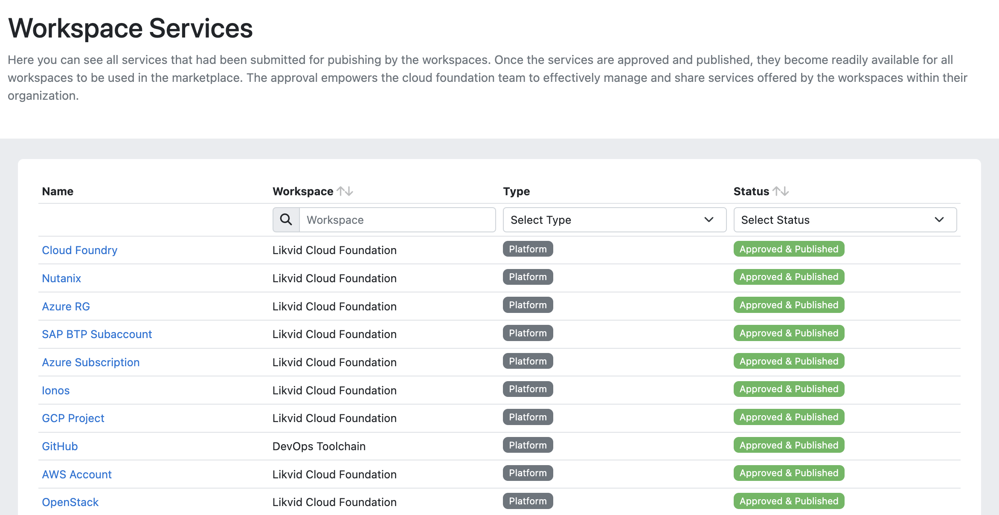
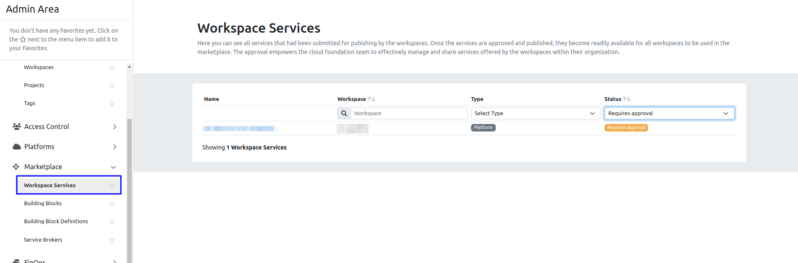
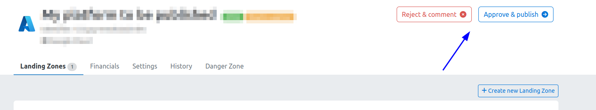

> Please note that the following functionality is only available to meshStacks that have the **Service Economy** module activated.
> Reach out to your Customer Success representative if you are interested in using this module.

## Workspace Services

As an admin, you can view all services that are offered by workspaces through their [Platform Builder](marketplace.platform-builder.md).
You can find this view in the Admin Area by going to "Workspace Services" under "Marketplace" on the left sidebar.

These are all Platforms & Building Blocks that exist in the organization. The list contains everything, including services
that are not approved and globally available yet, or that have been rejected.

A workspace service can have one of the following states:

- Requires Approval: The service is not globally available and requires approval from you or another admin.
- Rejected: The service is not globally available and has been rejected by you or another admin.
- Approved & Published: The service was approved and is globally available in the marketplace.

## Approval Workflow

To review a service, open the Workspace Services view. Services that require your approval or have been rejected are
automatically at the top of the page.

Upon selecting a service, you will be directed to its Control Plane. From there, you can either reject the publication request, or approve it, making the service accessible to all workspaces within your organization.

