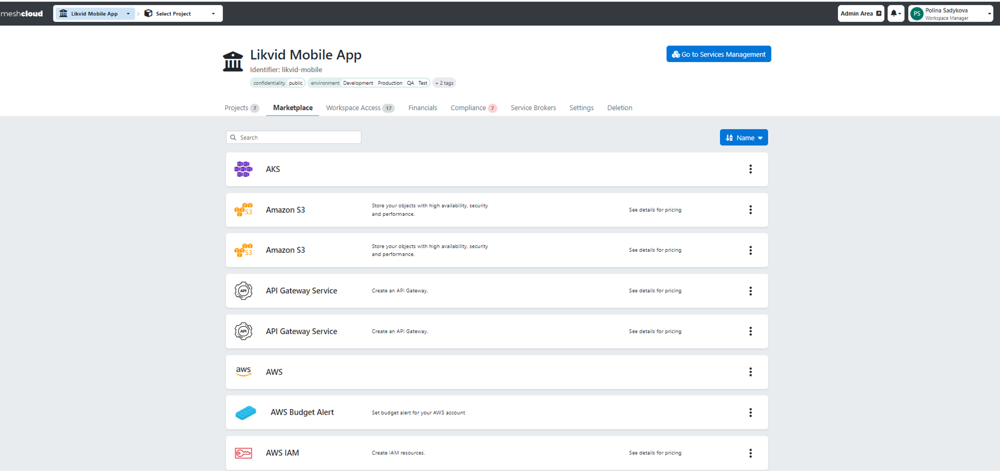
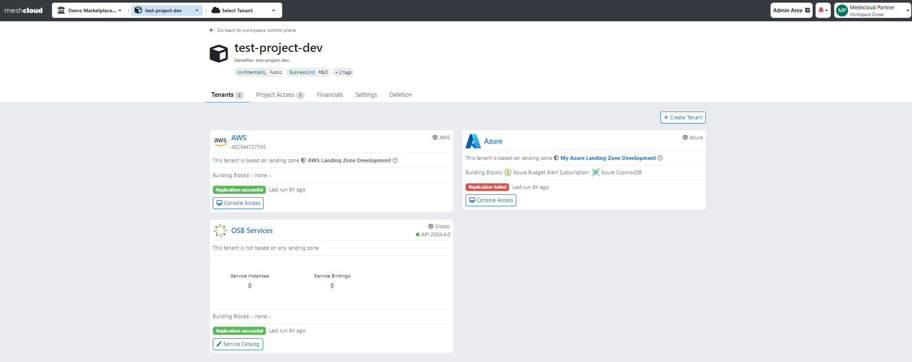
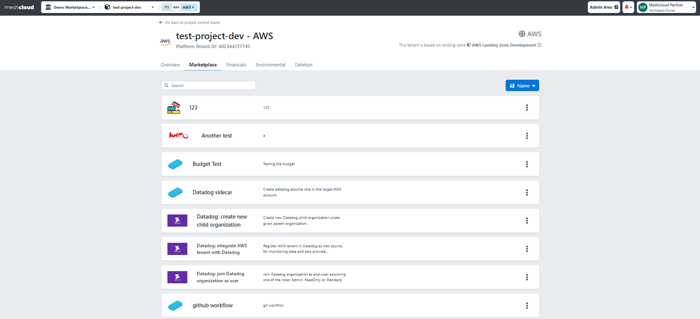

## Platform Services 

Platform Service within meshStack refers to any platform (e.g., Cloud or any other platform like GitHub) or services (e.g., Azure VNet) that can be effortlessly developed, executed, and managed by Platform Operators. In other words, Platform Operators can provide, via meshStack, ready-to-use Services and Platforms that empower applications to build, deploy, and scale applications without having to worry about the underlying hardware, networking, or other infrastructure components. The type of a Platform Service in meshStack depends on whether it can be developed as a [Building Blocks](administration.building-blocks.md), [Platform](administration.platforms.md), or [OSB Service](marketplace.service-instances.md).

## Marketplace

With meshStack, you can not only develop Platform Services for your application teams but also provide an overview of them in a united portfolio through a Marketplace Catalog that is located in the Marketplace tab of the Workspace.

The Marketplace Catalog presents application teams with details, prices, and documentation for all available Platform Services, allowing them to effortlessly add them to their Projects. Through the Marketplace Catalog, Workspace Owners and Managers can provision Platform Services for both new and existing Projects and Tenants. Here you can find a [guide](meshstack.how-to.add-platformservice.md) for adding different Platform Services from the Marketplace Catalog.

You can access the Marketplace Catalog not only through the Workspace panel but also directly from your meshTenant. Smart filtering is applied in the meshTenant control view, ensuring that only relevant Platform Services are displayed based on the specific meshTenant. For example, Azure meshTenant services, such as Azure Vnet, will be shown. 

To navigate to the Tenant Marketplace, choose a Tenant from the Project overview panel, click on the Tenant, and then select the Marketplace tab.

>In the next phase of upgrades for the Marketplace Catalog, we'll be introducing tags for Platform Services that will enable you to effortlessly filter and find the specific Platform Service you're looking for.