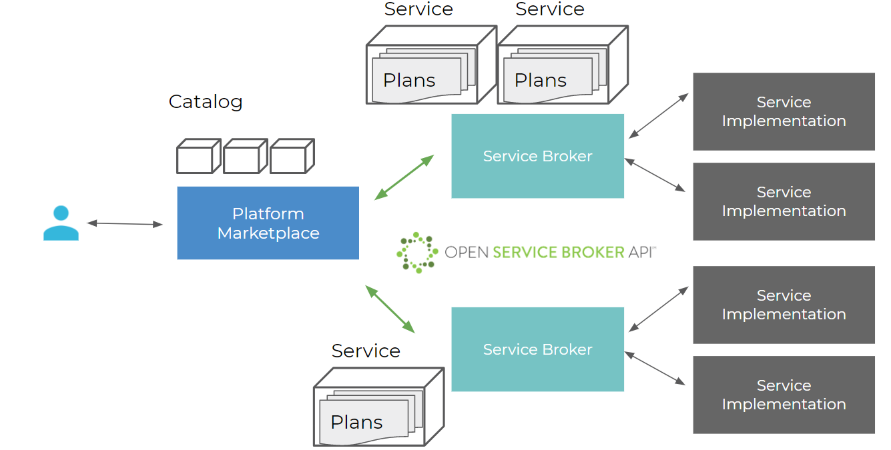

The meshMarketplace provides users with a set of services they can spin up for their projects (i.e. databases, message brokers, filesystems, etc). Platform operators can connect any service that implements the [Open Service Broker API](https://www.openservicebrokerapi.org/) to the marketplace and make it available to their users.

Using the marketplace, users can provision service instances (e.g. a database) and get connection information and credentials to use in their applications. This allows users to easily provision services for any application, independent of the hosting platform. For example, users can use the meshMarketplace to share a message queue between an application deployed to IaaS and an application deployed to Cloud Foundry PaaS in the same project.

## Definitions

Service Brokers may offer one or more services, which may have one or more plans each.  A service plan captures a variation of a service offering. Taking a MySQL service as an example, an “S” plan could offer 50GB of database storage whereas an “L” plan could offer 500GB. The Marketplace needs to provide a catalog of all available services and their various plans to the user. For this purpose, the Platform Marketplace periodically polls catalog information from registered Service Brokers and aggregates it.

Users never directly interact with a Service Broker. Instead, they  manage service instances through the meshMarketplace. Users can provision service instances in the context of a Project through the Marketplace. When a user requests the provisioning of a new service instance, the marketplace makes a provisioning request to the service broker and attaches the returned service instance information to the user’s chosen Project.

### Service Broker

A **service broker** is a component that creates an instance of a specific service and allows management of such service instances via the OSB API. An example would be a service broker for MariaDB services which allows you to request a MariaDB instance, potentially from a range of different sizes.

### Service Instance

A **service instance** is a specific deployed service that you can include in your application, e.g. a database created by the service broker.

### Service Binding

A **service binding** is a set of credentials you need to access your service instance, e.g. the connection string to access your database instance.
Service bindings can come with an expiration in which case they will be deleted after a set amount of days.

### Marketplace

The **marketplace** of a platform lists all service brokers available to you and allows you to inform yourself about available plans and request service instances to be used in your application.

Usually, you do not need to care where and how a service instance is deployed as long as its accessible via networks your deployment can connect to. For a more detailed classification of service provisioning models read [this blogpost](https://www.meshcloud.io/en/2018/08/30/platform-services-model-classification/).

## Developing Services

You can develop your own Service Broker and register it with the meshMarketplace. You can find further information [here](meshstack.meshmarketplace.index.md).
