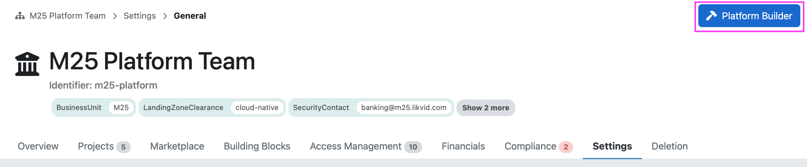
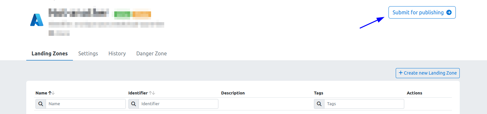
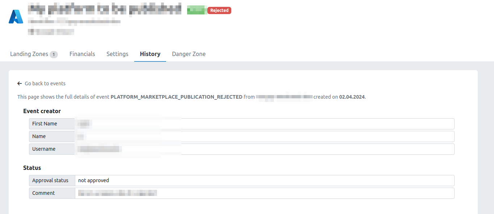

> Please note that the following functionality is only available to meshStacks that have the **Service Economy** module activated.
> Reach out to your Customer Success representative if you are interested in using this module.

## Introduction

The Platform Builder can be used by workspaces to offer their [platform services](marketplace.index#platform-services) to the rest of the organization.
For example, the Azure team in your organization could set up a workspace to offer their Azure [Platform](administration.platforms) from there to
the rest of the organization. Or the Networking team might want to offer their best-practice Cloud Network [Building Blocks](administration.building-blocks)
to Application Teams.

Anyone in the organization can offer their valuable services to the rest of the organization through the Platform Builder, as long as it’s approved by someone in the [Admin Area](administration.index).

You can open the Platform Builder at any time from the Workspace Control Plane by clicking the
"Platform Builder" button as shown below.

If you’d like to go back to the regular Workspace View, click on "Go to Workspace Management".

## Getting Access

If you don’t see the button to open the Platform Builder, your workspace probably doesn’t have it activated yet. As shown in the screenshot, open your Workspace Settings and toggle "Enable Platform Builder". Hit "Save" and you should see the "Platform Builder" button.

[!Getting Access](assets/platform-builder/getting-access.png)

## Types of Platform Services

The following three types of platform services can be created and offered in the Platform Builder:

1. [Platforms](administration.platforms). Platforms are a high-level concept in meshStack where users can book
   their own isolated tenant (environment) in a given cloud platform. meshStack has a handful of first-party supported
   platforms, but it also offers the ability to [create your own platforms](meshstack.how-to.create-your-own-platform)
   with the use of Terraform.
2. [Building Blocks](administration.building-blocks). Building Blocks are standardized extensions to cloud tenants that users
   can book and roll out. These can be either rolled out using Terraform, or manually. Example use cases are an on-premise
   connectivity to a cloud tenant.
3. When enabled for your meshStack, [Open Service Brokers](administration.service-brokers). Service Brokers are self-hosted components that can execute
   automation and provision workloads using the Open Service Broker API that can be booked by users in the meshStack.
   As the automation is fully managed by someone it can provision and do anything that you’d like.

## Development & Testing

By default, anything you create in the Platform Builder will be available to you inside the workspace and not directly published in the Service Catalog.
For development and testing, you can use any of your created platform services in **your own workspace**. They’ll be marked as "Private." This gives you a feel for the user experience and lets you debug any potential issues with the Platform Configuration or Terraform code.

## Publishing

After you’re done with development and testing, you can go to the Control Plane of your service in the Platform Builder and submit it for publication by clicking the "Submit for publishing" button.

Once approved by your platform team, it’ll become accessible to all workspaces in your organization.
If your publication request gets rejected, you can easily spot the reason by hovering over the rejected label or checking the rejection comment in the history.

Once you’ve addressed the issues, you can resubmit it for publishing.

> If you’re an administrator and want to know how
> to manage and approve workspace services, you can learn more [here](administration.workspace-services).
