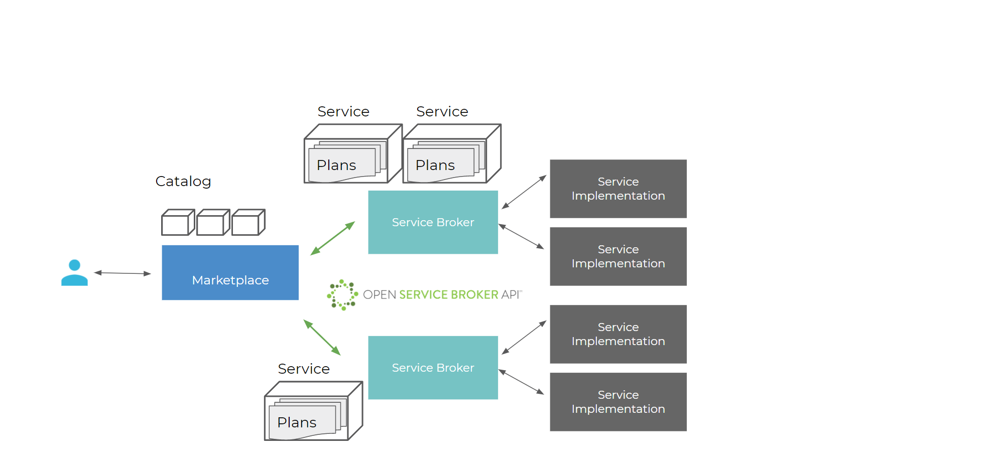

## Overview

A **service broker** is a component that creates an instance of a specific service and allows management of such service instances via the OSB API. An example would be a service broker for MariaDB services which allows you to request a MariaDB instance, potentially from a range of different sizes.

A **service instance** is a specific deployed service that you can include in your application, e.g. a database created by the service broker.

A **service binding** is a set of credentials you need to access your service instance, e.g. the connection string to access your database instance.

Service bindings can come with an expiration in which case they will be deleted after a set amount of days.

From the Marketplace users can add OSB services to their projects (i.e. databases, message brokers, filesystems, etc). Platform engineers can connect any service that implements the [Open Service Broker API](https://www.openservicebrokerapi.org/) to the OSB Services Platform and make it available to their users on the Markeplace.

## Service Plans

In order to provision a service instance for your project you first have to choose the Service Plan that best fits your needs. A service plan will be shown in the details screen of the Marketplace Catalog and it is a certain variant of the service, i.e. it has a certain amount of RAM available or storage, or network bandwidth, etc. So pick the matching plan whose resource coverages best matches your requirements.

Service Brocker may have one or more plans each. A service plan captures a variation of a service offering. Taking a MySQL service as an example, an “S” plan could offer 50GB of database storage whereas an “L” plan could offer 500GB.

## Maintain Service Instances

In order to see the status of your instances, add a binding, or remove a provisioned instance go to the **Instances** section under **OSB Services** in the navigation on the left. You find a list of all your service instances and can also access their dashboards via the dashboard icon on the right.

### Add a Binding

To finally get your connection information and credentials you have to add a binding to the service instance. You have to enter a name for the binding. When the binding has been created you can see the access information and connect to the service from within your application.

### Update Service Instance

Via the `pen` icon you can edit the service instance. Changing the name is always available. Just enter a new name if you want to change it. If the service supports an upgrade of plans, a dropdown with all plans of the service is displayed. You can select another plan if you want to change the plan for the given service instance. You can also change the parameters of the service (see [Service Parameters](#service-parameters) section below). Only enter the parameters you want to change. Empty parameters will be ignored.

### Tenant Bindings

> ⚠️ This feature is deprecated and will be removed in a future release.
> Please use [Building Blocks](./administration.building-blocks.md) with Platform Tenant Identifiers as inputs instead!
> For more information, have a look at the [deprecation item](https://meshcloud.canny.io/deprecations/p/deprecation-of-osb-tenant-bindings)

Some services require to bind a meshTenant. In that case you have to select one of your meshTenants when creating a binding.

If the service is located in the "Global" meshLocation, you can select all meshTenants of your meshProject. If the service is located in a Location-specific OSB Services, you can only select tenants of this meshLocation.

It is not possible to select the same meshTenant for multiple bindings of the same service instance.

### Share Service Instance

> ⚠️ This feature is deprecated and will be removed in a future release.
> Please use [Building Blocks](./administration.building-blocks.md) for Workspaces instead!
> For more information, have a look at the [deprecation item](https://meshcloud.canny.io/deprecations/p/deprecation-of-osb-service-instance-sharing)

If the Service Broker [supports](meshstack.meshmarketplace.profile.md#sharable-service-instances) it, service Instances can be shared between meshProjects of the same meshWorkspace. It is only sharable to projects, if the meshLocation the Service Instance relates to exists in the meshProject the instance shall be shared with. This is currently only supported for the global OSB Services.

Shared Instances are read-only. Only “own” bindings can be created/updated/deleted. This means that only bindings of the current project are shown and can be created/updated/deleted.

Sharing of a service instance can also be revoked. This can be done in the sharing as well as the shared with meshProject.
