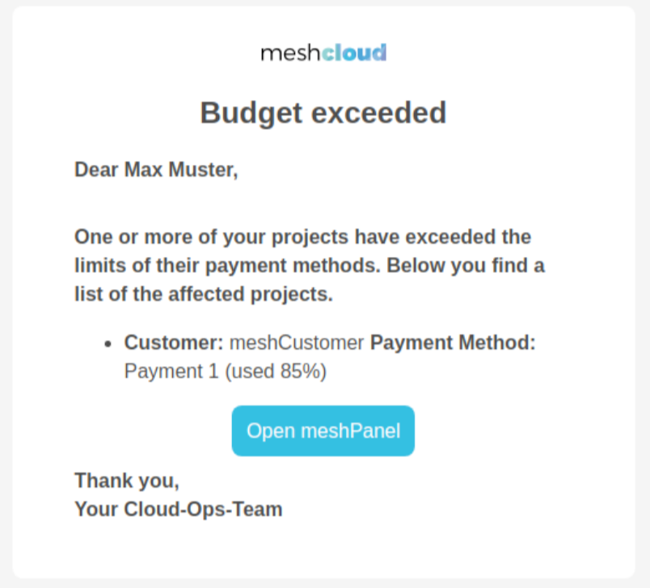

## What are Budget Alerts?

meshStack has the possibility to send out budget alerts to Customer Users to make them aware of any (soon to be) exceeding of predefined budgets.

This is very helpful to make users aware of any unexpected expenditure compared to the budget that was defined by an administrator.

In the below screenshot you can see an example of a budget alert that was received by a user.

It contains the necessary information for the user to be aware of where the problem lies, and how severe it is.

> Current limitation to how meshStack handles currencies: Although budgets can be applied in Dollar and Euro, budget alerts and payment method status only considers Euro. It is planned to expand the support for currencies besides Euro further in the future.

## How do I use Budget Alerts?

Budget alerts do not have to be configured. They will automatically be sent out if the conditions are right. A budget alert will be sent to a user if the following conditions are met:

- The user is a Customer Admin or Customer Owner in a meshCustomer.
- The meshCustomer has a payment method with a configured limit. The cloud consumption should be 80% or more on this payment method limit, e.g. €400 costs out of a €500 limit.

The budget alert will be sent via e-mail on Monday morning each week. To prevent spam, the user will receive all relevant budget alerts in a single e-mail, and not as one separate e-mail per budget alert.

## What do I do if a Budget is exceeded?

To deal with an exceeded budget, there are two options:

### 1. Increase the Limit of the Payment Method

The first and easiest option to fix a budget that is reaching its limit is to increase the limit. This has to be done by an administrator. Reach out to one of your Cloud Foundation administrators to get this done.

### 2. Request a new Payment Method

Another option is to request a new payment method. If configured by your Cloud Foundation team, in the customer control plane, you can go to “Financials” → “Payment Methods” and click “Request Payment Method” which will open a form on a new page to request a new payment method for your meshCustomer.
Once the new payment method is created, do not forget to set it as the active payment method on the project.

> For admins: click [here](https://docs.meshcloud.io/docs/meshcloud.payment-methods.html#external-payment-method-registration) to learn how to configure a payment method request button.
