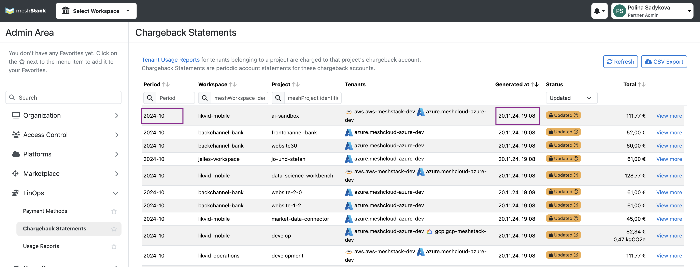
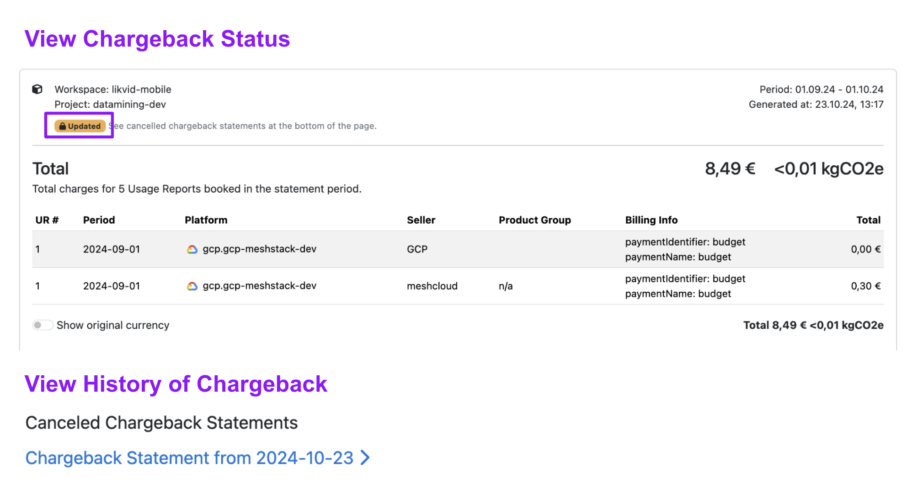
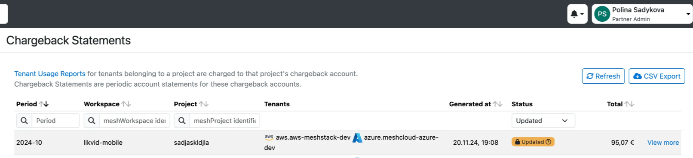

## Overview

This documentation provides an overview of the changes introduced with **Chargeback 2.0**, detailing the reasons for the update, key improvements, required actions, and limitations. The transition to Chargeback 2.0 will take effect by **the end of January 2025 (calendar week 4)**, with the January chargeback finalized under the new system.

## Why the Change Was Needed

Historically, any late bills or corrections (e.g., from cloud providers) arriving after chargeback statements were finalized were deferred to the next period. This approach often led to confusion and inaccuracies, making it difficult to understand the true impact of these late adjustments on final charges. Chargeback 2.0 addresses this issue by integrating late adjustments directly into the finalized statements of the relevant period, ensuring a more accurate and transparent representation of usage and costs. 

## Key Improvements

- **Inclusion of Late Cost Data**

Late bills or other corrections will now be **included in the month they apply to**, even after the chargeback statement has been finalized. Previously, late charges were carried over to the next period, leading to potential confusion and delayed visibility.

**Example:**
If an Azure charge for September 2024 usage is received after the chargeback statement has been finalized on October 6, 2024, this charge will be reflected in the **September chargeback statement**. The statement will show an **"Updated"** label to indicate that changes have been applied.

- **Applying Payment Methods Retroactively**

If a project doesn’t have a payment method because the previous one expired and no new method has been set, chargeback statements will not be generated for that project. However, tenant usage reports will still be created. Once you set a new payment method, the system retroactively generates chargeback statements for all the months that were missing them, using the newly added payment method.

For example, let’s say it’s February 2025, and your payment method for 2024 expired. If you haven’t added a new one yet, no chargeback statements will be generated for January and February 2025, but tenant usage reports will still be available without an associated payment method. Now imagine you add a new payment method at the end of March 2025. In this case, the system will regenerate tenant usage reports and produce chargeback statements for January, February, and March 2025, applying the new payment method to those months.

- **Transparency in meshStack**

In the **meshStack**, updates to finalized chargeback statements will be marked. When corrections are made, you will see an **"Updated" label** in the status column of the **Chargeback Statements page**. The **Generation Date** column will show the latest update date.

**What this means for you:**

    - Changes will be highlighted directly in meshStack for quick identification.
    - You can view in meshStack all ****updates that happened from your previous data retrieval by navigating to the Chargeback page, sorting generated at the column, and choosing only **updated** status chargeback statements.
    - When viewing the updated chargeback statement, you can navigate to the section displaying **canceled chargeback statements** and **compare** them with the current version to identify specific updates.

- **API and CSV Export Updates**

A new version of the **meshTenantUsageReport API (v3)** will be released, providing additional fields and more detailed responses. This will help make integrations and data handling more efficient.

- **API Enhancements**: More data points, including tags, payment method IDs, tenant IDs, platform type, and more will be available. So meshTenantUsageReport will include all parameters and responses same as for meshChargebacks API and more, so please use meshTenantUsageReport instead for your automation.
- **CSV Export**: Only the latest data will be included in CSV exports without the previous one for your convenience

> Please note also that moving tenant functionality is available only for those who are on the Chargeback 2.0 version
> 

## What action do you need to take

### **Update Your Integration**

- **API Update**: If you use the **meshTenantUsageReport API**, switch to the new **v3 API** to take advantage of expanded data fields and enhanced features. Also starting from March 1, 2025 v2 will not be available for usage anymore. 
- **Late Bills via API**: To track changes made to past periods after your last financial reports use **meshTenantUsageReport API by** specifying the **period** and using the **finalizedAfter** parameter to identify any updates that occurred after your last financial reports. For example, if your chargeback finalization date is on the 6th of the month and you have done your report on 07.11.2024 by collecting data via API, then you can next time specify the period 2024-11 and finalizedAfter 07.11.2024, so that you will have all data for November that finalized after your report. So data from **meshTenantUsageReport API** can be used for further processing with both, the cost-forward method, where you apply corrections to future months, and the cost-backward method, where you apply corrections to the period in which the costs were originally incurred.

> Please note that you can switch back to Chargeback 1.0 by navigating to the **Settings** and then the **Configuration** page. However, starting **March 1, 2025**, Chargeback 2.0 will become the default version, and the option to revert to Chargeback 1.0 will no longer be available.
> 

## Limitations of Chargeback 2.0

While Chargeback 2.0 significantly improves the transparency and accuracy of chargeback statements, there are a few limitations to consider:

### Cost Backward approach in meshstack UI

As mentioned earlier, you can use the API to collect costs that changed after the finalization date and apply corrections to future periods. However, in the panel, we use the cost-backward approach, so chargebacks and TUPRs are updated for the original usage month. Late bills and other corrections are now reflected in the correct month, with their status updated, even after the chargeback statement is finalized.

For example, in the screenshot below, costs were updated on 20.11.2024 for the October chargeback. These updates were applied to the October period and not carried over to the November chargeback.

### **Period for meshTenantUsageReport and meshChargeback APIs**

The **meshChargeback** and **meshTenantUsageReport APIs** will no longer use **specific dates** within the **period parameter** or in the response. Instead, the period will be displayed in a simplified monthly format (e.g., **2024-12**) for your convenience.

### **Environmental Data Reporting**

**Environmental report data** will be attached to the chargeback statement for the next month. This is due to delays in receiving the environmental data from Google Cloud. For example, data from August will appear in the **September chargeback statement**.

### **CSV Exports**

Currently, only the latest finalized data is reflected in CSV exports without differences between the previous and current versions of chargeback statements.

### Customizable exports

For some customers, our support team has been preparing Excel files for reporting. Unfortunately, this service will no longer be available due to technical limitations. We now recommend using the **meshTenantUsageReport APIs** for providing data for reports instead.
