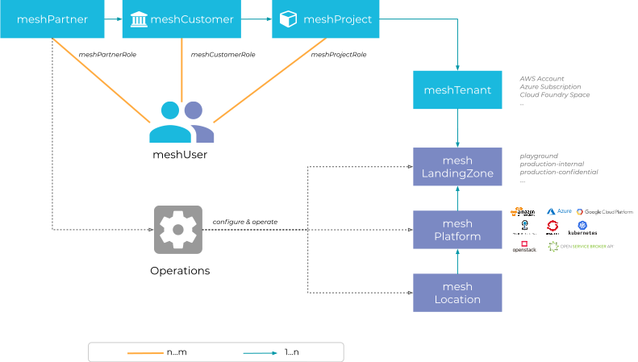

Welcome to the meshcloud platform documentation!

Here, you can find information on how to use meshcloud and an explanation of the most important concepts.

## Introduction

Quite a bit of complexity in multi-cloud management and multi-cloud governance comes from the use of different and inconsistent terminology between cloud platforms. meshcloud rectifies this using a unified language describing organization and governance structures independent of individual cloud platform implementations. We call this language the **meshModel**. Each individual object in this meshModel is called a **meshObject**. To resolve ambiguity we're prefixing entities in the meshModel using the `mesh` prefix.

The figure and table below explain the relation of the most important concepts in the meshModel.

| Entity                                         | Summary                                                                                   |
| ---------------------------------------------- | ----------------------------------------------------------------------------------------- |
| [meshUser](./meshcloud.profile.md)             | An individual user account. Roles define its level of access and permissions.             |
| [meshPartner](administration.index.md)         | Partners administrate and support a meshcloud installation.                               |
| [meshCustomer](./meshcloud.customer.md)        | A DevOps Team that manages its own [meshProject](./meshcloud.project.md)s and permissions |
| [meshCustomerUserGroup](./meshcloud.customer.md)| A group of users on a meshCustomer, that can be granted access via roles. |
| [meshProject](./meshcloud.project.md)          | A multi-cloud project owned by a [meshCustomer](./meshcloud.customer.md)                  |
| [meshTenant](./meshcloud.tenant.md)            | An isolated environment in a specific cloud platform, e.g. an AWS Account.                |
| [meshLandingZone](meshcloud.landing-zones.md)  | Defines configuration and governance policies for cloud environments.                     |
| [meshPlatform](meshcloud.platforms.md) | An individual cloud platform connected to meshcloud.                                      |
| [meshLocation](meshcloud.platforms.md) | A grouping of meshPlatforms, e.g. by geographic region.                                   |

## meshPanel

The meshPanel is the self-service user interface for meshStack and provides different control planes to manage various aspects of your meshObjects depending on your rights:

- [customer control plane](./meshcloud.customer.md#managing-your-meshcustomer)

   Manage the access of your team members in your [meshCustomer](./meshcloud.customer.md), change the tags or check the available payment methods for your meshCustomer.

- [project control plane](./meshcloud.project-resources.md#project-control-plane)

   Get an overview of all locations and their platforms of your [meshProject](./meshcloud.project.md). Add new team members to it or change the payment methods of your project.

- [tenant control plane](./meshcloud.project-resources.md#tenant-control-plane)

    Access the platform of your [meshTenant](./meshcloud.tenant.md), request Quotas for it or check the [usage reports](./meshcloud.project-metering.md#tenant-usage-reports).

The above description serve as an example what you are able to do as Customer Admin. Check out [meshCustomer Roles](./meshcloud.customer.md#meshcustomer-roles) for more details.

### Supported browsers

- Firefox ESR
- last 2 Firefox versions
- last 2 Chrome versions

If you experience problems with other browsers like Edge (Chromium), Safari or with mobile experience let us know.
We are interested to make that work as well!

## Contributing

This documentation is open source! Please feel free to hit the `Edit` button any time and help us [improve](https://github.com/meshcloud/meshcloud-docs/blob/master/CONTRIBUTING.md) the documentation. Your feedback is very welcome.

