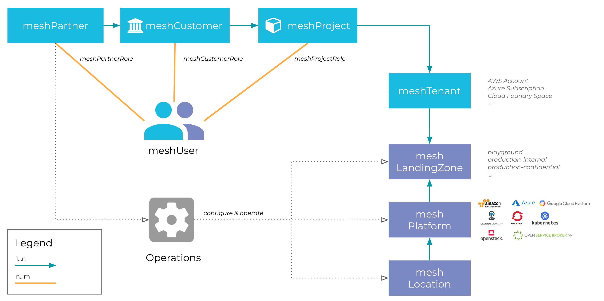

Welcome to the meshcloud platform documentation!

Here, you can find information on how to use meshcloud and an explanation of the most important concepts.

## Introduction

Quite a bit of complexity in multi-cloud management and multi-cloud governance comes from the use of different and inconsistent terminology between cloud platforms. meshcloud rectifies this using a unified language describing organization and governance structures independent of individual cloud platform implementations. We call this language the **mesh model**. To resolve ambiguity we're prefixing entities in the mesh model using the `mesh` prefix.

The figure below explains the relation of the most important concepts in the mesh model. The table has a summary

| Entity                                         | Description                                                                               |
| ---------------------------------------------- | ----------------------------------------------------------------------------------------- |
| [meshUser](./meshcloud.profile.md)             | An individual user account. Roles define its level of access and permissions.             |
| [meshPartner](administration.index.md)         | Partners administrate and support a meshcloud installation.                               |
| [meshCustomer](./meshcloud.customer.md)        | A DevOps Team that manages its own [meshProject](./meshcloud.project.md)s and permissions |
| [meshProject](./meshcloud.project.md)          | A multi-cloud project owned by a [meshCustomer](./meshcloud.customer.md)                  |
| meshTenant                                     | An isolated environment in a specific cloud platform, e.g. an AWS Account.                |
| [meshLandingZone](meshcloud.landing-zones.md)  | Defines configuration and governance policies for cloud environments.                     |
| [meshPlatform](meshcloud.platform-location.md) | An individual cloud platform connected to meshcloud.                                      |
| [meshLocation](meshcloud.platform-location.md) | A grouping of meshPlatforms, e.g. by geographic region.                                   |

## Contributing

This documentation is open source! Please feel free to hit the `Edit` button any time and help us [improve](https://github.com/meshcloud/meshcloud-docs/blob/master/CONTRIBUTING.md) the documentation. Your feedback is very welcome.
