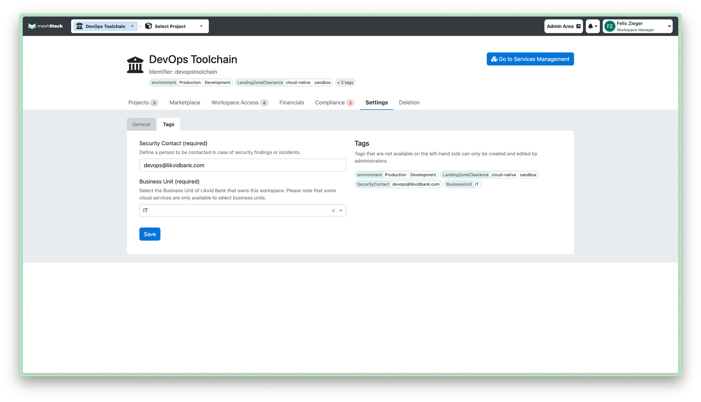
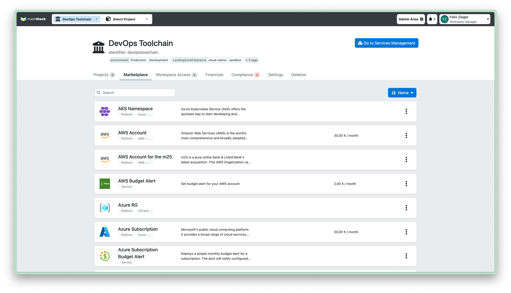

## Introduction

meshStack is a SaaS service that aids organizations in establishing cloud governance across heterogeneous environments, whether they are operating in public or private clouds. Cloud governance refers to a process of defining and implementing compliance rules, tools, and best practices to ensure efficient usage of cloud resources. This encompasses security, cost, and operations.

The target personas for meshStack include application teams, cloud architects, engineers, Heads of IT, and IT directors. The summary below outlines the benefits of meshStack for these personas.

For cloud architects and engineers:

- Provide application teams with compliant cloud platforms, ensuring that business applications run in an optimal environment following the best practices and rules established by the IT team.
- Offer IT services via the meshStack Marketplace to increase automation in IT resource management and empower application teams with self-service options.

For the Head of IT and IT Directors:

- Oversee expenditures across different cloud platforms within a single application
- Access detailed billing reports, aggregated by cloud provider, applications, etc.
- Improve efficiency with self-service options and automation

For the Application Team:

- Manage cloud resources in a self-service
- Request and utilize cloud resources within minutes
- Onboard team members and manage their access to the cloud.
- Consolidate costs across cloud resources running on AWS, Azure, GCP, etc.
- Attribute costs to specific projects and teams

## meshStack Concepts

### Cloud resources

meshStack organizes cloud environments using a comprehensive structure consisting of following objects:

- A **Tenant**, which is essentially a cloud environment where run your application resources. Tenant examples include an AWS account, a GCP project, an Azure subscription, Kubernetes namespaces, and so on.
- A **Platform** is an computational environment that hosts Tenants and offers cloud services and resources. For instance, AWS organization, GCP organization, Azure Tenant, or Openshift cluster are examples of a Platform.
- A **Landing Zone** is a set of rules and policies meant to organize platform resources into various domains, like "production", "development", or "regulated environment". Any Tenant operating within a Landing Zone will automatically have the rules of that Landing Zone applied, enforcing existing standards and compliance. Practical examples of Landing Zones include AWS Organizational Unit (OU) having set of guardrails, GCP Folder with services policies and so on.
- A **Project** brings together one or more Tenants from various clouds. The purpose of Projects is to logically organize your application resources into units such as "production", "sandbox", and so on.
- A **Workspace** typically represents one or multiple business applications that are overseen by an application management team. Each Workspace can contain one or more Projects, with an application team assigned to each Workspace.
- An **Application team** is granted access to a Workspace and various related Projects. Their objective is to manage the cloud environments of application(s).

The illustration provides a concise summary of the key concepts presented above.

### Payment method

A payment method represents a budget allocated to an application or a department for their cloud spending. Each payment method may have an amount and an expiration date, and it is always assigned to a single Workspace. However, a Workspace can support multiple payment methods. These methods can be used by Workspace projects to monitor their cloud expenditure.

### Tags

Tags offer a powerful way to add metadata to meshStack objects. These tags can be used for inventory purposes and to enforce compliance rules, ensuring that cloud applications run in a safe environment. Currently, meshStack allows tag assignments to a workspace, a project, a payment method, and a landing zone.

### Building blocks

mehStack offers a service called Building Block, which automates resource provisioning. End-users can use Building Block to self-deploy essential cloud resources, such as "Create a VPC" or "Establish on premise connection". In other scenarios, Building Block can automatically run for each newly created tenant, ensuring they have the necessary infrastructure prerequisites in place. Building Block supports Terraform to automate infrastructure provisioning.

## Policies

How to ensure that application tenants are operating on the appropriate cloud platform or Landing Zone? For instance, within a specific organization, how to verify that applications managed by a particular business unit are only running on the platform belonging to that unit? This might be necessary due to legal or financial requirements.

meshStack policies use tags to establish policies. For example, by applying a "BusinessUnit" tag to both a Landing Zone and a Project, policies can be set to only allow a Project to be deployed in a Landing Zone if their tags match, meaning they have the same value.

## Marketplace

meshStack not only simplifies cloud management but also provides a Marketplace service. This solution connects end-users with platform engineers and service providers. In this Marketplace, engineers can offer reliable IT services called Building Blocks, while platform providers can offer their custom platforms. Additionally, both platform providers and Building Block owners can choose to charge recurring fees for their services.

## FinOps

meshStack provides the crucial feature of automatically collecting cloud costs for a multi-cloud environment and mapping them to the relevant internal cost centers providing full cost transparency. The meshStack UI allows users, like Workspace owners, to oversee the total cost of cloud resource usage for all underlying projects. It also provides a user interface to display a detailed view of the costs for each tenant, project, and workspace, categorized by time period.

## Contributing

This documentation is open source! You are encouraged to click the `Edit` button at any time to help us [enhance](https://github.com/meshcloud/meshcloud-docs/blob/master/CONTRIBUTING.md) the documentation. We welcome your feedback.

## Getting Updates

We regularly release updates and provide weekly summaries. To stay informed about the latest changes in meshStack, you can: 

- View the roadmap on our website at [www.meshcloud.io](https://www.meshcloud.io/en/product/).
- Sign up for the [Product Newsletter](https://share.hsforms.com/1AbELCsdRRP6EaCkm1UeATwc0hrp) which is distributed biweekly and summarizes the key updates.
- Check the  [release notes](/blog) or subscribe to either the [RSS](/blog/feed.xml) or [atom](/blog/atom.xml) feeds for direct updates.