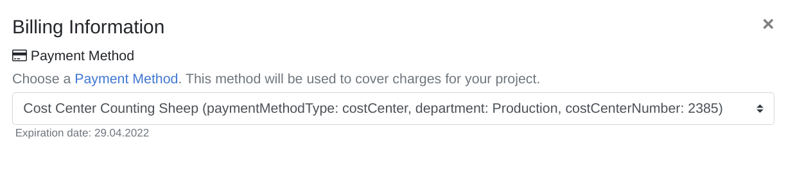

## Introduction

Just like you pay for a new t-shirt online via your credit card, enterprises also have to be responsible for the costs that they make in cloud platforms. Payment methods are used for allocating cloud costs, all the way back to the responsible department of your organization, for a clear and transparent accounting process. As the cloud can be mighty with its enormous offering of practically unlimited services, it is important that all meshProjects and meshCustomers are correctly charged and that this information makes its way back to the required systems. Payment methods therefore are the link between the cloud usage and the resulting cost in the context of a meshProject.

Payment methods are created **per** meshCustomer and come in two variants:

1) A cost center payment method (indicated via `COST_CENTER`), meaning the costs made by the meshTenants in your meshProjects will be fully charged to the cost center of your organization.

2) A budget payment method (indicated via `COST_LIMITATION`), meaning costs made by the meshTenants in your meshProjects will be charged based on the monetary budget amount that is set on this payment method.

## The Payment Method Lifecycle: Creation

The first step in reaping the benefits of payment methods is creating them. A few important things must be considered about payment methods before creating them

1. A payment method is **always** scoped to a single meshCustomer. This means it is not possible to create a global payment method that can be used for all meshCustomers. It is also not possible to re-use a single payment method across multiple meshCustomers.
2. A payment method's identifier is globally unique. This means you cannot create a payment method with the same identifier for multiple meshCustomers. Make sure to use an identifier that will not collide in other meshCustomers.

### Creating a payment method via the meshPanel

One way of creating payment methods is via the meshPanel. To do so, make sure that you have an account with the 'Partner Admin' role. Navigate to the Admin area and follow these steps:

1. Click on 'Customers' on the left.
2. Find a customer you want to create a payment method for and click on the 'Customer Payment Methods' icon on the right.

    

3. Click on 'Create Payment Method' at the top right.
4. Enter a name and identifier for the new payment method.
5. Choose a type for the payment method. Read more here on what type to choose and what the individual differences are.
6. (This is optional) Set a maximum amount of EUR on the payment method to indicate the remaining budget for this year.
7. (This is optional) Set an expiration date for the payment method. This is especially useful when a budget expires, e.g. at the end of the accounting year.
8. Additionally, you can enter custom settings to inject metadata into the payment method. This is useful when you want to enhance the payment method with organizational details like the cost center number or the business unit.
9. Click 'Save' and your new payment method will be available to the meshCustomer it was created in!

### Creating a payment method via the meshstack API

As automation matters, there is also the possibility to create payment methods via the meshstack API. To find the API documentation, open your meshstack and click on 'API' at the bottom of the meshPanel. A new page will open and on the left-hand side, you should see `meshPaymentMethod` listed under `meshObject Import`. Click on it and read the documentation to understand how you can create a payment method via the API.

## The Payment Method Lifecycle: Assigning to Projects

Now that the Partner Admin has created one or more payment methods for a meshCustomer, we are ready to link a payment method to one or more projects.

First, check if the payment method is correctly created in the meshCustomer. You can do so by navigating to the meshCustomer Account area. In order to do that you need to have Customer Admin rights within the respective customer. On the left-hand side, there should be an item called 'Payment Methods' which you can navigate to. All payment methods that are created and assigned to your current meshCustomer are shown here.

The payment methods that are assigned can be used for both existing projects and new projects.

### Applying a payment method to an existing project

In the Customer Account area, open 'Projects' on the left. Then click on the 'Edit project' button on the right for the project you would like to add a payment method. In the 'Edit Project' screen, you'll see the selected payment methods on the right. As explained at the top of the page, you also have the ability to specify a Substitute Payment Method. A Substitute Payment Method is useful when working with expiring cost centers or budgets. This makes sure that when the active payment method expires, it will activate the substitute payment method.

Select the Active Payment Method of choice, and optionally a Substitute Payment Method if that is desired. Save the project and the payment method(s) will be assigned to the project.

### Applying a payment method to a new project

Create a new project at the top of the meshPanel. Follow the project creation flow until you enter the 'Billing Information' page.

As you can see, on this page you have the ability to assign a payment method to the project. Keep in mind that this is mandatory. If you want to specify a substitute payment method, you can do so after creating the project and following the steps above in '**Applying a payment method to an existing project'**. If your meshCustomer has no payment methods, you will be confronted with a warning that looks like this:

After setting a payment method, you can continue the project creation flow and save the new project. You now have a new project with a payment method successfully assigned!

## The Payment Method Lifecycle: Enhance with Metadata

As it is difficult to handle large amounts of payment methods only via their names or identifiers, there is the possibility to provide metadata (in the form of key-value pairs) to the payment methods. This metadata can be provided when creating/editing the payment method in the meshPanel. This is already described in step 8 for '**Creating a payment method via the meshPanel**'.

An alternative way of providing metadata to payment methods is via the meshStack API. The API docs will describe how to inject the metadata in payment methods.

## The Payment Method Lifecycle: Exporting Data for External Systems

There are two possible ways to exporting the metadata of the payment methods, depending on the use case.

### Applying Metadata on Tenants in Cloud Platforms

One way of exporting the payment method data (on top of other metadata from meshCustomers and meshProjects) is via the meshTenant. The meshTenant in the cloud platform can be 'tagged' (or 'labeled' for Google Cloud Platform) with the metadata from meshcloud. There are multiple ways of exporting the metadata into the cloud platforms. You can read more about exporting your metadata [here](meshstack.tag-schema.md#meshtenant-metadata) and decide what approach fits best.

### Exporting Financial Data and Metadata

The other way of exporting metadata is via our [chargeback statements](meshcloud.project-metering.md#chargeback-statements). These chargeback statements are generated periodically and contain the financial data of one or more meshTenants (based on the Tenant Usage Reports). It is possible to export these chargeback statements via CSV and on top of that, provide one or more metadata values per CSV row. This is very helpful when parsing the CSV export in another tool for financial processing.

Not all metadata is exported by default, and each metadata field has to be explicitly configured before it will be exported as part of the CSV file. It is even possible to configure the export to include standard fields of the payment method, e.g. the name or expiration date. To configure this behavior, read more [here](meshstack.billing.md#chargeback).

The actual export itself can be done via the meshPanel. This is possible for both Partner Admins (for all meshCustomers) and Customer Admins (for the selected meshCustomer). When navigating to the Administration area (for partner admins) or Account area (for customer admins), you will see 'Chargeback Statements' on the left. Click on it and you will see all chargeback statements. Additionally, there is the option at the top right labelled 'CSV Export' to export the list to a single CSV file.
