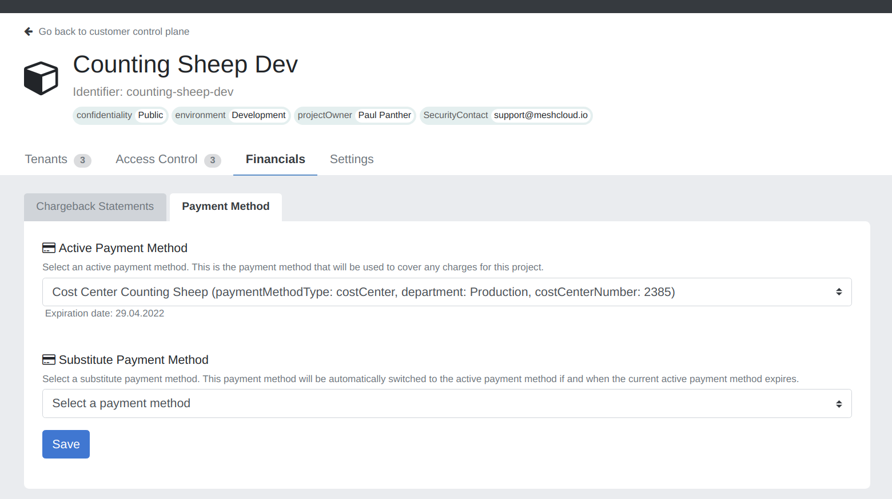
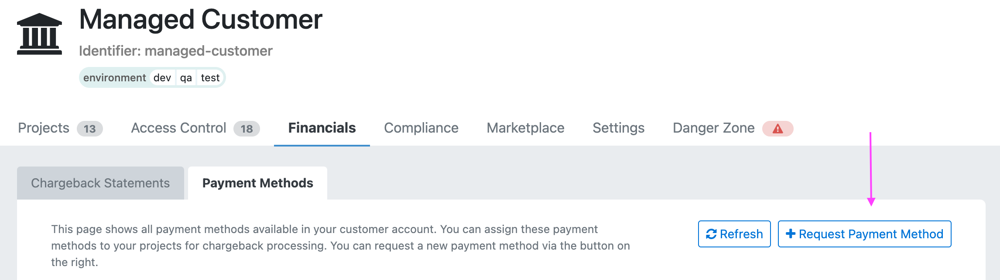

## Introduction

Just like you pay for a new t-shirt online via your credit card, enterprises also have to be responsible for the costs that they make in cloud platforms. Payment methods are used for allocating cloud costs, all the way back to the responsible department of your organization, for a clear and transparent accounting process. As the cloud can be mighty with its enormous offering of practically unlimited services, it is important that all meshProjects and meshWorkspaces are correctly charged and that this information makes its way back to the required systems. Payment methods therefore are the link between the cloud usage and the resulting cost in the context of a meshProject.

Payment methods are created **per** meshWorkspace and can be enhanced with [metadata tags](meshcloud.metadata-tags.md) for use cases such as cost center allocation, department information, etc. Additionally, it is possible to provide a euro amount to a payment method for budgeting purposes.

> Current limitation to how meshStack handles currencies: Although budgets can be applied in Dollar and Euro, budget alerts and payment method status only considers Euro. It is planned to expand the support for currencies besides Euro further in the future.

## The Payment Method Lifecycle: Creation

The first step in reaping the benefits of payment methods is creating them. A few important things must be considered about payment methods before creating them:

1. A payment method is **always** scoped to a single meshWorkspace. This means it is not possible to create a global payment method that can be used for all meshWorkspaces. It is also not possible to re-use a single payment method across multiple meshWorkspaces.
2. A payment method's identifier is globally unique. This means you cannot create a payment method with the same identifier for multiple meshWorkspaces. Make sure to use an identifier that will not collide in other meshWorkspaces.

> Please note that as of today payment methods only support EUR amounts. 

### Creating a Payment Method via the meshPanel

One way of creating payment methods is via the meshPanel. To do so, make sure that you have an account with the 'Organization Admin' role. Navigate to the Admin area and follow these steps:

1. Go to 'Payment Method' page under the FinOps section.
2. Click on 'Create Payment Method' at the top right.
3. Select the workspace for which a new payment method should be created.
4. Enter a name and identifier for the new payment method.
5. (This is optional) Set an amount of EUR on the payment method to indicate the budget of this payment method.
6. (This is optional) Set an expiration date for the payment method. This is especially useful when a budget expires, e.g. at the end of the accounting year.
7. Additionally, you can enter tags for the payment method, which are custom for your meshStack (also see [meshTags](meshstack.metadata-tags.md)). This is useful when you want to enhance the payment method with organizational details like the cost center number or the business unit.
8. Click 'Save' and your new payment method will be available to the meshWorkspace it was created in!

### Creating a Payment Method via the meshObject API

As automation matters, there is also the possibility to create payment methods via the meshObject API. This is especially helpful when an external system already manages the data that is relevant for payment methods. To find the API documentation, open your meshstack and click on 'API' at the bottom of the meshPanel. A new page will open and on the left-hand side, you should see `meshPaymentMethod` listed under `meshObject Import`. Click on it and read the documentation to understand how you can create a payment method via the API.

## The Payment Method Lifecycle: Assigning to meshProjects

Now that the Organization Admin has created one or more payment methods for a meshWorkspace, we are ready to link a payment method to one or more meshProjects.

First, check if the payment method is correctly created in the meshWorkspace. You can do so by navigating to the [workspace control plane](./meshcloud.workspace.md#managing-your-meshworkspace). In order to do that you need to have Workspace Manager rights within the respective workspace. In the workspace control plane, open **Financials** and then **Payment Methods**. All payment methods that are created and assigned to your current meshWorkspace are shown here.

The payment methods that are assigned can be used for both existing meshProjects and new meshProjects.

### Applying a Payment Method to an existing meshProject

In the [workspace control plane](./meshcloud.workspace.md#managing-your-meshworkspace), open the corresponding project. Then click on the **Financials** tab and open the **Payment Methods** tab. In this screen, you'll see the selected payment method(s). As explained at the top of the page, you also have the ability to specify a Substitute Payment Method. A Substitute Payment Method is useful when working with expiring cost centers or budgets. meshStack runs a job every night to make sure that when the Active Payment Method has expired, the Substitute Payment Method will be set as the active payment method. If there is no Substitute Payment Method, the active payment method will be removed.

Select the Active Payment Method of choice, and optionally a Substitute Payment Method if that is desired. Save the meshProject and the payment method(s) will be assigned to the meshProject.

> Please note that expired payment methods are removed from all projects automatically upon expiration and can no longer be assigned to any projects.

### Applying a Payment Method to a new meshProject

Create a new meshProject at the top of the meshPanel. Follow the project creation flow until you enter the 'Billing Information' page.

As you can see, on this page you have the ability to assign a payment method to the meshProject. Keep in mind that this is mandatory. If you want to specify a substitute payment method, you can do so after creating the meshProject and following the steps above in '**Applying a payment method to an existing meshProject'**. If your meshWorkspace has no payment methods, you will be confronted with a warning that looks like this:

After setting a payment method, you can continue the project creation flow and save the new meshProject. You now have a new meshProject with a payment method successfully assigned!

## The Payment Method Lifecycle: Enhance with Metadata

As it is difficult to handle large amounts of payment methods only via their names or identifiers, there is the possibility to provide tags (also see [Tag Schema](meshstack.metadata-tags.md)) to the payment methods. This metadata can be provided when creating/editing the payment method in the meshPanel. This is already described in step 8 [here](#creating-a-payment-method-via-the-meshpanel).

An alternative way of providing metadata to payment methods is via the meshObject API. The API docs will describe how to inject tags in payment methods.

## The Payment Method Lifecycle: Exporting Data for External Systems

There are two possible ways to exporting the metadata of the payment methods, depending on the use case.

### Applying Metadata on Tenants in Cloud Platforms

One way of exporting the payment method data (on top of other metadata from meshWorkspaces and meshProjects) is via the meshTenant. The meshTenant in the cloud platform can be 'tagged' (or 'labeled' for Google Cloud Platform) with the metadata from meshcloud. There are multiple ways of exporting the metadata into the cloud platforms. You can read more about exporting your metadata [here](meshstack.metadata-tags.md#meshtenant-metadata) and decide what approach fits best.

### Exporting Financial Data and Metadata

The other way of exporting metadata is via our [chargeback statements](meshcloud.project-metering.md#chargeback-statements). These chargeback statements are generated periodically and contain the financial data of one or more meshTenants (based on the Tenant Usage Reports). It is possible to export these chargeback statements via CSV and on top of that, provide one or more metadata values per CSV row. This is very helpful when parsing the CSV export in another tool for financial processing.

Not all metadata is exported by default, and each metadata field has to be explicitly configured before it will be exported as part of the CSV file. It is even possible to configure the export to include standard fields of the payment method, e.g. the name or expiration date. To configure this behavior, read more [here](meshstack.billing.md#chargeback).

The actual export itself can be done via the meshPanel. This is possible for both Organization Admins (for all meshWorkspaces) and Workspace Managers (for the selected meshWorkspace). When navigating to the Administration area (for organization admins), you will see **Chargeback Statements** on the left. When navigating to the [workspace control plane](./meshcloud.workspace.md#managing-your-meshworkspace) (for workspace managers) , you will see **Chargeback Statements** under **Financials**. Click on it and you will see all chargeback statements. Additionally, there is the option at the top right labelled 'CSV Export' to export the list to a single CSV file.

### External Payment Method Registration

Beside manually creating a new payment method in the meshPanel on an ad-hoc basis, it is also possible to let users navigate to an external URL for requesting
a new payment method, e.g. an internal budget request form. To make this even better, you can use the API of meshStack to create an approval flow and automate the creation
of any new payment methods.

The external URL can be figured under the configuration option `environment.ui.externalPaymentMethodUrl`.

By configuring the URL, the following button will appear in the meshPanel for meshWorkspaces:

