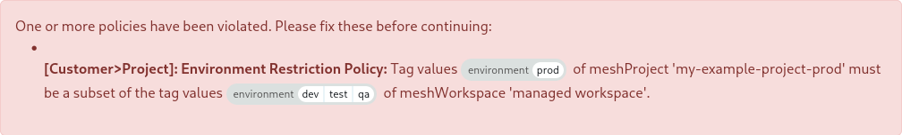

## Introduction: What are Policies?

A policy describes a restriction between two objects. You can only define a
policy on certain objects by using their defined tags. These particular objects
are called policy subjects.

> **Workspace**, **Project**, **User/Group** and **LandingZone** are policy
> subjects

For ease of use, we restrict the combinations of policy subjects which do not
make sense. Each policy describes which [tag](meshcloud.metadata-tags.md) values
have to be present on both policy subjects to comply with the policy. By setting
an [evaluation strategy](meshcloud.policies.md#policy-evaluation-strategy) you
can decide how the policy subjects are evaluated against each other.

Policies are enforced in various places wherever you edit a tag of a policy
subject or change a relation to another policy subject like assigning a user to
a workspace. Operators can learn more about configuring policies
[here](administration.policies.md).

### Authoritative and Affected Subject

The terms authoritative and affected subject shall make clear in which direction
the policy will be evaluated.

We have a limited selection of authoritative and affected subject combinations.
Valid combinations are

| Authoritative Subject | Affected Subject       |
| --------------------- | ---------------------- |
| Workspace             | Project                |
|                       | User/Group (Principal) |
|                       | LandingZone            |
|                       | Building Block         |
| Project               | User/Group (Principal) |
|                       | LandingZone            |

You can find the authoritative subject on the left side and the affected subject
on the right side. In general, the authoritative subject restricts the affected
subject depending on a selected evaluation strategy and the chosen tags.

### Policy Evaluation Strategy

A policy evaluation strategy describes how authoritative and affected policy
subjects shall be evaluated in the context of a policy. In that way, you can
decide in which form the tag values have to be present on both policy subjects
to comply with the policy. As mentioned before, policies are built on top of
meshStack's [tagging](./meshcloud.metadata-tags.md) system. By that system, you
can allow your tag to only have one value or multiple values. For the
evaluation, all tags are treated as arrays: no matter if there are no values, a
single value, or multiple values. This means you can also create a policy that
evaluates a single-select tag against a multi-select tag.

> **Null sets rule**: If _neither_ subject has the tag defined in your policy,
> your policy subjects are evaluated as compliant with that policy. This allows
> introducing additional tags and policies over existing objects without making
> them incompliant.

There are two different selectable evaluation options `Subset` and
`Intersection`.

#### Subset

Describes an evaluation strategy that the tag values of the affected subject
**must be a non-empty subset** of the authoritative subject tag values. The
evaluation of a `Subset` is successful if the affected subject is only tagged
with values which are also present in the tag values of the authoritative
subject.

> The Subset evaluation strategy is useful for modeling "clearances" with tags.
> A common use case is clearing workspaces to allow access to certain
> environments/stages and landing zone types using a multi-select tag at the
> workspace level. Policies with a subset evaluation strategy ensure all
> projects, landing zones, building blocks, etc. stay within the bounds of that
> clearance.

**Example:** In this example, we're looking at a policy between a project's
`environment` tag, and a workspace's `environment` tag with the following
allowed values: `dev`, `qa`, and `prod`. The project is the affected subject and
the workspace is the authoritative subject.

| Workspace  _authoritative_ | Project  _affected_ | Result | Explanation                                                                 |
| ----------------------------- | ---------------------- | ------ | --------------------------------------------------------------------------- |
| `prod`                        | `prod`                 | ✓      | `prod` is present on both Project and Workspace                             |
| `dev`, `qa`                   | `prod`                 | ✖      | Project `prod` is not present on Workspace `qa`,`dev`                       |
| `dev`                         | < empty >              | ✖      | Project has no tag values, the subset is empty                              |
| < empty >                     | `dev`                  | ✖      | Workspace has no tag values, Project `dev` is not a subset                  |
| < empty >                     | < empty >              | ✓      | Null sets rule: Both subjects have no tag values, the policy passes         |
| `qa`, `dev`                   | `prod`, `qa`           | ✖      | Project `prod` is not present in Workspace `qa`,`dev`                       |
| `qa`, `dev`                   | `dev`, `qa`            | ✓      | `dev`, `qa` is present on both Project and Workspace, order does not matter |

#### Intersection

Describes an evaluation strategy that the tag values of the affected subject
**must have a non-empty intersection** with the tag values of the authoritative
subject tag values. The evaluation of an `Intersection` is successful if at
least one tag value is present on both policy subjects or if both sets are
empty.

> The Intersection evaluation strategy is useful for modeling "compatibilities"
> with tags. Common use cases are modeling access to landing zones/services or
> enforcing the use of specific "admin" principals/user groups for prod
> environments.

Example:

In this example, we're looking at a policy between a User/Group `environment`
tag, and a workspace's `environment` tag with the following allowed values:
`dev`, `qa`, and `prod`. The User/Group is the affected subject and the
workspace is the authoritative subject.

| Workspace  _authoritative_ | User/Group  _affected_ | Result | Explanation                                                         |
| ----------------------------- | ------------------------- | ------ | ------------------------------------------------------------------- |
| `prod`                        | `prod`                    | ✓      | `prod` is present on User/Group and Workspace                       |
| `dev`, `qa`                   | `prod`                    | ✖      | User/Group `prod` is not present on Workspace `qa`,`dev`            |
| `dev`                         | < empty >                 | ✖      | No overlapping value, the intersection is empty                     |
| < empty >                     | `dev`                     | ✖      | No overlapping value, the intersection is empty                     |
| < empty >                     | < empty >                 | ✓      | Null sets rule: Both subjects have no tag values, the policy passes |
| `qa`, `dev`                   | `prod`, `qa`              | ✓      | User/Group `qa` is present in Workspace `qa`,`dev`                  |
| `qa`, `dev`                   | `dev`, `qa`               | ✓      | `dev`, `qa` is present on User/Group and Workspace                  |

### Policies for Users/Groups

Users and WorkspaceUserGroups are treated as a common "Principal" object when it
comes to policies. You can only define a policy for "User/Group". Those policies
will always apply to both subject types. It is not possible to define a policy
that only matches users, but not WorkspaceUserGroups. The reason for that is
that you can assign both subject types (users and WorkspaceUserGroups) to
workspaces and projects. If you want to restrict this access to, e.g., only
allow access to production for certain users and groups, the policy always has
to apply to both subject types. It wouldn't make sense to restrict only the
assignment of groups, but you could still assign any user. Because of that, you
can only select "User/Group" as a policy subject in a policy.

Users exist on a global level and are not related to a specific workspace. If
you want to define a policy to only provide certain users/groups access to,
e.g., production projects, the following aspects have to be considered:

1. If a user is globally defined to have access to any production project, you
   can add the production environment tag to that user, so this user gets access
   to all production projects in all workspaces.
2. If you want to maintain per workspace who has access to production projects,
   you have to use [WorkspaceUserGroups](./meshcloud.workspace.md#user-groups)
   for that. It is not possible to assign a single user certain tags within a
   certain workspace.
3. To provide easy access to "unrestricted" projects (e.g. those with the
   environment "dev" and "qa") we provide
   [default tags](./meshstack.metadata-tags.md#tags-on-meshusers) for users.
   meshStack makes sure that these default tags are applied to all users.

### What can I achieve with policies?

Based on your tags defined in the policies, you can

- restrict (new) projects to a workspace
- restrict the new _assignments_ of users/groups to workspaces
- restrict the new _assignments_ of users/groups to projects
- restrict the new _assignments_ of LandingZones to projects

### When am I impacted by policies?

> If your organization has no policies defined, the information below is not
> relevant.

We will discuss the possible places here where you may encounter policies when
doing any of the following actions:

1. Creating a new project
   1. When adding a platform with a LandingZone to a new project, all policies
      are evaluated between a 'project' and a 'LandingZone'
   2. When adding a new user or WorkspaceUserGroup to a workspace, all policies
      are evaluated between the 'workspace' and the 'User/Group'.
   3. Upon saving a new project, all policies are evaluated between 'workspace'
      and 'project'.
2. Editing a project
   1. When adding a new tenant with a LandingZone, all policies are evaluated
      between the 'project' and the selected 'LandingZone'.
   2. When adding a new user or WorkspaceUserGroup to a project, all policies
      are evaluated between the 'project' and the 'User/Group'.
   3. When changing a tag value (e.g., changing the environment) of a project,
      **all** policies related to the project are evaluated as it impacts many
      policy subjects. The following policy subjects will be evaluated against
      the project:
      - the workspace the project lives in
      - all assigned LandingZones
      - all assigned users
      - all attached WorkspaceUserGroups
3. Adding a user or WorkspaceUserGroup to a workspace. All policies are
   evaluated between 'workspace' and 'User/Group'.

> In the meshPanel, non-compliant choices are disabled or excluded in the lookup
> case of the users/groups.

### What happens when I violate a policy?

It might happen, consciously or unconsciously, that you violate one or more
policies. At every place in the meshPanel that is mentioned above this section,
we prevent you from committing a violation by disabling non-compliant choices or
excluding them from the lookup in case of the users/groups. Via the meshPanel,
you will therefore barely come across a violation. But there are some cases in
which we can't disable the non-compliant choices for you. Thus, we prevent you
from finalizing the violation by prompting an error message explaining which
policy or policies you violated, and why.

Take this policy violation as an example (see the picture below), where we have
a policy defined on 'workspace' and 'project' with the evaluation strategy
'Subset', both on the `environment` tag.

The project called 'my-example-project-prod' now only has environment `prod` set
and the workspace 'managed-workspace' the project lives in, has environments
`dev`, `test` and `qa` defined. This means there is a mismatch as `<prod>` is
not inside `<dev, test, qa>`. To solve this problem, we have to pick an
environment that is defined on the workspace, e.g., `dev`. After picking a valid
environment value, we can save the project again, and (if we don't violate any
further policies) the project tag is successfully saved, including the right
compliance for your organization! ✅

### Are there any other places where policies are enforced?

Besides end-users being impacted at the places above, there are also other
places where policy violations could be caused. For example, while editing tags
of the authoritative policy subjects like workspace or project. Your tag choices
might not be compliant with your existing assignments anymore. These violations
will be logged. The diagram below describes all possible relationships between
policy subjects and the behavior that is expected depending on the change of a
subject.

```mermaid
flowchart TB
    subgraph Legend
    start1["blocking violation on new assignments of"]:::legendClass --> stop1[ ]:::legendClass
    start2["logging violation of existing assignments on"]:::legendClass -.-> stop2[ ]:::legendClass
    start3["blocking violation on creation and editing of"]:::legendClass --> stop3[ ]:::legendClass
    end
    subgraph In case of policies violation
    direction TB
      Workspace:::authoritativeClass --> Project
      Workspace --> User/Group
      Project --> User/Group
      Project:::authoritativeClass --> LandingZone
      LandingZone -.-> Project
      User/Group -.-> Workspace
      User/Group -.-> Project

    end

classDef authoritativeClass fill:#dae8fc;
classDef legendClass height:0px;
linkStyle 2 stroke: blue;
linkStyle 3 stroke: blue;
```

> If you have a policy between the workspace and project. Editing project tags
> still causes a blocking violation if not compliant with a workspace.

### Policy Examples

> The information below might be more relevant for administrators, but
> nevertheless it should give you a rough idea of how policies could be
> implemented.

Your organization is fully free to define policies across the entire meshStack.
A few common use cases are:

1. Enforcing that a project is used for an environment that is also defined on
   its workspace.

   Imagine a workspace with `environment=[sandbox, test]`. If there is a policy
   in place between workspaces and projects on the environment tag, users cannot
   create new projects that use an environment that is not available on the
   workspace, for example `environment=[prod]`.

   > You can configure the environment tag as immutable. Immutable means that
   > the tag values of the environment tag can only be set during the creation
   > of the policy subject. It can't be changed afterward. With this
   > configuration, you can ensure the subject is always compliant with its
   > existing assignments.

2. Enforcing that a project only has users/groups that are allowed access highly
   confidential projects or production projects.

3. Enforcing that a project only has LandingZones assigned to it that are meant
   for the environment of the project.

4. Enforcing that a project only has LandingZones assigned to it that are meant
   for the given business unit of the project.
