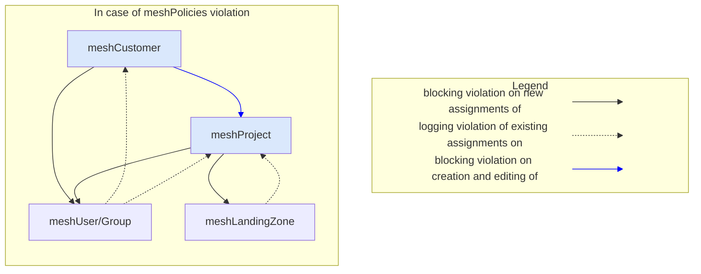

## Introduction: what are meshPolicies?

A meshPolicy describes a restriction between two meshObjects. You can only define a meshPolicy on certain meshObjects by using their defined tags. These particular meshObjects are called meshSubjects.

> **meshCustomer**, **meshProject**, **meshUser/Group** and **meshLandingZone** are meshSubjects

For ease of use, we restrict the combinations of meshSubjects which do not make sense. Each meshPolicy describes which [tag](meshcloud.metadata-tags.md) values have to be present on both meshSubjects to comply with the meshPolicy. By setting an [evaluation strategy](meshcloud.policies.md#meshPolicy-evaluation-strategy) you can decide how the meshSubjects are evaluated against each other.

> meshPolicies will only be enforced for meshCustomers. meshPartner is excluded.

meshPolicies are enforced in various places wherever you edit a tag of a meshSubject or assign a meshSubject to another meshSubject (e.g. assigning a meshUser to meshCustomer in the Access Control). How meshPolicies can be configured is described [here](administration.mesh-policies.md).

### Authoritative and affected meshSubject

The terms authoritative and affected meshSubject shall make clear in which direction the meshPolicy will be evaluated.

We have a limited selection of authoritative and affected meshSubject combinations. Valid combinations are

- meshCustomer -> meshUser/Group
- meshCustomer -> meshProject
- meshProject -> meshUser/Group
- meshProject -> meshLandingZone

You can find the authoritative meshSubject on the left side and the affected meshSubject on the right side. In general, the authoritative meshSubject restricts the affected meshSubject depending on a selected evaluation strategy and the chosen tags.

### meshPolicy evaluation strategy

A meshPolicy evaluation strategy describes a strategy how authoritative and affected meshSubjects shall be evaluated in the context of a meshPolicy. In that way, you can decide in which form the tags values have to be present on both meshSubjects to comply with the meshPolicy. As mentioned before, meshPolicies are built on top of meshStack's [tagging](./meshcloud.metadata-tags.md) system. By that system, you can allow your tag to only have one value or multiple values. For the evaluation, all tags are treated as arrays: no matter if there are no values, a single value, or multiple values. This means you can also create a meshPolicy that evaluates a single-select tag against a multi-select tag.

> If **neither** meshSubject has the tag defined in your meshPolicy, your meshSubjects are evaluated as compliant with that meshPolicy.

There are two different selectable evaluation options `Subset` and `Intersection`.

#### Subset

Describes an evaluation strategy that the tag values of the affected meshSubject **must be a subset** of the authoritative meshSubject tag values. The evaluation of a `Subset` is successful, if the affected meshSubject is only tagged with values which are also present in the tag values of the authoritative meshSubject.

> Recommended for meshPolicy between:
>
> - meshCustomer -> meshProject

Example:

In this example, we're looking at a meshPolicy between a meshProject's `environment` tag, and a meshCustomer's `environment` tag with the following allowed values: `dev`, `qa`, and `prod`. The meshProject is the affected meshSubject and the meshCustomer is the authoritative meshSubject.

| meshProject  | meshCustomer | Result | Explanation                                                             |
| ------------ | ------------ | ------ | ----------------------------------------------------------------------- |
| `prod`       | `prod`       | ✓      | `prod` is present on both meshProject and meshCustomer                  |
| `prod`       | `dev`, `qa`  | ✖      | meshProject `prod` is not present on meshCustomer `qa`,`dev`            |
| < empty >    | `dev`        | ✖      | No overlapping value, the meshProject has no tag values at all          |
| < empty >    | < empty >    | ✓      | Both tags have no values, which equates to a successful evaluation      |
| `prod`, `qa` | `qa`, `dev`  | ✖      | meshProject `prod` is not present in meshCustomer `qa`,`dev`            |
| `dev`, `qa`  | `qa`, `dev`  | ✓      | `dev`, `qa` is present on both  meshProject and meshCustomer            |

#### Intersection

Describes an evaluation strategy that the tag values of the affected meshSubject **must have an intersection** with the tag values of the authoritative meshSubject tag values. The evaluation of a `Intersection` is successful, if at least one tag value is present on both meshSubjects.

> Recommended for meshPolicy between:
>
> - meshCustomer -> meshUser/Group
> - meshProject -> meshUser/Group
> - meshProject -> meshLandingZone

Example:

In this example, we're looking at a meshPolicy between a meshUser/Group `environment` tag, and a meshCustomer's `environment` tag with the following allowed values: `dev`, `qa`, and `prod`. The meshUser/Group is the affected meshSubject and the meshCustomer is the authoritative meshSubject.

|  meshUser/Group  | meshCustomer | Result | Explanation                                                             |
| ---------------- | ------------ | ------ | ----------------------------------------------------------------------- |
| `prod`           | `prod`       | ✓      | `prod` is present on meshUser/Group and meshCustomer                    |
| `prod`           | `dev`, `qa`  | ✖      | meshUser/Group `prod` is not present on meshCustomer `qa`,`dev`         |
| < empty >        | `dev`        | ✖      | No overlapping value, the meshUser/Group has no tag values at all       |
| < empty >        | < empty >    | ✓      | Both tags have no values, which equates to a successful evaluation      |
| `prod`, `qa`     | `qa`, `dev`  | ✓      | meshUser/Group `qa` is present in meshCustomer `qa`,`dev`               |
| `dev`, `qa`      | `qa`, `dev`  | ✓      | `dev`, `qa` is present on meshUser/Group and meshCustomer               |

### meshPolicies for meshUsers/Groups

meshUsers and meshCustomerUserGroups are treated as one when it comes to meshPolicies. You can only define a meshPolicy for "meshUser/Group". Those meshPolicies will always apply to both meshSubject types. It is not possible to define a meshPolicy that only matches meshUsers, but not meshCustomerUserGroups. The reason for that is, that you can assign both meshSubject types (meshUsers and meshCustomerUserGroups) to meshCustomers and meshProjects. If you want to restrict this access to e.g. only allow access to production for certain users and groups, the meshPolicy always has to apply to both meshSubject types. It wouldn't make sense to restrict only the assignment of groups, but you could still assign any user. Because of that, you can only select "meshUser/Group" as a meshPolicy subject in a meshPolicy.

meshUsers exist on a global level and are not related to a specific meshCustomer. If you want to define a meshPolicy to only provide certain meshUsers/Groups access to a e.g. production projects, the following aspects have to be considered:

1. If a user is globally defined to have access to any production project, you can add the production environment tag to that user, so this user gets access to all production projects in all meshCustomers.
2. If you want to maintain per meshCustomer who has access to production projects, you have to use [meshCustomerUserGroups](./meshcloud.customer.md#user-groups) for that. It is not possible to assign a single meshUser certain tags within a certain meshCustomer.
3. To provide easy access to "unrestricted" projects (e.g. those with the environment "dev" and "qa") we provide [default tags](./meshstack.metadata-tags.md#tags-on-meshusers) for meshUsers. meshStack makes sure that these default tags are applied to all users.

### What can I achieve with meshPolicies?

Based on your tags defined in the meshPolicies, you can

- restrict (new) meshProjects to a meshCustomer
- restrict the new _assignments_ of meshUsers/Groups to meshCustomers
- restrict the new _assignments_ of meshUsers/Groups to meshProjects
- restrict the new _assignments_ of meshLandingZones to meshProjects

### When am I impacted by meshPolicies?

> If your organization has no meshPolicies defined, the information below is not relevant.

We will discuss the possible places here, you may encounter meshPolicies when doing any of the following actions:

1. Creating a new meshProject
   1. When adding a meshPlatform with a meshLandingZone to a new meshProject, all meshPolicies are evaluated between a 'meshProject' and a 'meshLandingZone'
   2. When adding a new meshUser or meshCustomerUserGroup to a meshCustomer, all meshPolicies are evaluated between the 'meshCustomer' and the 'meshUser/Group'.
   3. Upon saving a new meshProject, all meshPolicies are evaluated between 'meshCustomer' and 'meshProject'.
2. Editing a meshProject
   1. When adding a new meshTenant with a meshLandingZone all meshPolicies are evaluated between the 'meshProject' and the selected 'meshLandingZone'.
   2. When adding a new meshUser or meshCustomerUserGroup to a meshProject, all meshPolicies are evaluated between the 'meshProject' and the 'meshUser/Group'.
   3. When changing a tag value (e.g. changing the environment) of a project, **all** meshPolicies related to the meshProject are evaluated as it impacts many meshSubjects. The following meshSubjects will be evaluated against the meshProject:
      - the meshCustomer the project lives in
      - all assigned meshLandingZones
      - all assigned meshUsers
      - all attached meshCustomerUserGroups
3. Adding a meshUser or meshCustomerUserGroup to a meshCustomer. All meshPolicies are evaluated between 'meshCustomer' and 'meshUser/Group'.

> In the meshPanel, non-compliant choices are disabled or excluded in the lookup case of the meshUsers/Groups.

### What happens when I violate a meshPolicy?

It might happen, consciously or unconsciously, that you violate one or more meshPolicies. At every place in the meshPanel that is mentioned above this section, we prevent you from committing a violation by disabling non-compliant choices or excluding them from the lookup in case of the meshUsers/Groups. Via the meshPanel, you will therefore barely come across a violation. But there are some cases, in which can't disable the non-compliant choices for you. Thus, we prevent you from finalizing the violation by prompting an error message explaining which meshPolicy or -policies you violated, and why.

Take this meshPolicy violation as an example (see the picture below), where we have a meshPolicy defined on 'meshCustomer' and 'meshProject' with the evaluation strategy 'Subset', both on the `environment` tag.

The project is called 'my-example-project-prod' now only has environment `prod` set and the meshCustomer 'managed-customer' the project lives in, has environments `dev`, `test` and `qa` defined. This means there is a mismatch as `<prod>` is not inside `<dev, test, qa>`. To solve this problem, we have to pick an environment that is defined on the meshCustomer, e.g. `dev`. After picking a valid environment value, we can save the project again, and (if we don't violate any further meshPolicies) the project tag is successfully saved, including the right compliance for your organization! ✅

### Are there any other places where meshPolicies are enforced?

Besides end-users being impacted at the places above, there are also other places where meshPolicy violations could be caused. For example, while editing tags of the authoritative meshSubjects like meshCustomer or meshProject. Your tag choices might not be compliant with your existing assignments anymore. These violations will be logged. The diagram below describes all possible relationships between meshSubjects and the behavior that is expected depending on the change of a meshSubject.

> If you have a meshPolicy between the meshCustomer and meshProject.
> Editing meshProject tags still cause a blocking violation if not compliant with a meshCustomer.

### What are some examples?

> The information below might be more relevant for administrators, but nevertheless it should give you a rough idea of how meshPolicies could be implemented.

Your organization is fully free to define meshPolicies across the entire meshStack. A few common use cases are:

1. Enforcing that a meshProject is used for an environment that is also defined on its meshCustomer.

   Imagine a meshCustomer with `environment=[sandbox, test]`. If there is a meshPolicy in place between meshCustomers and meshProjects on the environment tag, users cannot create new meshProjects that use an environment that is **not** available on the meshCustomer, for example `environment=[prod]`.

   > You can configure the environment tag as [immutable](./meshcloud.metadata-tags.md#immutable-tags). Immutable means that the tag values of the environment tag can only be set during the creation of the meshSubject. It can't be changed afterward. With this configuration, you can ensure the meshSubject is always compliant with its existing assignments.

2. Enforcing that a meshProject only has meshUsers/Groups that are allowed access highly confidential projects or production projects.

3. Enforcing that a meshProject only has meshLandingZones assigned to it that are meant for the environment of the meshProject.

4. Enforcing that a meshProject only has meshLandingZones assigned to it that are meant for the given business unit of the meshProject.
