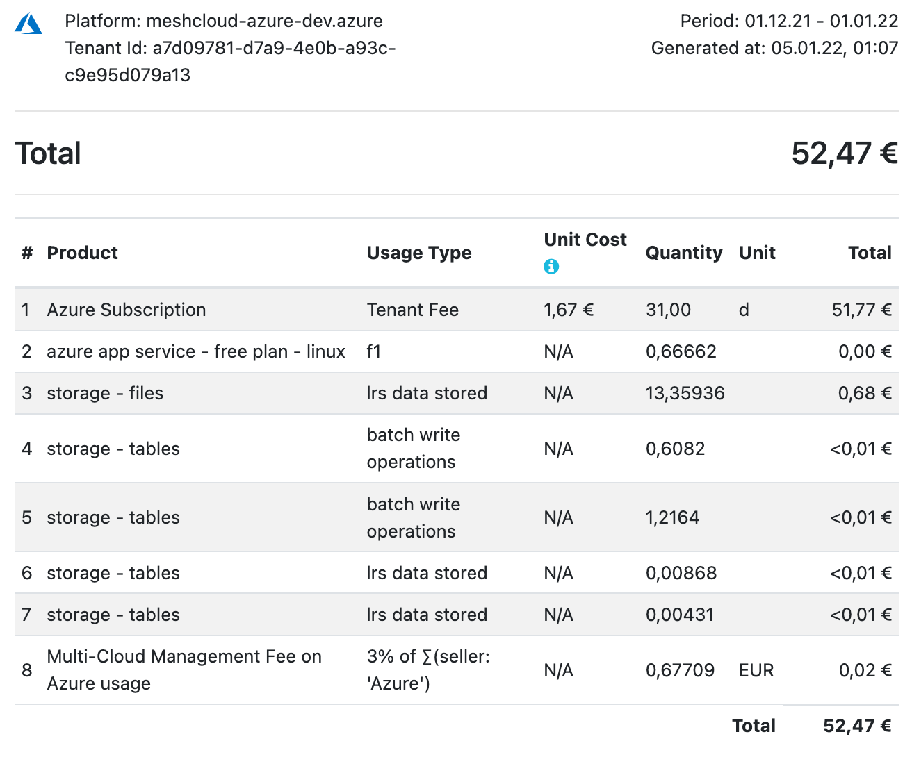
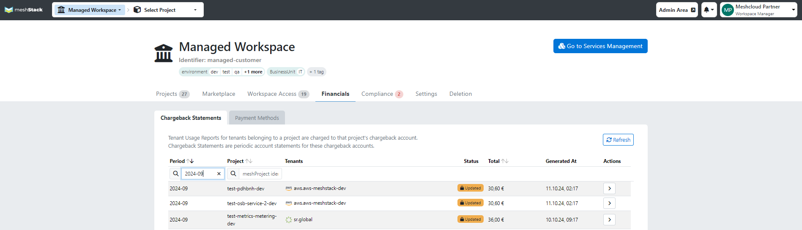
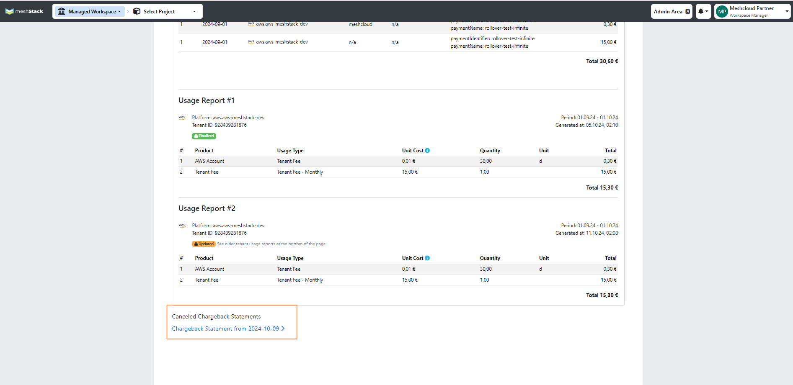

meshStack provides central [multi-cloud billing](meshstack.billing.md). It can automatically collect usage information from all your cloud platforms and provides central access to cost and usage data.

This information will be consolidated by project, providing an overview of resource usage, including detailed insights into when and how long your resources were running, along with the associated costs.

## Payment Information

A payment method is used to ensure transperent budget management and allocate costs back to the responsible team within your organization. One common example of a payment method is a cost center, which helps categorize and track expenses specific to team or projects. Please find more detailed information about payment methods and how they could be used [here](meshcloud.payment-methods.md).

As the cost and usage data are consolidated by project, payment methods will be also created in Workspace and assigned per project in meshStack.

## Reviewing Metering Data

### Tenant Usage Reports

A tenant usage report provides usage information of one tenant (project representation in a specific platform). This report shows for example all resources like VMs, Storage, Public IPs, etc.

Tenant Usage Reports can be accessed in the tenant control plane under **Financials** > **Usage Reports**.
meshStack generates a tenant usage report for every usage period (monthly).

> meshStack defines **usage period** as starting from the first day of a month to the last day of the month in UTC.

You also have access to a preview report of the current period (e.g. the current month), to always have full control of
your resources and their usage.

From a Tenant Usage Report you can also access a Detailed Report to see every single resource consumption.
That means you can e.g. see whether a resource was running for 3 hours, stopped for 5 hours and then started again for another 6 hours.

Partner accounts can access tenant usage reports for all their assigned meshWorkspaces in the Administration Area via **Platforms** > **Usage Reports**.

Note that unit costs for Azure and GCP services are not supported.
Therefore, the unit costs are not available in the Tenant Usage Reports for those platforms.

### Chargeback Statements

As an analogy from banking, you can think of a chargeback statement like a credit card statement you receive at the end of the month about your usage charged to your payment method.

This chargeback statement is attached to each project and each chargeback is composed of tenant usage reports, which are reports for each tenant. For example, if your project uses both AWS and GCP, you will have one chargeback that combines two tenant usage reports. To check your chargebacks go to **Financials** > **Chargeback Statements** in your workspace. Or as admin go to **Chargebacks Statements** page under the FinOps section.

> Chargebacks are finalized at the beginning of each month for the previous usage period to allow cloud providers to complete their reports. However, each chargeback only includes data from the month it was used. For example, an October chargeback, that was finalized on November 6th, will only include cloud usage from October.

Chargeback statements consist of **line items** showing the individual booking entries made into a chargeback account.
When booking a tenant usage report, meshStack splits up the report's `netAmount` by seller and product group into
individual entries. This split allows cloud foundation teams to process chargeback for different kinds of usage
like cloud provider cost vs. internal overhead fees.

#### Chargeback Statement Previews 

meshStack also regularly generates a preview of the chargeback statement for the current month, providing real-time cost data. This preview includes all tenant usage reports that meshStack expects to be finalized before the end of the chargeback period. The chargeback statement preview is available on the Chargeback Statements page, where it will be marked with an `Open` status label in the Status column.

> Please note that meshStack currently only generates a preview for the currently active chargeback period.
> A tenant usage report that will finalize in the next chargeback period will not be included in the current period's
> preview.

#### Tags and Payment Methods

The active payment method at the end of the reporting period will appear on the chargeback statement, so your organization's accountant will know whom to send the bill to. Tags associated with this payment method will also be included in the chargeback statement for easier financial management. So chargeback statement for June 2024 will show the tags and payment method that were set as on the last day of the month in this case June 30th. 

> When setting a payment method for the entire year, accountants should ensure that a payment method valid for the year 2022, for example, has an expiration date of January 1, 2023, rather than December 31, 2022. This ensures the payment method remains valid throughout the entire year.

#### Exporting Chargeback Statements

It is possible to do an export from these views by clicking on the "CSV Export" button.
This export will contain the line items (see above) of all the chargeback statements currently in the view.
The line item data is suitable for feeding into chargeback processing, e.g. importing it to an ERP System to transfer
budgets between cost centers.

Chargeback Statements also contain billing information per line item. Your Cloud Foundation team can [configure](meshstack.billing-configuration.md)
which information meshStack should include as billing information in chargeback statements.

> Cloud Foundation teams typically configure billing information to payment method name, identifier, expiration date and amount as well as any workspace tags, project tags and payment method tags.

You can review this billing information in meshPanel when opening chargeback statement. CSV Exports of chargeback statements also include the configured billing information.

#### Late Bills From Providers

Late bills from providers or any other corrections that arrive after the chargeback statement has been finalized will still be attributed to the month in which the usage occurred. This means that finalized chargebacks will be updated accordingly.

For example, if the September 2024 chargeback statement is finalized on October 6, 2024, but Azure generates an additional expense for September usage on October 10, the September chargeback statement will be updated to reflect this change. The statement will display an "Updated" label in the status column on the Chargeback Statements page. Additionally, the "Generation Date" column will indicate the most recent update to the statement.

When you open the dedicated chargeback statement, you can also identify what exactly changed by navigating down below the chargeback statement, opening an old one, and comparing it with a new one.

Transparency around updates in finalized chargeback statements extends in CSV exports, which always reflects the latest data as well as in API.

#### Retroactive Chargeback Statements

When no payment method is active on a meshProject, chargeback statements are not created at the end of a month. Only when an active payment method is applied at a later point in time does the chargeback statements generation resume. For missing months, where no payment method was applied the next chargeback statement with a valid payment method will contain the usage reports of the missing months.
