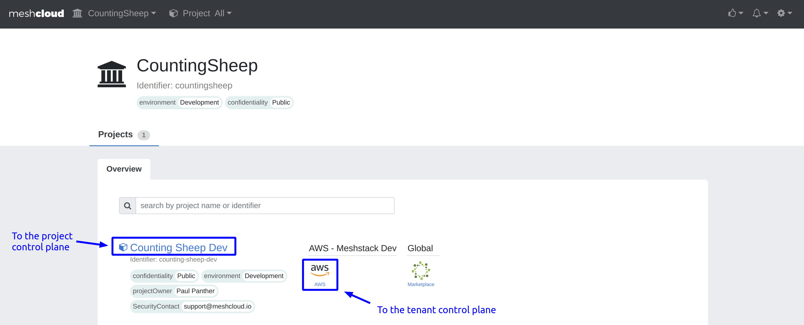
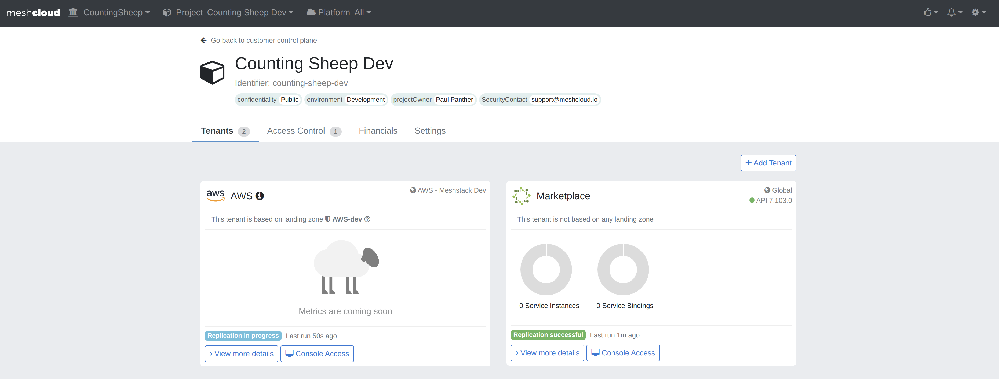

When users are [assigned](meshcloud.project.md#assign-user-to-a-meshproject) to a meshProject, this project appears in their projects overview on the workspace control plane, also known as their home screen. As long as they are not assigned to the project, they do not have access to its resources and the regarding control planes. To access the meshProject you can click on its name to get to the [project control plane](meshcloud.project-resources.md#project-control-plane) or you click on a specific Cloud Platform to get directly to the [tenant control plane](meshcloud.project-resources.md#tenant-control-plane).

As a Workspace Manager or Owner you are able to see all active meshProjects within your meshWorkspace in your home screen. Additionally, you can also access the project and tenant control plane of them even if your are not assigned to the project.
Only **Platform Access** won't still be possible in case you are not assigned to the project.

## Project Control Plane

In the project control plane you get an overview of all locations and their platforms, that are available for the selected meshProject.
Via the `View Details` button on the card for a specific platform, you'll get to the [tenant control plane](#tenant-control-plane).

In each of the cards on the project control plane, you can see the replication status of the tenant and the timestamp the tenant was last updated.
The tenant status is one of 'Replication failed', 'Replication in progress' or 'Replication successful'.

## Tenant Control Plane

The tenant control plane provides some general statistics of your meshProject in this cloud platform. Depending on the Cloud Platform type, the sidebar under the **Platform Access** tab on the left provides different options to interact with your cloud resources. The support varies by platform, but always includes a SSO login option to the platform's native CLI or web console.

A [OSB Services](marketplace.service-instances.md) is another type of cloud platform, that allows you to provision different type of services instances.

## CI/CD access to Cloud Platform

Platforms like AWS and Kubernetes provide advanced options to get access for you CI/CD pipelines. In case of OpenStack and Cloud Foundry, we provide the creation of [Service Users](meshcloud.service-user.md) for these purposes.
