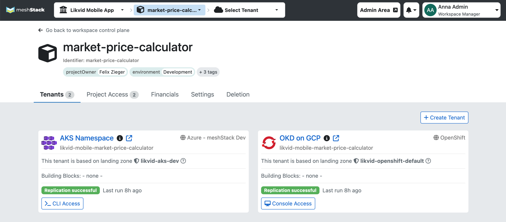
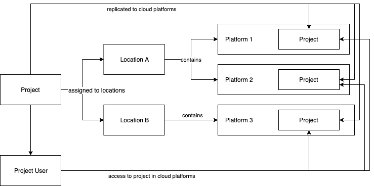

meshProjects are multi-cloud enabled projects that allow teams to manage and scale cloud resources across all [meshPlatforms](meshcloud.platforms.md) made available to their [meshWorkspace](meshcloud.workspace.md).

> Only users with the role [Workspace Manager](meshcloud.workspace.md#assign-meshworkspace-roles) or [Workspace Owner](meshcloud.workspace.md#assign-meshworkspace-roles) have access to the administrative functionality described in this section.

## Create a new meshProject

We wrote an extensive guide on how to create a new meshProject [here](meshstack.how-to.create-project.md).

## Manage meshProjects

In your [workspace control plane](meshcloud.workspace.md#managing-your-meshworkspace) under the **Projects** tab you will find all meshProjects of your meshWorkspace.
To manage a project, click the name of the meshProject to open the project control plane.

In the project control plane you can manage your tenants, payment information and the assigned users and groups of the project.

## Replication of Project Users

The following diagram shows how access rights and project [replication](meshcloud.tenant.md) result in the correct project access for your users.

Projects have a representation in each cloud platform that we call [meshTenant](meshcloud.tenant.md). Azure Subscriptions, AWS Accounts and Cloud Foundry Spaces are all examples of Tenants. Each meshProject can have at most one Tenant in cloud platforms enabled for the project.
meshcloud uses orchestration to ensure users assigned to a meshProject always have the same role on all Tenants associated with the Project.

### Adding meshTenants

The edit screen of a project shows the list of all active [meshTenants](meshcloud.tenant.md). Via a dropdown below this list, new meshTenants can be created by selecting the according [meshPlatform](meshcloud.platforms.md). They will be added to the project when clicking the `+` button. Depending on the configuration of the [meshPlatform](meshcloud.platforms.md), users may also have to select a [Landing Zone](meshcloud.landing-zones.md) for this platform.

When adding a [meshPlatform](meshcloud.platforms.md) to a meshProject, meshStack creates a representation of the meshProject for that meshPlatform. This representation is called a [meshTenant](meshcloud.tenant.md) and is an isolated cloud environment e.g. an AWS Account, Azure Subscription or Cloud Foundry Space.

[meshPlatforms](meshcloud.platforms.md) can also be removed from the project with some limitations. All resources in the [meshTenant](meshcloud.tenant.md) (i.e. OpenStack instances, Cloud Foundry Apps, etc.) have to be deleted manually before removing a meshPlatform. For a single meshTenant removal on a project, the same rules apply that are described in [Project Deletion](#delete-a-meshproject)

### Editing Payment and Project Settings

You can configure one or multiple [payment methods](meshcloud.payment-methods.md) for you meshWorkspace. For a meshProject you have to select a specific one, so the project resources can be billed via a specific payment method and to a specific billing address.

You also have the option of setting a substitute payment method on a project. This feature is enabled via a configuration in meshStack. A job that runs daily will check if the already assigned payment method is expired and if it is, will replace it with the substitute payment method. In that case, the substitute payment will be set to `None`.

Depending on the configuration of your meshStack implementation, you may be able to edit additional project [metadata tags](meshcloud.metadata-tags.md) here.

## Access Control on a meshProject

Before being able to assign a user or [user groups](meshcloud.workspace.md#user-groups) to a meshProject, the user or group must have been [invited to the meshWorkspace](meshcloud.workspace.md#invite-users-to-a-meshworkspace-team). By adding a group, all users of this group will be provided access to the meshProject. In the **Project Access** section of the project edit screen all users and groups of the project are listed and new ones can be added. When adding/changing or removing a user or a group, all users and members will be informed via email about this change of access rights they have.
While adding users or groups or updating roles on a project an expiration date can be set. All expired and soon expired roles will be listed under projects/expired access.
Soon expired access (expiration date < 7 days) will be highlighted with **yellow** and expired access will be highlighted with **red**.

If [4-eye-principle](meshstack.authorization.md#user-project-role-approval) is activated in your meshStack installation, an additional approval might be necessary, before a user or group is actually assigned/remove/updated on a project.

### Assign user to a meshProject

In the **Project Access** section you can find a type-ahead `Search for a workspace user or group` field at the bottom. You search for users via their first and last name, email address and username. Groups can be found via their group name and identifier. You have to select the user or group you want to assign in the dropdown. Also select a project role. Press the `+` to add the user or group to the project. Note that only users with a valid account on the meshPanel can access your projects. You can assign multiple project roles to a user or a group on the same project.

### Project Roles

Project roles grant a configured set of permissions in cloud platforms used by the project. Project roles can be configured according to existing requirements or policies, by default the following roles are used:

- **Project Reader**: A read-only user, like a finOps manager or similar.
- **Project User**: A default user, like a developer, who can manage resources in the cloud platform.
- **Project Admin**: An admin user, who can also change configurations of the project in the cloud platform.

### Update Project Role

You can change the Project Role, by choosing a different role in the dropdown at the **Project Access** section, and clicking the **disc** icon afterwards to save the change.

### Expiration of a user or group assignment

An expiration date can be set for an assignment to a project. When this expiration date is reached, access to the project will be revoked. An expiration date can be set directly when assigning a user or group to the project. It can also be updated any time.

Workspace Managers are informed about project role assignments that will expire soon via dashboard notifications on the my project screen and in the Account Dashboard.
Via "Projects" -> "Expired Access", the expired or soon to expire role assignments are listed and can be extended.

### Unassign user or group from a meshProject

In the **Project Access** section you can click the `-` button in the row of a user or group to remove them from the project. The users and members will not be able to access this project in meshPortal and the cloud platforms anymore. You can add the user or group to your project again later on and all related users will get access again.

## Delete a meshProject

If you would like to delete a project that is no longer used, open the corresponding project, navigate to **Deletion**. The project deletion will be finalized when the deletion of all meshTenants in the project has been performed successfully. If you want to keep the project but delete one or more individual tenants, you can also [delete a single meshTenant](meshcloud.tenant.md#delete-a-meshtenant) on the tenant control plane.

The [deletion procedure](meshcloud.tenant.md#delete-a-meshtenant) of your meshProject depends on the variety of meshTenants. There 3 possible cases:

1. a project contains exclusively tenants where we don't support automatic deletion (AWS, GCP, Azure, Kubernetes, OpenShift)
2. a project contains exclusively OpenStack, Cloud Foundry and OSB Services meshTenants
3. a project contains a project containing a combination of 1. and 2.

**1. Non-automatic deletion**: If the project contains tenants on which a partner or a platform engineer will have to perform manual deletion actions. Your project is deleted, when all tenant deletions have been confirmed by the partner or platform engineer.

**2. Automatic deletion**: The system will perform a check to see if any resources exist in the tenants of the project being deleted. If resources do exist in any of those platform tenants, you will be informed about them and have to manually delete those resources. Once you have performed the manual resource deletion, you can confirm the project deletion by entering the identifier of your project.

**3. Combination of the above**: If a projects contains a combination of tenants from 1. and 2. the tenants which don't require manual deletion are deleted automatically. For the other tenants the manual deletion step is necessary.

> Your meshProject is not deleted when any meshTenant requiring a manual deletion has been declined. This means, your meshProject will be available on the workspace control plane containing only the meshTenants whose deletion had been declined.
