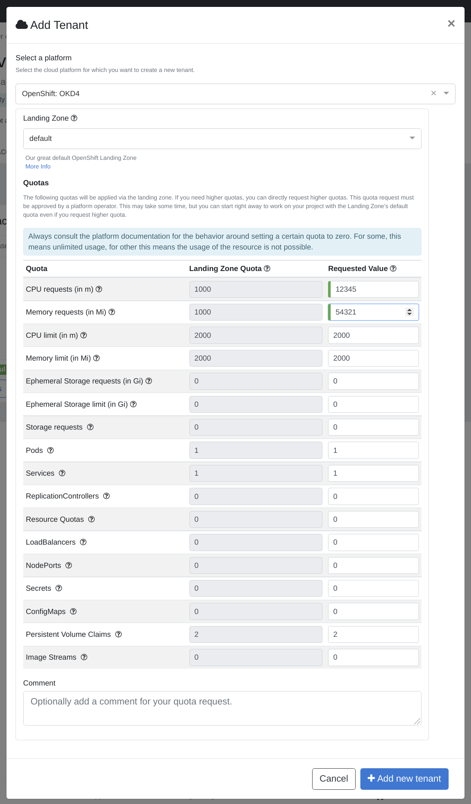
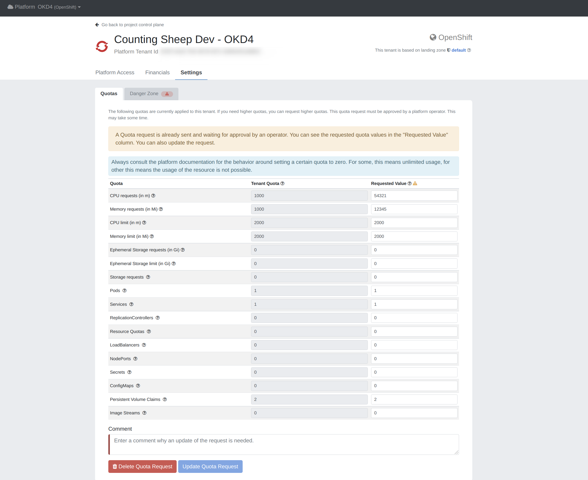

[meshTenants](./meshcloud.tenant.md) for private cloud platforms may get applied certain quotas to limit the available resources for these tenants.
A default quota can be applied via a [meshLandingZone](./meshcloud.landing-zones.md). If you need a higher quota, you can create a Tenant Quota Request.
You can define the quotas you need in such a request.

> Tenant Quota Requests are currently only supported for OpenShift tenants. More private cloud platforms will follow.

## Quota Request during meshTenant creation

You can directly submit a Tenant Quota Request when creating a meshProject or adding a meshPlatform to a meshProject. If the meshPlatform supports quotas, you will see the default quotas that will be applied via the [meshLandingZone](./meshcloud.landing-zones.md). If you already know that you need a higher quota, you can request higher quota values.

## Managing Tenant Quota for existing meshTenants

Quota requests can be made when editing a [meshProject](meshcloud.project.md). A dialog opens up when you click on the "tachometer" button next to the meshTenant.

You can also update and cancel existing requests in the dialog. Additionally you see which quotas are currently applied to your [meshTenant](./meshcloud.tenant.md).

## Approval of Tenant Quota Requests

Platform Operators will approve your Tenant Quota request. They may also modify it, if there is some inconsistency in the quota request or if there is a limit, that only
allows them to provide less quota than you requested. If they change it, they have to provide a reason why they changed it. You will find this comment in the tenant
quota dialog when managing your tenant quota as described above.
