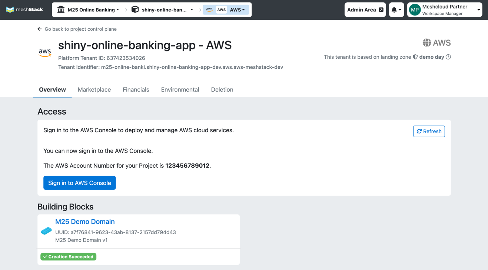

meshTenants are the representation of a [meshProject](./meshcloud.project.md) in a [meshPlatform](./meshcloud.platforms.md).
meshTenants are isolated cloud environments protected by multi-tenant mechanisms of the cloud platform. The following types of meshTenants are supported by meshStack:

- Accounts in AWS
- Subscriptions in Microsoft Azure
- Projects in Google Cloud
- Namespaces in Kubernetes & OpenShift
- Projects in OpenStack
- Spaces in CloudFoundry

## Using your Tenant

To use your tenant, open the tenant control plane by going to the [project control plane](./meshcloud.project.md#manage-meshprojects) and opening one of its tenants.

In the tenant control plane you can log in to the cloud platform, manage your Building Blocks, view costs associated to the tenant and book additional services for the tenant from the [marketplace](./marketplace.index.md).

## Replication and Reconciliation

meshStack combines the meshProject configuration (managed in self-service by the [meshWorkspace](./meshcloud.workspace.md) admins), the [Landing Zone](./meshcloud.landing-zones.md) and [meshPlatform](./meshcloud.platforms.md) configuration (managed by the platform operator) to compute a **desired state** for each meshTenant. For private cloud platforms this may include applying certain [quotas](./meshcloud.tenant-quota.md) to your meshTenant.

meshStack continuously reconciles the **actual state** of meshTenants with their desired state. This process is called replication and ensures that all cloud tenants governed by meshStack are in a known and expected state.

## Metadata Tags

meshStack automatically derives [metadata tags](./meshcloud.metadata-tags.md) for meshTenants based on the metadata tags set on the meshProject, the [payment method](./meshcloud.payment-methods.md) configured on the meshProject and
the meshWorkspace it belongs to.

Any update to tenant metadata (e.g. a change in payment method) triggers a new meshTenant reconciliation cycle.

## Delete a meshTenant

> Only users with the role [Workspace Manager](meshcloud.workspace.md#assign-meshworkspace-roles) or [Workspace Owner](meshcloud.workspace.md#assign-meshworkspace-roles) have access to the administrative functionality described in this section.

If you would like to delete a meshTenant that is no longer used, open the corresponding meshTenant and navigate to **Deletion**.

> If you delete the entire meshProject [submitted for deletion](meshcloud.project.md#delete-a-meshproject) instead,
> the meshProject will be deleted once all meshTenants within the meshProject have been deleted successfully.

When you delete a tenant it will be removed from the project view and submitted to the tenant deletion queue. You will also immediately loose access to the tenant in the cloud platform.
You can review the tenant deletion queue on the "Deletion Queue" tab from your Workspace view.

Tenant deletion always requires approval. It is possible that an operator will reject the deletion of a tenant, in which case it will be reinstantiated into the project.

Operators can configure how meshStack processes tenants on the deletion queue per landing zone.
meshStack will update the status of your tenant in the Deletion Queue accordingly and send notifications to keep you updated about deletion progress.

> If you are a platform operator and want to learn more about the approval and deletion workflows in the Admin Area, read more [here](./administration.delete-tenants.md)

## Reuse of an existing tenant

meshStack does not support reusing platform tenants. Imagine a tenant has been deleted, but the underlying platform tenant has not been deleted by the platform operator. You may think of reusing this tenant in another project. This is not supported by meshStack and will lead to an error during import. The reason for this current limitation is handling the reuse of tenants in the metering system. Having the same tenant being used by different projects (perhaps even within the same month), makes it hard or in some cases even impossible to decide which project to charge for this tenant. Therefore reusing platform tenants is currently not supported by meshStack.

> Read best practices on building a solid tenant management in your cloud foundation on the [cloud foundation website](https://cloudfoundation.org/maturity-model/tenant-management/).

## Deprovisioning / Deleting Tenants

Before a meshTenant can be [automatically deleted](meshcloud.tenant.md#automatic-deletion) by meshStack, users must make sure that no resources are left in the cloud platform tenants. This is a security measure as we do not want to accidentally delete a tenant with resources still used from the cloud platforms. We therefore check the absence of resources prior of tenant deletion and upon presence of a resource we stop the deprovisioning process.

This security check is currently supported for the platforms:

- CloudFoundry
- OpenStack
- OSB Services

> Since this security measure is very important, fully automated deprovisioning of projects from other platforms is currently not supported and requires [manual intervention](administration.projects.md#delete-tenants). We are looking into extending support for further automating this process in the future.
