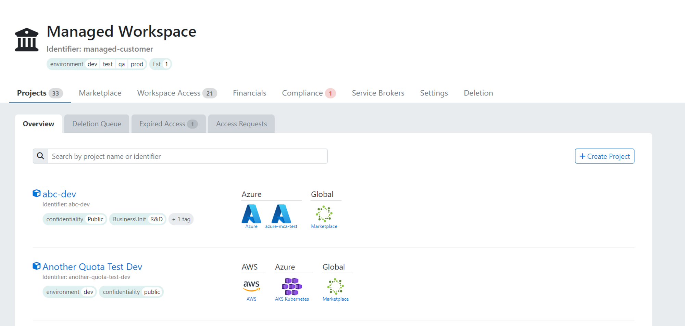
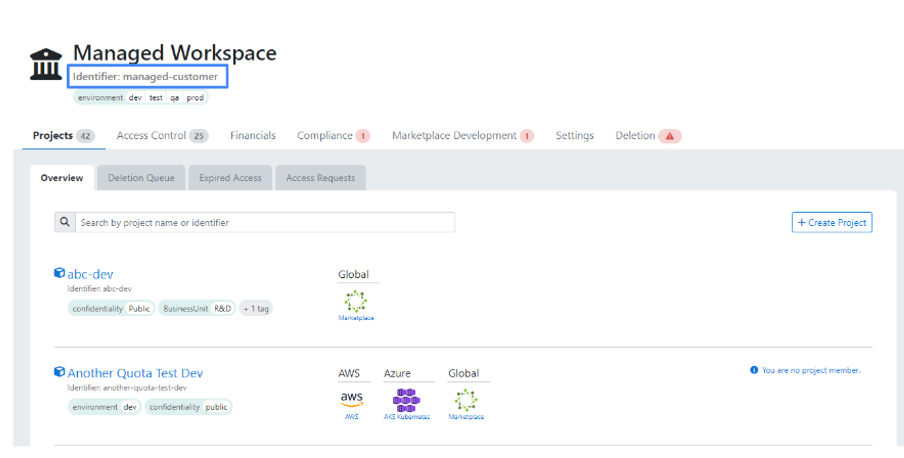

A meshWorkspace usually represents a product team or department in your organization. Self-service within a meshWorkspace
allows you to invite and manage team members, create [meshProjects](meshcloud.project.md) and maintain organizational metadata like payment methods.

## Workspace Creation

Organizations implementing meshStack can choose to offer self-service workspace registration via meshPanel or externalize
the process to some existing ITSM or process automation system. Partners can read more about these options [here](meshstack.onboarding.md#workspace-registration).

In any case, the meshWorkspace creation process always involves collecting basic workspace information like name, identifier
and any additional [metadata specific to your organization](meshstack.metadata-tags.md#workspace-tag-schema).

## Managing your meshWorkspace

Every aspect of your meshWorkspace can be managed in the so-called [workspace control plane](./meshcloud.workspace.md#managing-your-meshworkspace). The workspace control plane is the highest control plane. From that level, you can navigate down to the [project control plane](meshcloud.project.md#manage-meshprojects) & [tenant control plane](meshcloud.tenant.md#using-your-tenant). Each control plane has a similar layout. Depending on your permissions within the workspace and the meshStack configuration, you will have access to different tabs like **Settings** or **Financials**. The workspace control plane below shows the control plane from the perspective of a Workspace Manager.

General information of a meshWorkspace (like its name) and [Workspace Tags](meshstack.metadata-tags.md#workspace-tag-schema) can be edited under the **Settings** tab.
The workspace identifier is also shown here, but it can never be changed,
as it is used as an immutable identifier of the meshWorkspace for its
representation in the different cloud platforms. You are however able to change the display name of the meshWorkspace.

If configured by your Cloud Foundation team, you may also be able to edit additional workspace [metadata tags](meshcloud.metadata-tags.md) in the Settings Tab.

## Invite Users to a Workspace Team

If you would like to give others access to your meshWorkspace and the related meshProjects, go to your **Workspace Access** tab.
You can access them by pressing the settings icon on the top right of the meshPanel.
From here, navigate to **Current Access**. Here you can invite users or groups to the meshWorkspace.
You can search for users via first & last name, email and username. The users that can be found via
this search depend on the configured IAM system in you meshInstallation. It is e.g. possible to search for users in an Active Directory or a Google Cloud Directory. Additionally all users already known to meshStack can be found via this user search. Besides users, also [groups](#user-groups) can be searched for. You can search for groups via their name and identifier.

If you want to invite a user that it is not known to the connected IAM system and meshStack, you are able to invite a user by providing
the first and last name as well as an email address. The invited user will be matched via the email address when he logs in the first time to meshStack.
The "invite user" link is available when the search did not return any results.

You can initially setup the meshWorkspace role in the dropdown which describes the access level of the invited user or group.
Press "+" to add to the meshWorkspace. All users and members of the group will receive an email with the information,
that they have been granted access to your meshWorkspace.

Assigning a meshWorkspace role is necessary in order to give access to [meshProjects](meshcloud.project.md) insight the meshWorkspace.
If 4 eyes-principle is active, the user or group will not be assigned directly to your meshWorkspace. Another Workspace Manager has to approve this role assignment first. Therefore the user or group will appear in the "Pending Requests" section.

## Workspace User Groups

For not having to assign multiple users individually to your projects, you can also group them in a user group. User groups can be assigned roles on a [meshWorkspace](#invite-users-to-a-meshworkspace-team) and a [meshProject](meshcloud.project.md#access-control-on-a-meshproject) in the same way as for usual users.

You can view workspace user groups within your workspace by going to the **User Groups** section in the **Access Control** tab.
Currently, creating a group is only supported via the [meshStack API](pathname:///api/) and to create one you will need a Workspace identifier, which you can find on the Workspace overview.

### Creating Groups in meshStack

You can create groups directly in meshStack using the `meshWorkspaceUserGroup` declarative API endpoint. This API allows you to create workspace-specific groups, add users to these groups, and remove users. 

However, be aware that whenever you update the group, you must send the full list of members, as this API will replace the existing members with the list you provide.

## Assign Workspace Roles

You can change the role assigned to each user or group on the current meshWorkspace.
To change the assigned role choose a new role from the dropdown.

A user or a group can be assigned multiple roles simultaneously. All users and members will receive the combined rights of all their assigned roles.

The following roles are available:

- **Workspace Owner**: Has full access to the meshWorkspace and its projects and can manage access to the meshWorkspace. A user that has this role will be the contact person for any matters related to the meshWorkspace. There can be maximum two Workspace Owners in a meshWorkspace. If a Workspace Owner already exists, that Workspace Owner can assign the Workspace Owner role to another user. If a Workspace Owner doesn't exist, the Workspace Managers can assign a Workspace Owner.
- **Workspace Manager**: Has full access to the meshWorkspace and its projects and can manage access to the meshWorkspace.
- **Workspace Member**: Has full access to project resources, but **cannot** manage access, create projects, etc. of the meshWorkspace.

### Workspace Roles

The following table provides details about the functionality available to the different roles.

<!-- TODO: we should add a better hierarchy at some point and thin this list down -->

|                                                                                                                      | Workspace Owner | Workspace Manager | Workspace Member |
|----------------------------------------------------------------------------------------------------------------------| :------------: | :------------: |:----------------:|
| View Projects                                                                                                        |    &#10003;    |    &#10003;    |  (if assigned)   |
| [Workspace&nbsp;Projects](meshcloud.project.md#manage-meshprojects)                                                  |    &#10003;    |    &#10003;    |                  |
| &nbsp;&nbsp;[Create&nbsp;Project](meshcloud.project.md#create-a-new-meshproject)                                     |    &#10003;    |    &#10003;    |                  |
| &nbsp;&nbsp;[Edit&nbsp;Project](meshcloud.project.md#manage-meshprojects)                                            |    &#10003;    |    &#10003;    |                  |
| &nbsp;&nbsp;&nbsp;&nbsp;[Add&nbsp;meshTenants](meshcloud.project.md#adding-meshtenants)                              |    &#10003;    |    &#10003;    |                  |
| &nbsp;&nbsp;&nbsp;&nbsp;[Delete&nbsp;meshTenants](meshcloud.tenant.md#delete-a-meshtenant)                           |    &#10003;    |    &#10003;    |                  |
| &nbsp;&nbsp;&nbsp;&nbsp;[Payment&nbsp;Information](meshcloud.project.md#provide-payment-information-for-meshproject) |    &#10003;    |    &#10003;    |                  |
| &nbsp;&nbsp;&nbsp;&nbsp;[Access&nbsp;Control](meshcloud.project.md#access-control-on-a-meshproject)                  |    &#10003;    |    &#10003;    |                  |
| &nbsp;&nbsp;[Expired&nbsp;Access](meshcloud.project.md#expiration-of-a-principal-assignment)                         |    &#10003;    |    &#10003;    |                  |
| &nbsp;&nbsp;[Project&nbsp;Statements](meshcloud.project-metering.md#project-statement)                               |    &#10003;    |    &#10003;    |                  |
| &nbsp;&nbsp;[Delete&nbsp;Project](meshcloud.project.md#delete-a-meshproject)                                         |    &#10003;    |    &#10003;    |                  |
| [Workspace&nbsp;Users](meshcloud.workspace.md)                                                                       |    &#10003;    |    &#10003;    |                  |
| &nbsp;&nbsp;[Give&nbsp;Access](meshcloud.workspace.md#invite-users-to-a-meshworkspace-team)                          |    &#10003;    |    &#10003;    |                  |
| &nbsp;&nbsp;[Edit&nbsp;Access](meshcloud.workspace.md#assign-meshworkspace-roles)                                    |    &#10003;    |    &#10003;    |                  |
| &nbsp;&nbsp;[Remove&nbsp;Access](meshcloud.workspace.md#remove-assigned-meshworkspace-roles)                         |    &#10003;    |    &#10003;    |                  |
| &nbsp;&nbsp;[Assign&nbsp;Workspace&nbsp;Owner](#assign-meshworkspace-roles)                                          |    &#10003;    |                |                  |
| [Workspace&nbsp;User&nbsp;Groups](meshcloud.workspace.md#user-groups)                                                |    &#10003;    |    &#10003;    |                  |
| [Workspace&nbsp;Settings](#workspace-deletion)                                                                       |    &#10003;    |    &#10003;    |                  |
| [Payment&nbsp;Methods](meshcloud.payment-methods.md)                                                                 |    &#10003;    |    &#10003;    |                  |
| [Service&nbsp;Broker&nbsp;Development](meshstack.meshmarketplace.development.md)                                     |    &#10003;    |    &#10003;    |                  |
| Delete Workspace                                                                                                     |    &#10003;    |                |                  |

> The roles that are available meshStack Administrators are described in the [Administration](administration.index.md) section.

meshWorkspace roles grant rights in meshStack only. In order to access cloud resources users need to be [granted a role on a meshProject](meshcloud.project.md#access-control-on-a-meshproject).

## Remove assigned Workspace Roles

If you would like to remove a user or group from your meshWorkspace go to the **Workspace Access** tab and select **Current Access**. You can click the "trash" icon in the **Current Access** section to remove the user or group from your meshWorkspace. If 4-AP is active in your meshInstallation and the role request has not been approved by another Workspace Manager yet, click the "trash" icon in the "Access Requests" section. When removing someone from the meshWorkspace, the user or group is automatically removed from all projects it has access to. All users won't be able to access cloud resources of your projects anymore, if they are not assigned via another role binding anymore. The users or members of the group will be informed via email, that their access to the meshWorkspace was revoked.

## Roles Recertification

If you do not have a central Identity and Access Management (IAM) system for recertifying roles, you can still recertify roles locally in meshStack by controlling the duration of access for a Workspace. To do this, navigate to the Settings page and select the Compliance tab. From there, you can choose a specific time frame for a particular Workspace role, such as a 6-month limit for the Workspace Owner role. This means that users cannot be assigned to the Workspace Owner role for longer than 6 months. By choosing a specific time frame, you also make it mandatory to set an expiration date for Workspace roles. This means that an expiration date for a Workspace role will be required during Workspace creation or when assigning users afterward. After the expiration date, users will be automatically unassigned from Workspace.

Role recertification is also available for assigning users to the role via API. When you enable Workspace Role Recertification in the Settings, the system will automatically set an expiration date when you create a WorkspaceUserBinding or WorkspaceGroupBinding using the meshObject API. For instance, if you've configured on the Settings page to limit a Workspace Owner's access to 6 months, any Workspace Owner created via the API will automatically have an expiration date of 6 months from the date they were created.

## Workspace Deletion

Before a meshWorkspace may be deleted, a check is performed to verify the following:

- all meshProjects in the meshWorkspace have been deleted
- all published Service Brokers in the meshWorkspace have been [deactivated](meshstack.meshmarketplace.development.md#deactivation-of-service-brokers)

The deletion can be performed only by the Workspace Owners! You can delete the workspace under **Deletion** in the workspace control plane. You will be asked for confirmation and a deletion reason.

Note : The deletion of a workspace can not be reversed!

The following steps will be done during deletion:

- all assigned users & groups as well as pending binding requests will be removed from the meshWorkspace
- all payment methods on the meshWorkspace will be soft-deleted, so meshPartners can still get details like info on usage of these payment methods
- all policy violations related to the deleted meshWorkspace will be removed
- a "deleted" event is written to the workspace events, including a reason that was provided during deletion

meshWorkspaces are soft-deleted, so meshPartners can still see deleted meshWorkspaces and their events in the Admin Area. Deleted meshWorkspaces and meshPaymentMethods will be highlighted by a "Deleted" label.
