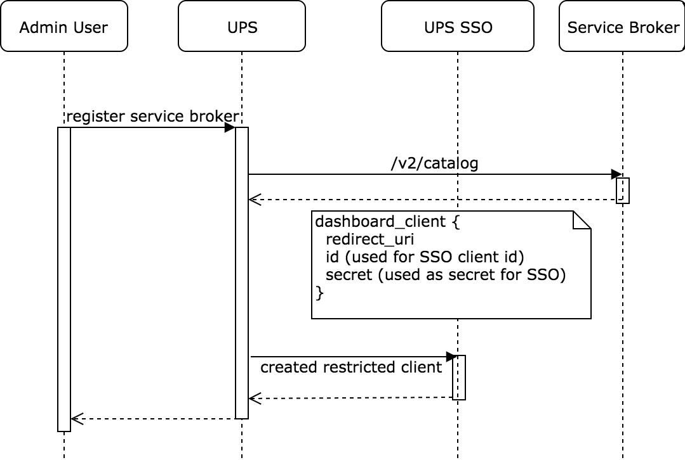
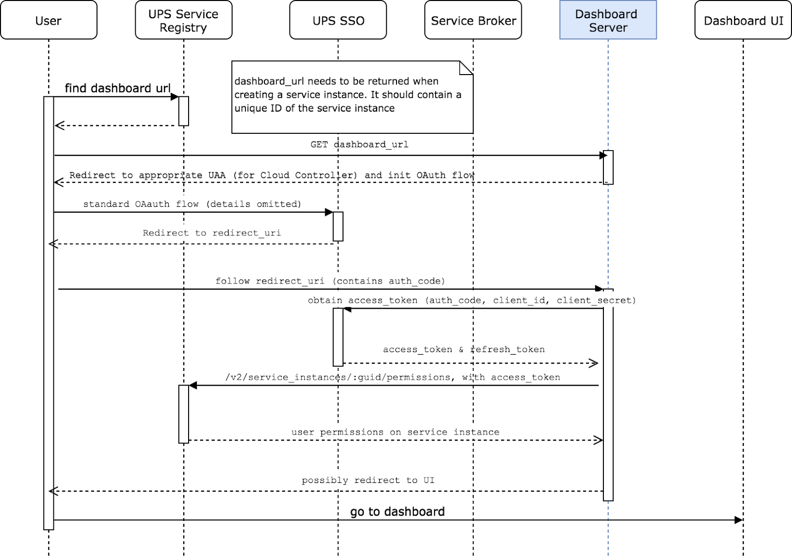

> **Important! This functionality is only available on the meshStack Enterprise plan**
> If you are on a SaaS plan and you want to replicate Authorization information to another
> system, please consider using [Azure Active Directory Permission Replication](meshstack.meshmarketplace.index#aad-permission-replication)
> or build your own integration using the [meshObject API](pathname:///api/).

Service Brokers can offer dashboards for their service instances. Users can use the dashboard to interact with the service, e.g. for monitoring and service configuration. This tutorial explains how to implement a dashboard for the OSB Services Platform

## Overview of the SSO Flow

Since only the OSB Services Platform knows which users may have access to a specific service instance, Service Broker Dashboards must integrate with the OSB Services Platform’s SSO provider (meshIdB). This section describes the OAuth code flow, that must be used by the Service Broker to provide a Dashboard integrated with meshStack Single-Sign-On (SSO).

### 1. Create restricted client in meshIdB for Service Broker

The platform (OSB Services) retrieves the desired SSO OAuth client information from the Service Broker when retrieving the service catalog (see figure below). The OSB Services Platform then proceeds with creating the client in meshIdB, if it doesn’t exist yet.



Service Brokers should be aware that there’s only a single, global namespace for dashboard client ids. It is recommended that Services use a client id  prefixed with a DNS name or other suitable identifier to ensure global uniqueness.

### 2. The OAuth flow + Authorization

When the user accesses the dashboard, the dashboard has to follow the auth flow as follows:



Service Brokers need to discover the URLs for initiating the OAuth flow and for retrieving the permissions on the service instance from OSB Services Platfrom.

## Implementing a dashboard

The OSB API spec does not specify all necessary steps to achieve properly secured dashboard integration with a OSB Services Platform. This section describes how Service Brokers can discover user permissions and the URLs necessary for OAuth integration with OSB Services Platform specifically, leveraging the [OSB API Profile](meshstack.meshmarketplace.profile).

### Permissions on Service Instance Level

The authorization shall be done per service instance for every user who accesses the dashboard. This means that only users that are assigned to the project in the OSB Services Platform where the service instance was created, or users in the projects this service instance [is shared with](marketplace.service-instances#share-service-instance), shall have access to its dashboard. Therefore the OSB Services Platform provides a REST endpoint to retrieve the information whether the current user is allowed to access a specific service instance. This URL is submitted in the context object of a provision request as the property `permission_url`:

```json
{
  "permission_url": "https://{mesh-hostname}/serviceInstances/c48d065b-a123-4a1e-8021-2965928d022d/permissions",
  "...": "..."
}
```

When requesting the URL, the access token retrieved via the described OAuth flow, must be submitted in the Authorization header:

```yml
Authorization: Bearer eyHKJDSA57...
```

The response of this request contains a simple json object with a permission field, that can currently have the values `NONE` and `USER`.

```json
{
  "permission" : "USER"
}
```

If `NONE` is returned, the access to the dashboard must be denied for the user. If `USER` is returned, access must be granted. If the service instance id is not known by the OSB Services Platform (meshMarketplace), HTTP Status 404 is returned.

### Initiating the OAuth Flow

There are two ways for Service Brokers to initiate the OAuth flow for SSO. Implementers can choose the way that’s more convenient for them.

#### 1. Use OAuth URLs available in the context

To simplify the OAuth flow for the service brokers and to guarantee, that the service broker uses the same IdB as the platform, the `auth_url` is part of the context when provisioning a service instance.

```json
{
  "auth_url":"https://{mesh-hostname}/auth/realms/meshfed/protocol/openid-connect/auth?client_id=my-service-client-id&response_type=code&redirect_uri={redirect_uri}&nonce={nonce}&state={state}",
  "...": "..."
}
```

This URL is a template. The `redirect_uri` must be set by the Service Broker (to redirect to a specific URI containing the service instance id or similar). The random parameters nonce and state have to be generated and replaced by the service broker (see OpenID documentation for this.)
For the OAuth flow, a token endpoint is required too. It is a static link and the request must be built as described in the OpenId documentation.

```json
{
  "token_url": "https://{mesh-hostname}/auth/realms/meshfed/protocol/openid-connect/token",
  "...": "..."
}
```

#### 2. Use X-Api-Info-Location header as in Cloud Foundry

For being compatible with Cloud Foundry and making integration easy for Service Brokers, that are already using the Cloud Foundry SSO, an `X-Api-Info-Location` header is submitted on every request the meshMarketplace executes to the Service Broker.

The header contains an URL to retrieve general information like the auth URL.

```yml
X-Api-Info-Location: http://{mesh-hostname}/info
```

The response when calling this URL has the following content:

```json
{
  "authorization_endpoint": "https://{mesh-hostname}/auth/realms/meshfed/protocol/openid-connect/auth",
  "token_endpoint": "https://{mesh-hostname}/auth/realms/meshfed/protocol/openid-connect/token"
}
```
