AWS is a proprietary public cloud platform provided by Amazon Web Services. meshStack supports project and user management for AWS to include AWS services into cloud projects managed by meshStack.

meshStack supports project creation, configuration, user management and SSO for AWS.

## Integration Overview

To enable integration with AWS, Operators deploy and configure the meshStack AWS Connector. Operators can configure one or multiple `PlatformInstance`s of `PlatformType` AWS. In a typical setup, we recommend grouping each AWS `PlatformInstance` in a separate `Location`.

This makes AWS available to meshProjects like any other cloud platform in meshStack.

meshStack automatically configures AWS IAM in all managed accounts to integrate SSO with [meshStack Identity Federation](./meshstack.identity-federation.md).

meshStack uses [AWS Organizations](https://aws.amazon.com/organizations/) to provision and manage AWS Accounts for [meshProjects](./meshcloud.project.md). To use AWS with a meshStack deployment, operators will need an AWS [management account](https://docs.aws.amazon.com/organizations/latest/userguide/orgs_getting-started_concepts.html) acting as the parent of all accounts managed by meshStack. The complete meshStack setup contains three dedicated accounts:

* management account: organization management account, the account that hosts the AWS Organization. `meshfed-service-user` needs to assume a role in this account to perform tasks such as new account provisioning.`meshfed-service-user` (Replicator User)
* meshcloud account: meshStack will use this account to host the IAM users used by meshStack. `meshfed-service-user` (Replicator User) lives in this account. We have a dedicated account for this user so that meshcloud can easily roll the credentials of the user when needed.
* automation account: meshStack will use this account to manage CloudFormation that are used in [Landing Zones](https://docs.meshcloud.io/docs/meshcloud.landing-zones.html).

```mermaid
graph LR;
    subgraph Organization Account
        meshfedServiceRole("🪖 MeshfedServiceRole");
        costExplorerServiceRole("🪖 MeshCostExplorerServiceRole");
    end
    subgraph meshcloud Account
        replicatorUser["👤 ReplicatorUser & AccessKey"];
        costExplorerUser["👤 CostExplorerUser & AccessKey"];
    end
    replicatorUser--Trusted Entity with External-id-->meshfedServiceRole;
    costExplorerUser--Trusted Entity with External-id-->costExplorerServiceRole;
    subgraph Automation Account
        meshfedAutomationRole("🪖 MeshfedAutomationRole");
    end
    replicatorUser--Trusted Entity with External-id-->meshfedAutomationRole
```

### IAM Roles and Service Control Policies

When a user (e.g. a developer) accesses an AWS Account, they are assigned an AWS IAM role based on their project role configured on the corresponding meshProject. Operators can configure these roles and their permissions by providing an [AWS Cloud Formation](https://aws.amazon.com/cloudformation/) template. meshStack uses this template to initialize and update AWS Account configurations.

When configuring these roles, operators must take care to correctly guard against privilege escalation and maintain project sandboxing. Operators should also consider leveraging [Service Control Policies](https://docs.aws.amazon.com/organizations/latest/userguide/orgs_manage_policies_scp.html) to simplify role configuration and set up a guarded boundary for the maximum of permissions granted to any role.

## How to integrate AWS as a meshPlatform into meshStack

This is described in the Guide section under [How to integrate a meshPlatform into meshStack](meshstack.how-to.integrate-meshplatform.md).
