AWS is a public cloud platform provided by Amazon Web Services.
meshStack supports account creation, configuration, access control and cost management for AWS.

## Integration Overview

To enable integration with AWS, platform engineers configure one or multiple `meshPlatform`s of `PlatformType` AWS in the [Platform Administration](administration.platforms.md) in meshPanel.

meshStack uses [AWS Organizations](https://aws.amazon.com/organizations/) to provision and manage AWS Accounts for [meshProjects](meshcloud.project.md). To use AWS with a meshStack deployment, operators will need an AWS [management account](https://docs.aws.amazon.com/organizations/latest/userguide/orgs_getting-started_concepts.html) acting as the parent of all accounts managed by meshStack. The complete meshStack setup contains three dedicated accounts:

* management account: organization management account, the account that hosts the AWS Organization. `meshfed-service-user` needs to assume a role in this account to perform tasks such as new account provisioning.`meshfed-service-user` (Replicator User)
* meshcloud account: meshStack will use this account to host the IAM users used by meshStack. `meshfed-service-user` (Replicator User) lives in this account. We have a dedicated account for this user so that meshcloud can easily roll the credentials of the user when needed.
* automation account: meshStack will use this account to manage CloudFormation that are used in [Landing Zones](meshcloud.landing-zones.md).

```mermaid
graph LR;
    subgraph Organization Account
        meshfedServiceRole("🪖 MeshfedServiceRole");
        costExplorerServiceRole("🪖 MeshCostExplorerServiceRole");
    end
    subgraph meshcloud Account
        replicatorUser["👤 ReplicatorUser & AccessKey"];
        costExplorerUser["👤 CostExplorerUser & AccessKey"];
    end
    replicatorUser--Trusted Entity with External-id-->meshfedServiceRole;
    costExplorerUser--Trusted Entity with External-id-->costExplorerServiceRole;
    subgraph Automation Account
        meshfedAutomationRole("🪖 MeshfedAutomationRole");
    end
    replicatorUser--Trusted Entity with External-id-->meshfedAutomationRole
```

### IAM Roles and Service Control Policies

meshStack replicates meshProject roles as AWS IAM roles to AWS SSO. Platform engineers can configure the mapping of these roles via meshLandingZones.

When configuring these roles, platform engineers must take care to correctly guard against privilege escalation and maintain project sandboxing. Operators should also consider leveraging [Service Control Policies](https://docs.aws.amazon.com/organizations/latest/userguide/orgs_manage_policies_scp.html) to simplify role configuration and set up a guarded boundary for the maximum of permissions granted to any role.

## How to integrate AWS as a meshPlatform into meshStack

This is described in the Guide section under [How to integrate a meshPlatform into meshStack](meshstack.how-to.integrate-meshplatform.md).
