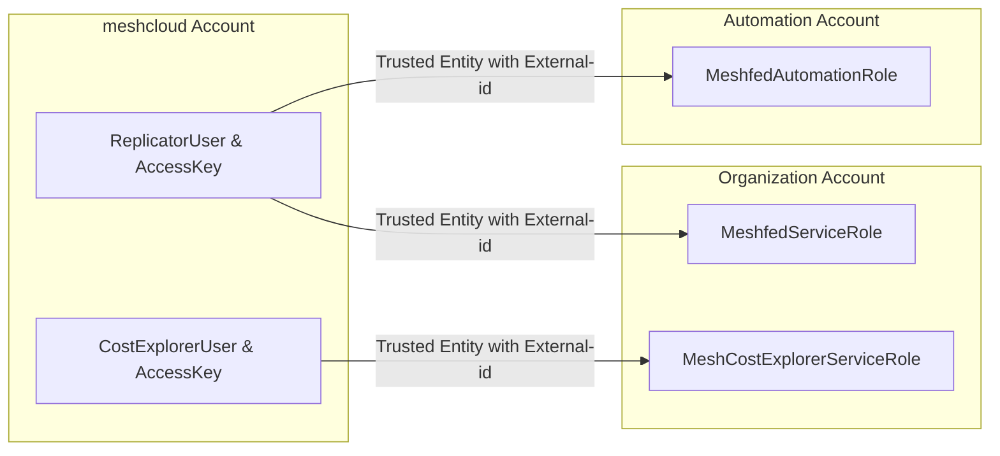

meshStack imports metering data from [AWS Cost Explorer](https://aws.amazon.com/aws-cost-management/aws-cost-explorer/).
It is recommended to have a daily report update interval in order to keep the costs of calling the API low. This can be
configured via the `awsStateCollectionInterval` property.

The `amortized cost` is used when generating the tenant usage reports.

## IAM User Configuration



### Policies

For the purpose of metering, meshStack requires the AWS Access Key and Secret Key of a user created in the `meshcloud` AWS account.
A role  should be created in the AWS `management account` which has the following policies attached (This role will be referred to as `MeteringRole` from now on).

1. **MeshCostExplorerServiceRole's Access Policy**: This policy allows the Metering IAM user to call the AWS Cost Explorer API to read data required for metering. Note that Savings Plan and Reserved Instance related permissions are needed only if you have specific meshCustomers buying those directly, and you need to implement a cash-flow based Chargeback process for those. See [Reserved Reserved Instances & Savings Plans Guide](./meshstack.aws.reserved-instance-guide.md) for more details.
2. **CostExplorerUser's Assume Role Policy**: This policy allows CostExplorerUser IAM user to assume the IAM Role `MeshCostExplorerServiceRole`

<!--DOCUSAURUS_CODE_TABS-->
<!--Organization Account MeshCostExplorerServiceRole's Access Policy-->
```json
{
    "Version": "2012-10-17",
    "Statement": [
        {
            "Sid": "",
            "Effect": "Allow",
            "Action": [
                "ce:GetSavingsPlansUtilizationDetails",
                "ce:GetSavingsPlansUtilization",
                "ce:GetSavingsPlansCoverage",
                "ce:GetReservationUtilization",
                "ce:GetReservationCoverage",
                "ce:GetDimensionValues",
                "ce:GetCostAndUsage",
                "organizations:ListAccounts"
            ],
            "Resource": "*"
        }
    ]
}
```

<!--Meshcloud Account CostExplorerUser's Assume Role Policy-->
```json
{
  "Version": "2012-10-17",
  "Statement": [
    {
      "Sid": "",
      "Effect": "Allow",
      "Principal": {
        "AWS": "arn:aws:iam::<<ORGANIZATION_ACCOUNT_ID>>:role/MeshCostExplorerServiceRole"
      },
      "Action": "sts:AssumeRole",
      "Condition": {
        "StringEquals": {
          "sts:ExternalId": "<<EXTERNAL_ID>>"
        }
      }
    }
  ]
}
```
<!--END_DOCUSAURUS_CODE_TABS-->


## Reserved Instances & Savings Plans

This section applies only if your meshCustomers pay you (the Cloud Foundation team), upfront to purchase Reserved Instances
and Savings Plans directly on their AWS accounts, which give them priority for consuming the RI or SP.
If this is the case, you can enable `reservedInstanceFairChargeback` and `savingsPlanFairChargeback` feature
flags to achieve the following. See [Reserved Reserved Instances & Savings Plans Guide](./meshstack.aws.reserved-instance-guide.md) for more details.

The upfront payments will be shown as line items in the tenant usage report for the month on which the Reserved Instance or Savings Plan starts.

meshStack also adds a discount which is equal to the `amortized upfront cost` to the relevant tenant usage report.
This line item will be added to the report every month until the end of the Reserved Instances or Savings Plan period.

To achieve this, meshStack collects the information about Reserved Instances and Savings Plans via the cost explorer API.

## Configuration Reference

This section describes the configuration of a AWS Platform Instance in the meshStack [configuration model](./meshstack.index.md#configuration)
at `mesh.platforms` for AWS metering.

<!--snippet:mesh.platforms.aws.kraken#type-->


<!--DOCUSAURUS_CODE_TABS-->
<!--Dhall Type-->
```dhall
let AwsPlatformKrakenConfiguration =
      { platform :
          {- The combination of meshPlatform and meshLocation identifiers, i.e. <platform-id>.<location-id> -}
          Text
      , region :
          {- The region of the IAM user -}
          Text
      , meshfed-service-user :
          {-
              Metering IAM user credentials
                  access-key: "<AWS_ACCESS_KEY>"
                  secret-key: "<AWS_SECRET_KEY>"
          -}
          { access-key : Secret, secret-key : Secret }
      , organization-root-account-role :
          {- The role assigned to the metering IAM user -}
          Text
      , organization-root-account-external-id :
          {- The external ID passed to "sts:AssumeRole" when used in privileged context -}
          Optional Text
      , filter :
          {- Filter type of NONE and EXCLUDE_TAX are supported. -}
          FilterType
      , reservedInstanceFairChargeback :
          {-Enable fair chargeback for meshCustomer purchased RIs-}
          Bool
      , savingsPlanFairChargeback :
          {-Enable fair chargeback for meshCustomer purchased SPs-}
          Bool
      }
```
<!--Example-->
```dhall
let example
    : AwsPlatformKrakenConfiguration
    = { platform = "aws.aws-location"
      , region = "eu-central-1"
      , meshfed-service-user =
        { access-key = Secret.Native "AWS_ACCESS_KEY_KRAKEN"
        , secret-key = Secret.Native "AWS_SECRET_KEY_KRAKEN"
        }
      , organization-root-account-role =
          "arn:aws:iam::123456789123:role/MeteringRole"
      , organization-root-account-external-id = Some
          "abcd1234-12ab-12ab-12ab-abcdef123456"
      , filter = FilterType.NONE
      , reservedInstanceFairChargeback = True
      , savingsPlanFairChargeback = True
      }
```
<!--END_DOCUSAURUS_CODE_TABS-->

## Configuring Seller Information

If you would like to see the AWS costs attributed to a seller in the [chargeback statments](./meshcloud.project-metering.md#chargeback-statements), a product needs to be created manually in the meshcloud [Product Catalog](meshstack.billing-configuration.md#defining-a-custom-product-catalog). This product should have a `resourceType` of `sellerInfo` and should be scoped to a `platformType` of `Aws` . An example is shown below.

```json
{
    "resourceType": "sellerInfo",
    "displayName": "AWS Seller Info",
    "scope": {
        "platformType": "Aws",
        "location": null,
        "platformInstance": null,
        "localProjectId": null
    },
    "usageTypes": [],
    "description": "",
    "sellerId": "AWS",
    "sellerProductGroup": null,
    "@metadata": {
        "@collection": "Products",
        "Raven-Java-Type": "io.meshcloud.kraken.core.metering.Product"
    }
}
```
