## Configure AAD as IdP for AWS SSO

This section describes how to set up AWS SSO with Azure Active Directory.

### Create an Enterprise Registration

Go to `Enterprise applications` on Azure, click on `New application` and search for `aws` and choose `AWS Single Sign-on`

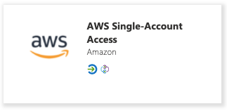

Follow the steps in AAD under Getting Started (Pick SAML for the single sign on)

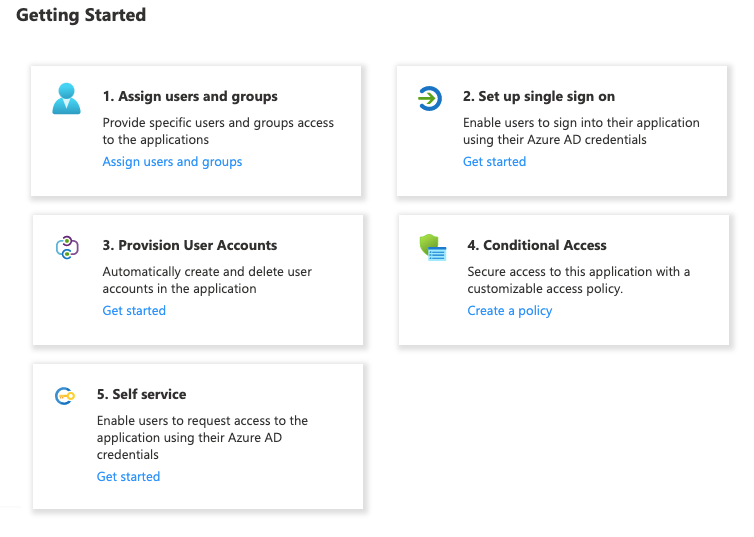

### Configure AWS for AAD integration

Switch to AWS Console and search for `sso`, now choose `AWS Single Sign-on`

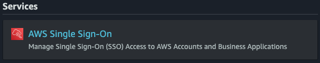

Now choose `Enable AWS SSO`

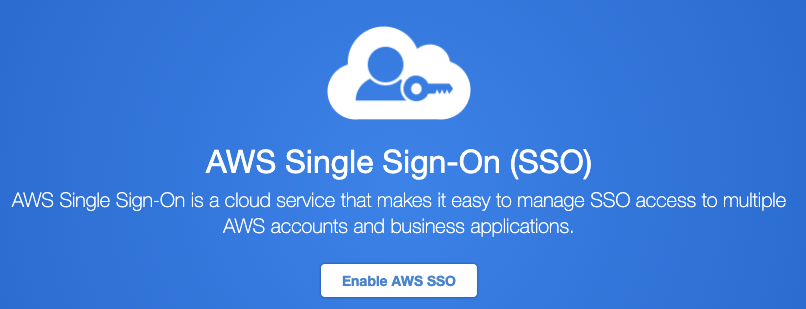

Configure the identity source by clicking on `Choose your identity source`

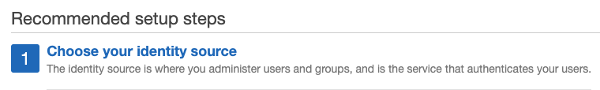

Now choose `change` on `Identity source`

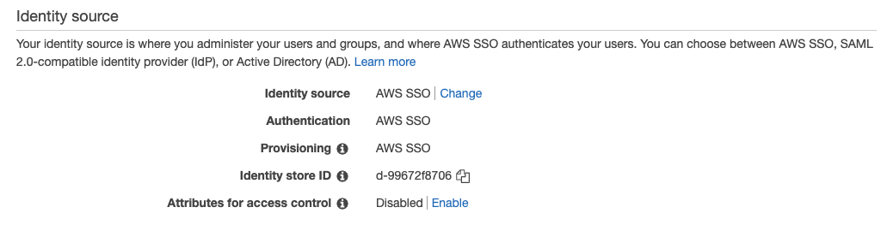

Select `External identity provider`

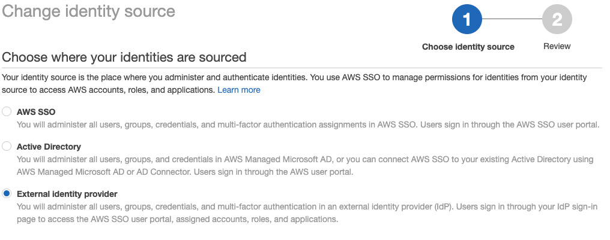

### Metadata

Download `AWS SSO SAML metadata` from AWS and then you should upload it into `Single Sign-On` page on Azure with the `Upload metadata file` button.

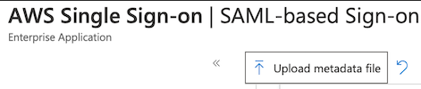

Also check the following image to download `IdP SAML metadata` file from Azure, you can find it in the same page as `Federation Metadata XML`

After downloading the `Federation Metadata XML` from Azure you have to upload this file into your AWS SSO Identity Source under `IdP SAML metadata`

### Provisioning

Before the automatic provisioning is enabled, you can click `enable automatic provisioning` on AWS to get the Tenant URL and Access Token to configure SCIM for provisioning on AAD side.

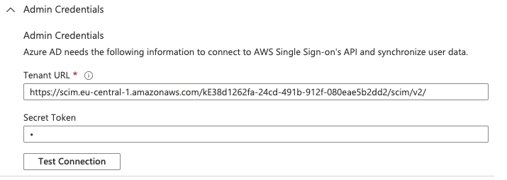

The `userName` must be set to what is configured as an `euid` in meshStack

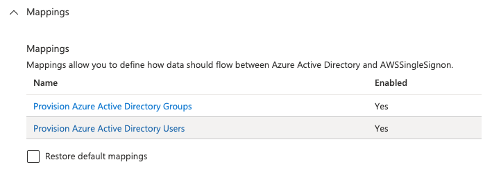

Disable the Group sync here, as usually only groups managed by meshStack will be used and they will be created by meshStack anyway.

When clicking on the directory users mapping, you will see, that the userPrincipalName to userName mapping cannot be deleted.

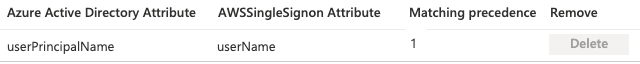

These users will be replicated with Provisioning Settings.

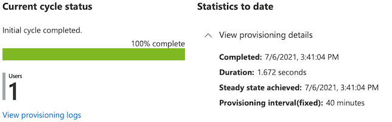

Once you configure that Provisioning, you should click that `Start provisioning` button and it will replicate your Users and Groups into the AWS SSO. After this point this service will replicate the users every 40 minutes however you can always use `Provision on demand` or `Restart provisioning` buttons to run that replication.

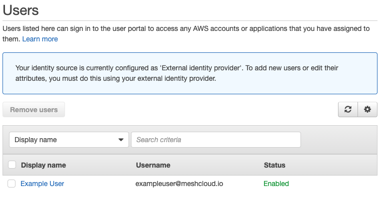
