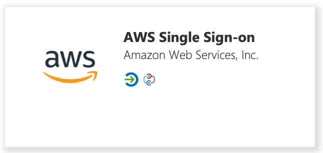
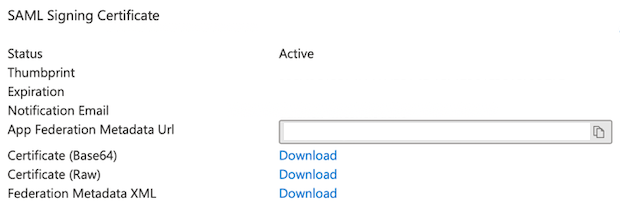
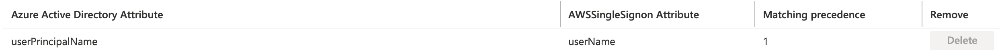
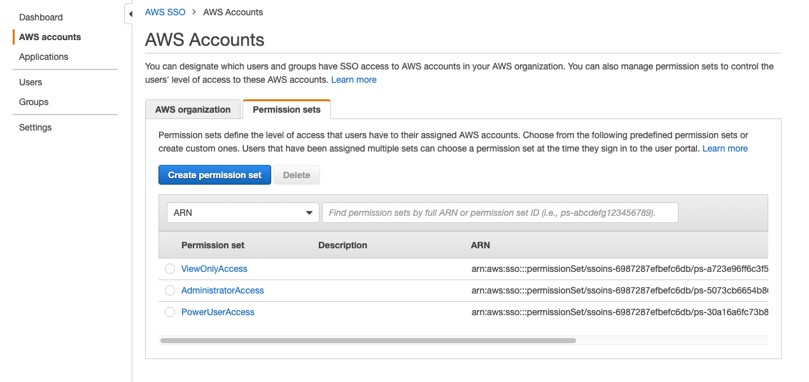

> This guide was written for AWS SSO, which has a new name AWS IAM Identity Center. The guide is still valuable and applicable.

## Enable AWS SSO

Switch to AWS Console and search for `sso`, now choose `AWS Single Sign-on`

Now choose `Enable AWS SSO`

## Configure an External IdP

Configure the identity source by clicking on `Choose your identity source`

Now choose `change` on `Identity source`

Select `External identity provider`

Download `AWS SSO SAML metadata` to later use this metadata for configuration in your source IdP (e.g. AAD). Leave this tab open, as you also need to add the IdP SAML metadata later on. But at first we have to get this metadata from the IdP.

## Configure AAD as IdP for AWS SSO

This section describes how to set up AWS SSO with Azure Active Directory. Make sure that you have the "Application Administrator" role in Azure assigned to you. Even if you are "Global Administrator", you require additionally this role.

### Create an Enterprise Registration in AAD

Go to `Enterprise applications` on Azure, click on `New application` and search for `aws` and choose `AWS Single Sign-on`

Follow the steps in AAD under Getting Started. Mandatory are only the first 3 steps. Conditional Access and Self service are optional.

#### 1. Assign users and groups

You have to assign users who shall have access to the enterprise application. Ideally you can build some automation to add the required users to the enterprise application.

#### 2. Set Up SSO via SAML

Pick SAML as the SSO method. Use the `AWS SSO SAML metadata` you downloaded before from AWS. Upload it into `Single Sign-On` page on Azure with the `Upload metadata file` button.

Click Save in the "Basic SAML Configuration" dialog. You may need to reload the page now, as Azure may still show "Required" for the Reply URL, but that is just a display issue in Azure.

Next you have to download the SAML `Federation Metadata XML`.

After downloading the `Federation Metadata XML` file from Azure you must upload it into your `AWS SSO Identity Source` as `IdP SAML metadata`. This configuration can also be set manually to do that use the Azure `Login URL` as the AWS `IdP sign-in URL` and `Azure AD Identifier` as the `IdP Issuer URL`.

#### 3. Provisioning

Automatic provisioning can be set via `SCIM`. Select `enable automatic provisioning` on AWS SSO service to get the `Tenant URL` and `Access Token` to configure SCIM on Azure AD Enterprise Application from `AWS Single Sign-on | Provisioning` tab. These secrets must be also shared with meshcloud Operator to configure the replicator service.

> An important precondition regarding the automated user provisioning to AWS SSO is, that the userName in AWS SSO will be set to the [euid](meshstack.identity-federation#externally-provisioned-identities). This limitation is caused by AWS SSO only allowing to filter on userNames to find users. Azure AD attributes can be mapped to AWS SSO service with `Mappings` configuration.

Disable the Group sync in Azure by clicking on the "Provision Azure Active Directy Groups" mapping and disable it in the details screen. Usually only groups managed by meshStack will be used and also they will be created by meshStack.

When `Provision Azure Active Directory Users` button is clicked, the following page shows userPrincipalName to userName mapping cannot be deleted because it is mandatory attribute and it has to be synchronized however any `Azure Active Directory Attribute` can be mapped to `userName`.

> In the `Settings` section of the `Provisioning` you could define the scope of users. You could switch to using not only users assigned to the Enterprise Application, but all users of the directory. The problem with this provisioning approach is that SSO login via SAML won't be possible, because only users assigned to the enterprise application are allowed to log in via SAML.

Once you configure "Provisioning", you should click `Start provisioning` and it will replicate your Users and Groups into AWS SSO. After this point this service will replicate the users every 40 minutes however you can always use `Provision on demand` or `Restart provisioning` buttons to run that replication.

## Create AWS SSO Permission Sets

In order to assign groups created by meshStack to a certain Permission Set on an AWS account, you have to create according Permission Sets in AWS SSO.

By default three project roles are available in meshStack: Project Admin, Project User, Project Reader. If you don't have
specific PermissionSets in mind yet, a good starting point is to provide the following defaults for the three roles. When creating
a new Permission Set you can select "Use an existing job function policy" and then select the following job function policies:

- AdministratorAccess
- PowerUserAccess
- ViewOnlyAccess

These `permission set` ARNs will be used by replicator as default policies. Customers can modify their policies later without affecting ARN to decide which policies they want to assign their users.
