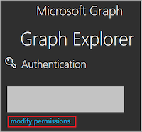

meshcloud can automatically provision Azure Subscriptions as Tenants for [meshProjects](./meshcloud.project.md) and configure them according to your organiziations policies
using [Landing Zones](./meshcloud.landing-zones.md).

## Integration Overview

To enable integration with Azure, operators need to deploy and configure the meshStack Azure Replicator. Operators can configure one or multiple `PlatformInstance`s of `PlatformType.Azure`. This makes Azure available to meshProjects like any other cloud platform in meshStack.

Azure relies on Azure Active Directoy (AAD) for authentication and authorization. meshcloud can seamlessly integrate with common
AAD setups like [Azure Hybrid Identity](https://docs.microsoft.com/en-us/azure/active-directory/hybrid/). meshcloud helps you implement Azure in line with [Governance best-practices](https://docs.microsoft.com/en-us/azure/cloud-adoption-framework/govern/governance-disciplines) by integrating [Blueprints](https://docs.microsoft.com/en-us/azure/governance/blueprints/overview) and Management Groups using [Landing Zones](#landing-zones)

In order to plan and execute a successful integration of Azure using meshcloud, organizations need to consider the following parts described in the sections below.

## Azure Active Directory Integration

All Subscriptions in Azure must be associated with exactly one AAD Tenant storing role and permission assignments. Azure uses this AAD Tenant to evaluate permissions on all resources contained in that subscription. meshcloud manages roles and assignments
by automatically replicating [meshProject Role Assignments](./meshcloud.project.md) to this AAD Tenant.

However, a key decision in any Azure integration is how your organization wants to provision user identities in this AAD Tenant.
meshcloud supports two different ways to achieve this.

### Externally-provisioned Identities

The default model expected by Microsoft is [Hybrid Identity](https://docs.microsoft.com/en-us/azure/active-directory/hybrid/), i.e. a local Active Directory (AD) synced to Azure (Azure Active Directory, AAD). Organizations can implement this sync using
[Azure Active Directory Connect (AD Connect)](https://docs.microsoft.com/en-us/azure/active-directory/hybrid/whatis-azure-ad-connect). This sync populates user identities into an AAD Tenant owned by the organization and can also synchronize existing groups and memberships.

The user identities are synchronized to your organization's "home tenant", which also owns the email domains identifying these users.
In most organizations, other applications like Office 365 already consume user identities from this AAD Tenant.

> Please make sure that all users who need access to the Azure Portal are replicated into the AAD. meshcloud will issue
> a replication warning for projects that have role assignments that cannot be replicated because a user identity could not be found on the home tenant.

#### meshcloud AAD Tenant

Because meshcloud requires read-write permissions to manage user roles on Azure Subscriptions, we recommend creating a
separate "meshcloud AAD Tenant" to be exclusively used by meshcloud. Our orchestration engine then creates Guest Users in the meshcloud AAD Tenant that reference user identities from the "home tenant" (AAD B2B). This way, users have a single cloud identity managed
by your organization-wide policies while isolating "development" related Azure activies into its own AAD Tenant which has no
way of affecting other applications using the home tenant like Office 356 etc.

#### External User Id (euid)

Using [externally-provisioned user identities](./meshstack.identity-federation.md#externally-provisioned-identities) requires your IdP to provide a user identifier suitable to locate user identities
in the "home tenant". This external user id needs to be mapped to the `euid` user attribute in the [meshIdB](./meshstack.identity-federation.md).

It is important that the provided euid's are <b>case-sensitive</b> and must match the user entries saved in the AAD against which the replication should happen! This is a limitation imposed by the search queries of Microsoft Graph API.

> meshcloud can support complex Azure AD setups involving user identity lookup rules and multiple home tenants. Please contact our experts for more details.

### meshStack-provisioned Identities

In the [meshStack-provisioned Identities](./meshstack.identity-federation.md#meshstack-provisioned-identities) setup meshStack provisions user identities itself under a virtual domain in a "meshcloud AAD Tenant". This AAD tenant is then configured for federated authentication against [meshIdB](./meshstack.identity-federation.md).

This setup is useful for smaller organizations do not have existing AAD Tenants. We recommend large organizations use
externally-provisioned Identities that help ensure users have a single cloud identity with Microsoft Azure only.

### Licensing Considerations

Users managed in the meshcloud AAD Tenant do not require AAD Premium Licenses.

## Subscription Provisioning

To provide Azure Subscription for your organization's meshProjects, meshcloud supports using Enterprise Enrollment or allocating from a pool of pre-provisioned subscriptions.

### Enterprise Enrollment Account

meshcloud can automatically provision new subscriptions from an Enterprise Enrollment Account owned by your organization. This is suitable for large organizations that have a Microsoft Enterprise Agreement and want to provide a large number of subscriptions in a fully automated fashion.

> Microsoft currently has limitation of a maximum of 250 Subscriptions per Enrollment Account (EA). It's therefore possible to configure meshStack to consume subscriptions from multiple EA's for the same [platform instance](./meshcloud.platform-location.md). Please contact our experts for more details.

### Pre-provisioned Subscriptions

If your organization does not have access to an Enterprise Enrollment, you can alternatively configure meshcloud to
consume subscriptions from a pool of externally-provisioned subscriptions. This is useful for smaller organizations that whish
to use "Pay-as-you-go" subscriptions or if you're organization partners with an [Azure Cloud Solution Provider](https://docs.microsoft.com/en-us/azure/cloud-solution-provider/overview/azure-csp-overview) to provide your subscriptions.

The meshcloud Azure replication detects externally-provisioned subscriptions based on a configurable prefix in the subscription
name. Upon assignment to a meshProject, the subscription is inflated with the right [Landing Zone](./meshstack.azure.landing-zones.md) configuration
and removed from the subscription pool.

## Service Principal Setup

In order to manage user roles and permissions, meshcloud requires a Service Principal on the meshcloud AAD Tenant.
The Service Principal must be authorized in the scope of the meshcloud AAD Tenant.

1. Under **Azure Active Directory** &rarr; **App registrations** create a new web app (call it e.g. `meshReplicator`).
2. Add an client secret under **Certificates &amp; secrets** and write it down (it is the `SERVICE_PRINCIPAL_CLIENT_SECRET`).
3. Add the `Directory.ReadWriteAll`, `Group.ReadWriteAll` and `User.Read` permissions (application type) and click **Grant permissions**. You will also need to grant admin consent to your app. Therefore click **Grant admin consent** in the permissions screen.
4. Go to the App overview and write down the following: **Application (client) ID** (`SERVICE_PRINCIPAL_CLIENT_ID`), **Directory (tenant) ID** (`AAD_TENANT`, typically a `*.onmicrosoft.com` domain) and the **object id** (`SERVICE_PRINCIPAL_OBJECT_ID`).

Operators need to supply these variables to the [meshStack Configuration](#meshstack-configuration) for this Azure Platform Instance.

### Configuring Enterprise Enrollment

#### 1. Setting up the Enrollment Account

We recommend using dedicated enrollment accounts (EA) for exclusive use by meshcloud.

> EA Administrators must be careful to chose an EA Account Owner that's homed in the meshcloud AAD Tenant!

Subscriptions provisioned through the EA get automatically associated with the AAD Home-Tenant of the EA Account Owner.
If your organization uses Microsoft (i.e. outlook.com) identities as EA Account Owner, please invite the EA Owner user first into the meshcloud AAD Teant before creating the enrollment account.

To list your available EA accounts you can use the [`Get-AzEnrollmentAccount`](https://docs.microsoft.com/en-us/powershell/module/az.billing/get-azenrollmentaccount?view=azps-2.6.0) powershell command:

```powershell
PS C:\> Get-AzEnrollmentAccount

ObjectId                             PrincipalName
--------                             -------------
dbd8453d-071f-4fb4-8e01-c99f5b067649 jason@contoso.onmicrosoft.com
7ff524ac-a0de-4402-876f-934ccee3b601 carol@contoso.onmicrosoft.com
```

After creating (or finding) a suitable EA Account, please note down the accounts object id as `EA_ACCOUNT_ID`.

#### 2. Authorizing the meshcloud Service Principal for EA

To use EA for Subscription provisioning, an EA Administrator must authorize the [meshcloud Service Principal](#meshcloud-service-principal) on the Enrollment Account [following the official instructions](https://docs.microsoft.com/en-us/azure/azure-resource-manager/grant-access-to-create-subscription).

### Automated B2B User Invitation

Users can automatically get invited via Azure. The system needs an email address which is usually fetched from the [euid](./meshstack.identity-federation.md#externally-provisioned-identities). The email must exist inside an Azure Active Directory (AAD) and automatically gets invited to the AAD in which the meshProject subscriptions live.

In order to activate it just add the `b2b-user-invitation` configuration to your Azure platform config:

```yml
replicator-azure:
  platforms:
    - platform: azure.meshcloud-azure-dev
      b2b-user-invitation:
        # URL the user is redirected to when he manually accepts an invitation
        redirect-url: http://localhost
        send-azure-invitation-mail: false
```

You can decide if you want Azure to send an automatic email notification about the invitation process to the user by setting `send-azure-invitation-mail` to `true`. Usually this is not needed as meshStack handles
the invitation notifications.


### Configuring Blueprint Automation

In order to assign [Blueprints](https://docs.microsoft.com/en-us/azure/governance/blueprints/overview) the meshcloud Azure replicator needs to be configured with the service principal id of the `Azure Blueprints` app
provided by Microsoft.

#### Finding the Azure Blueprints App Id

The `Azure Blueprints` service principal id is different in every AAD Tenant, so we need to find the id
of the app in the meshcloud AAD Tenant.

The easiest way to accomplish this is to start an Azure cloud shell in a subscription on the meshcloud AAD Tenant and execute the following command:

```powershell
PS Azure:\> Get-AzureRmADServicePrincipal -ApplicationId f71766dc-90d9-4b7d-bd9d-4499c4331c3f
```

The response should be similar to

```powershell
ServicePrincipalNames : {f71766dc-90d9-4b7d-bd9d-4499c4331c3f}
ApplicationId         : f71766dc-90d9-4b7d-bd9d-4499c4331c3f
ObjectType            : ServicePrincipal
DisplayName           : Azure Blueprints
Id                    : 227ac22a-************
```

Write down the ID (in this case `227ac22a-*`) as this is the `AZURE_BLUEPRINT_PRINCIPAL`.

If this call **does not** return a usable ID then you can try an alternative way and find this principal via the [Graph Explorer](https://developer.microsoft.com/en-us/graph/graph-explorer):


1. Open [https://developer.microsoft.com/en-us/graph/graph-explorer](https://developer.microsoft.com/en-us/graph/graph-explorer)
2. Login with a Global Admin user from the directory in which you want to check for the `AZURE_BLUEPRINT_PRINCIPAL`
3. You need sufficient permissions to read the principal. Select modify permissions to get the permissions

4. Enable the `Directory.AccessAsUser.All`, `Directory.Read.All`, `Directory.ReadWrite.All` rights and give your admin consent

5. List your Blueprint Service Principal ID via

    ```text
    GET https://graph.microsoft.com/beta/<AAD_TENANT_ID>/servicePrincipals?$filter=appId eq 'f71766dc-90d9-4b7d-bd9d-4499c4331c3f'
    ```

    Replace the `<AAD_TENANT_ID>` with the Directory ID of your AAD (can be found in the properties screen of the AAD in [https://portal.azure.com](https://portal.azure.com))
6. Remember to delete the Graph Explorer App access afterwards from your **Enterprise applications** section of your Active Directory in the Azure portal

The response should look like this:

```json

{
    "@odata.context": "https://graph.microsoft.com/beta/$metadata#servicePrincipals",
    "value": [
        {
            "id": "227ac22a-************",
            "deletedDateTime": null,
            "accountEnabled": true,
            "appDisplayName": "Azure Blueprints",
            "appId": "f71766dc-90d9-4b7d-bd9d-4499c4331c3f",
            "applicationTemplateId": null,
            "appOwnerOrganizationId": "f8cdef31-a31e-4b4a-93e4-5f571e91255a",
            "appRoleAssignmentRequired": false,
            "displayName": "Azure Blueprints",
            "errorUrl": null,
            "homepage": null,
            "loginUrl": null,
            "logoutUrl": null,
            "notificationEmailAddresses": [],
            "preferredSingleSignOnMode": null,
            "preferredTokenSigningKeyEndDateTime": null,
            "preferredTokenSigningKeyThumbprint": null,
            "publisherName": "Microsoft Services",
            "replyUrls": [],
            "samlMetadataUrl": null,
            "samlSingleSignOnSettings": null,
            "servicePrincipalNames": [
                "f71766dc-90d9-4b7d-bd9d-4499c4331c3f"
            ],
            "signInAudience": "AzureADMultipleOrgs",
            "tags": [],
            "addIns": [],
            "api": {
                "resourceSpecificApplicationPermissions": []
            },
            "appRoles": [],
            "info": {
                "termsOfServiceUrl": null,
                "supportUrl": null,
                "privacyStatementUrl": null,
                "marketingUrl": null,
                "logoUrl": null
            },
            "keyCredentials": [],
            "publishedPermissionScopes": [],
            "passwordCredentials": []
        }
    ]
}
```

Write down the ID (in this case `227ac22a-*`) as this is the `AZURE_BLUEPRINT_PRINCIPAL`.

> In case your admin user can not grant the Graph Explorer the admin access rights he needs to query the AAD, try to create a new user via the Azure Portal in the AAD and grant this temporary user `Global Admin`rights. Try to use this user for login with the Graph Explorer. After you did your query you can delete this user again.

#### Authorize the meshcloud Service Principal

You must must grant the meshcloud Service Principal `owner` access to all [management groups](https://docs.microsoft.com/en-us/azure/governance/management-groups/) in the meshcloud AAD Tenant.

Before you can grant this access, you must have access to the root Management Group yourself. If you haven't already done so, please make sure your user is a `Global Administrator` on the meshcloud AAD Tenant
and has [elevated access to all management groups](https://docs.microsoft.com/en-us/azure/role-based-access-control/elevate-access-global-admin).

> In case you're not able to see all management groups after elevating access, try signing out and back in to Azure Portal.

Once you have elevated access, use the Azure Portal to Navigate to the "Management Groups"  blade, then click on the "Details" link of the Tenant Root Group. Select "Access Control (IAM)" from the menu and create a Role assignment that grants the [App created above](#meshcloud-service-principal) for the meshcloud Service Principal (i.e. `meshReplicator`) the `Owner` permission on this resource.

In this screen you can also find the Object ID and Application ID of your service principal. In case you prefer the CLI and have the Azure CLI installed the following Powershell command can also reveal this ID for you:

```powershell
Get-AzADServicePrincipal | Where-Object {$_.Displayname -eq "<NAME_OF_THE_SERVICE_ACCOUNT>"}
```

## Platform Instance Configuration

With the information we gathered in the above section we now can configure the Azure Replicator.
This will typcially configured by your meshcloud experts, but please consult the following example as a reference
of possible configuration settings.

```haskell
let Provisioning = ./Azure/Provisioning.dhall
let InviteB2BUserConfig = ./Azure/InviteB2bUserConfig.dhall

in    λ(Secret : Type)
    → { platform = "azure.meshcloud-azure-dev"
      , accountNamePattern :
          Optional Text
      , groupNamePattern :
          Optional Text
      {- This is the ID of the "Azure Blueprint" service principal which must be known beforehand. -}
      , blueprintServicePrincipal = "<AZURE_BLUEPRINT_PRINCIPAL>"
      {- # https://docs.microsoft.com/en-us/rest/api/blueprints/assignments/createorupdate#assignmentlockmode -}
      , blueprintLockAssignment = "AllResourcesReadOnly"
      , blueprintLocation = "westeurope"
      , servicePrincipal :
          {- Either friendly domain name or your tenants GUID -}
          { aadTenant = "<AAD_TENANT>"
          , objectId = "<SERVICE_PRINCIPAL_OBJECT_ID>"
          , clientId = "<SERVICE_PRINCIPAL_CLIENT_ID>"
          , clientSecret = "<SERVICE_PRINCIPAL_CLIENT_SECRET>"
          }
      , b2bUserInvitation :
          Optional InviteB2BUserConfig
      , provisioning :
          Provisioning
      , roleMappings :
          {-
          The mesh project role is mapped to an Azure role. You can enter the role which should be assigned for the
          user holding this meshProject roles.For more information about Azure roles see
          https://docs.microsoft.com/bs-latn-ba/azure/role-based-access-control/built-in-roles.
          For example:
            admin: b24988ac-6180-42a0-ab88-20f7382dd24c # magic GUID for contributor
            user: acdd72a7-3385-48ef-bd42-f606fba81ae7  # magic GUID for reader
          -}
          [{ mapKey : "admin", mapValue : "b24988ac-6180-42a0-ab88-20f7382dd24c" }]
      }
```

Where `Provisioning.dhall` consists of:

```haskell
let EnterpriseEnrollment =
      {-
      You can configure multiple owners of the created/assigned subscriptions.
      Enter the object IDs of the subscription owners. This is useful for
      extended automation.
      -}
      { subscriptionOwnerObjectIds ["<SUB_OWNER_OBJECT_ID>"]
      , enterpriseEnrollment :
          { enrollmentAccountId =  "<EA_ACCOUNT_ID>"
          , subscriptionOfferType = "MS-AZR-0017P"
          {-
          There is a safty mechanism to avoid duplicate Subscription creation in case
          of an error. This delay should be a bit higher then it usually takes to
          create subscriptions. For big installations this is somewhere between 5-15
          minutes.
          -}
          , subscriptionCreationErrorCooldownSec = 600
          }
      }

let PreProvisioned =
      { subscriptionOwnerObjectIds :
          List Text
      , preProvisioned :
          {-
          Unused subscriptions must begin with this name in order to be picked by
          the replicator.
          -}
          { unusedSubscriptionNamePrefix = "mesh" }
      }

in  < EnterpriseEnrollment :
        EnterpriseEnrollment
    | PreProvisioned :
        PreProvisioned
    >
```

And `InviteB2BUserConfig.dhall` contains:

```haskell
{- URL used in the Azure invitation mail if send -}
{ redirectUrl = "https://example.com"
{- Flag if an Invitation mail by Azure should be send out -}
, sendAzureInvitationMail = false
}
```

### Azure Subscription Name

The name of the generated subscriptions can be fully customized. A `printf` format string is used. You can read about all the available options in the official Java documentation about [`String.format`](https://docs.oracle.com/javase/8/docs/api/java/util/Formatter.html#syntax).

For example a string pattern `%s.%s` would generate: `customer.project`. Which is the default.

The following arguments are provided:

1. argument: customer identifier
2. argument: project identifier
3. argument: meshProject ID

### Azure Group Name

Similiar to the [Azure Subscription Name](#azure-subscription-name) a `printf` compatible string can be used. The arguments available here are:

1. argument: customer identifier
2. argument: project identifier
3. argument: meshRole Name
4. argument: meshProject ID
