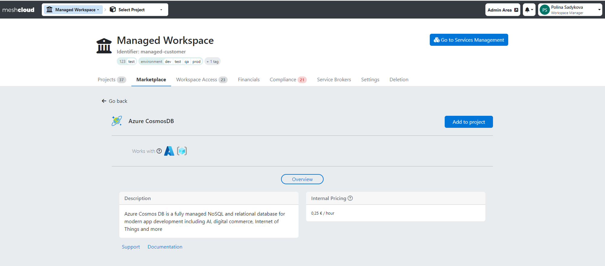
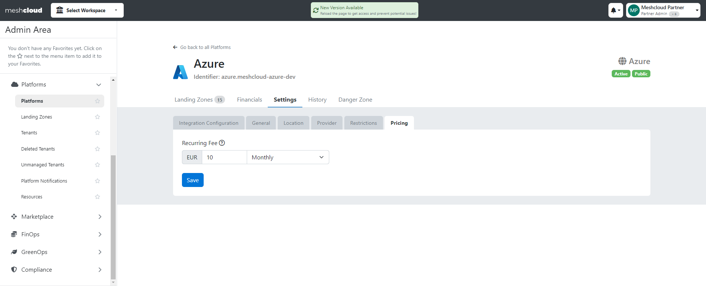
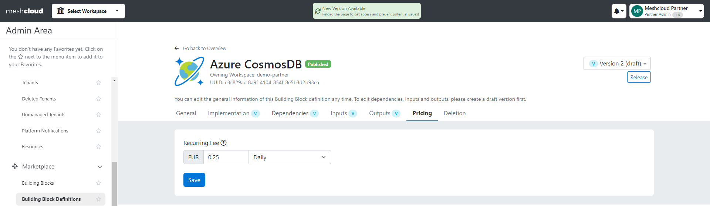

## Chargeback

> Chargeback is the process of allocating IT cost to consumers and feeding it into the company-wide finance and controlling processes.

Each project in meshStack is associated with a Chargeback Account. meshStack periodically generates [chargeback statements](meshcloud.project-metering.md#chargeback-statements).

The attributes that shall be part of the billing info on the chargeback statements can be configured.

You need to specify a wait-period after which the chargeback statements are finalized. This period exists to allow the public cloud platforms to get all their usage events into the calculation. For private cloud platforms the waiting period is usually a few hours up to a day, but for public cloud providers it can be significantly longer. If you plan to use a public cloud provider, please choose the longest wait period for finalizing your chargeback statements. This ensures that all discounts and events of the month are included in the chargeback statement meshStack generates.

| Provider | Suggested Wait Period                                                                                                                                                               |
| -------- | :---------------------------------------------------------------------------------------------------------------------------------------------------------------------------------- |
| GCP      | 5 Days                                                                                                                                                                              |
| AWS      | 6 Days                                                                                                                                                                              |
| Azure    | Depends on the workspaces Azure EA account, please contact us and check when Azure bills you. It can happen in the middle of a month. So delays of about 15 days are to be expected. |

### Available metadata keys

The following metadata keys are derived from meshStack metadata and therefore available on every meshStack implementation

| Key                   | Description                                      |
| --------------------- | :----------------------------------------------- |
| last_modified         | Date when metadata was last modified             |
| contactMail           | email address of the project owner               |
| ownerUsername         | Username of the project owner                    |
| ownerFirstName        | First name of the project owner                  |
| ownerLastName         | Last name of the project owner                   |
| paymentName           | Name of the payment method                       |
| paymentIdentifier     | Identifier of the payment method                 |
| paymentExpirationDate | Expiration date of the payment method            |
| paymentAmount         | Amount available for payment method              |

### Available tag keys

It is also possible to derive [meshTags](meshstack.metadata-tags.md) as metadata keys by using its tag name.

### Configuration example

<!--snippet:mesh.kraken.api.statements-->

The following configuration options are available at `mesh.kraken.api.statements`:
<!--DOCUSAURUS_CODE_TABS-->
<!--Dhall Type-->
```dhall
let Statements =
    {-
      relevant-meta-keys:
        A list of metadata and tag keys that shall appear in chargeback statements as billing info.
        General payment information can be accessed via paymentName, paymentIdentifier, paymentExpirationDate
        and paymentAmount. Custom Tags can be referenced via their property name in the according tag JSON schema.
        Custom Tags are workspace tags, project tags and payment tags.

      period-offset-days:
        It is the offset of days after which chargeback statements are generated.
        This time should always be set to a higher value than the finalizeReportsAfterDays
        that are configured for kraken-worker, as only finalized reports are considered in chargeback statements.

      first-period:
        Chargeback statement periods will be created monthly starting from this date on (UTC datetime format: yyyy-MM-ddTHH:mm:ssZ)
    -}
      { relevant-meta-keys : List Text
      , period-offset-days : Natural
      , first-period : Text
      }
```
<!--Example-->
```dhall
let example
    -- these relevant-meta-keys reference all statically available payment information
    : Statements
    = { relevant-meta-keys =
        [ "paymentName"
        , "paymentIdentifier"
        , "paymentExpirationDate"
        , "paymentAmount"
        ]
      , period-offset-days = 5
      , first-period = "2020-01-01T00:00:00Z"
      }

let example2
    -- these relevant-meta-keys reference tags that can be defined individually per meshImplementation
    : Statements
    = { relevant-meta-keys = [ "customTag1", "customTag2" ]
      , period-offset-days = 5
      , first-period = "2020-01-01T00:00:00Z"
      }
```
<!--END_DOCUSAURUS_CODE_TABS-->

> If you are interested in including budgeting into your chargeback process, have a look at the use of [payment methods](./meshcloud.payment-methods.md).

## Setting Internal Prices

In meshStack, you have the flexibility to define prices for [Platform Services](./marketplace.index.md) in addition to usage costs from providers. Configuring your internal prices allows you to account for various expenses such as licensing costs or the effort invested in maintaining and enhancing Platform Services. These internal prices will be displayed on the service details page within the Marketplace.



For Platforms, you can now establish monthly or daily recurring prices per meshTenant, which will be charged only once when a user adds a Platform Tenant. You can configure prices within meshStack by navigating to the Pricing tab of the Platform Settings. Additionally, prices for Platforms per Landing Zone can be set up by contacting the meshcloud support team, among other pricing options.



For Building Blocks prices can be configured as recurring monthly or daily fees per Building Block instance. To set prices, navigate to the Pricing tab of the Building Block setting or you can set it during Building Block creation.



If you would like to add prices for OSBs, please contact our support team and they will assist you in setting them up.

>Please note that any changes in the price of Platform Services will be reflected in the chargeback statements based on the period in which the change occurred. For instance, a new price set for a Building Block on March 28th will be applied to the March chargeback statement.

### Private Platform

When configuring a product for private cloud billing, Partners need to choose the cloud resource type to target and how the metering engine
should generate usages and apply prices to them. The documentation section of each private cloud platform lists the supported resource types and the traits available in the metering engine.
Traits are a properties of a cloud resource like CPU or RAM. Partners can use traits to configure predicates (filter resources applicable to a pricing rule) and to control how meshMetering calculates usages.

meshMetering supports flexible rules for creating usages, like

- **time**: charge consumption based on the usage of a resource over a time period
- **quantity**: charge consumption based on a quantity
- **time-quantity**: charge consumption based on the product of time and quantity

Quantities are represented with prefixable units according to the [UCUM standard](https://ucum.org/ucum.html) inside meshMetering.
Specifically, meshMetering uses the UCUM "print" formatting where units need to be human readable (e.g. in usage reports).
In configuration (e.g. when defining a product catalog entry), meshMetering uses the UCUM "case-sensitive" representations.
This can lead to small differences when describing units. For example, one kilo-byte would be represented as

- `1 kB` in a usage report
- `1 kBy` in a product catalog entry

When building a product catalog, Partners can define rates to define prices for usages.
It's also possible to define rates with a different prefix, e.g. if the primitive unit of the resource
trait is measured in "MB", Partners can define a price in "GB". meshMetering will automatically apply
the necessary conversions so that usage reports are presented in the unit defined in the product catalog. This is useful to provide human-readable and intuitive units for pricing rules. meshMetering supports the following prefixes, with examples described in bytes
according to UCUM "case-sensitive" representation.

| Metric Prefix | Example | Binary Prefix | Example |
| ------------- | ------- | ------------- | ------- |
| kilo (10^3)   | 1 kBy   | kibi (1024^1) | 1 KiBy  |
| mega (10^6)   | 1 MBy   | mebi (1024^2) | 1 MiBy  |
| giga (10^9)   | 1 GBy   | gibi (1024^3) | 1 GiBy  |
| terra (10^12) | 1 TBy   | tebi (1024^4) | 1 TiBy  |
| peta (10^15)  | 1 PBy   | pebi (1024^5) | 1 PiBy  |


### Other Pricing Concepts

#### Scope Selectors

Every cloud resource has a scope in meshcloud, defined by the meshTenant in belongs to.
ScopeSelectors are hierarchical selectors that allow Product Catalog entries to specify the resource scopes they apply to. ScopeSelectors can target all platforms of a certain platform type, a specific meshPlatform or an individual meshTenant.

Using ScopeSelectors, Operators can for example define different prices for platforms running in different locations or platforms.

<!--snippet:mesh.kraken.productcatalog.scopeselector#type-->


<!--DOCUSAURUS_CODE_TABS-->
<!--Dhall Type-->
```dhall
let ScopeSelector =
    {-
      The Scope Selector specifies the cloud resource scopes that a product catalog entry applies to.
      Fields, depending on the type of scope selected:

        platformType:
            The PlatformType to target

        location:
            The meshLocation identifier to target

        platformInstance:
            The meshPlatform identifier to target

        localProjectId:
            The platform identifier for the meshTenant, e.g. an Azure Subscription Id.
    -}

      let ByPlatformType = { platformType : PlatformType }

      let ByPlatformInstance =
            ByPlatformType ⩓ { location : Text, platformInstance : Text }

      let ByTenant = ByPlatformInstance ⩓ { localProjectId : Text }

      in  < PlatformType : ByPlatformType
          | PlatformInstance : ByPlatformInstance
          | Tenant : ByTenant
          >
```
<!--Example-->
```dhall
let example =
    -- this ScopeSelector targets all platforms of type "Azure"
      ScopeSelector.PlatformType { platformType = PlatformType.Azure }

let example2 =
    -- this scope selector targets a specific OpenStack platform
      ScopeSelector.PlatformInstance
        { platformType = PlatformType.OpenStack
        , location = "eu.de-central"
        , platformInstance = "pike"
        }
```
<!--END_DOCUSAURUS_CODE_TABS-->


#### Discounts

Discounts allow Partners to add or deduct charges to Tenant Usage Reports. A common use case for Platform Operators is to configure a discount with a positive rate to charge projects with a "management fee" based on the project's actual cloud consumption.

<!--snippet:mesh.kraken.productcatalog.discount#type-->


<!--DOCUSAURUS_CODE_TABS-->
<!--Dhall Type-->
```dhall
let Discount =
    {-
        scope:
            Specifies the scope this discount applies to, see ScopeSelector

        discountRule:
            Specifies the type of discount rule used to calculate the discount.

        displayName:
            The name to display for this discount on the tenant usage report.

        description:
            The description to display for this discount on the tenant usage report.

        sellerId:
            The id of the seller to charge this discount to. A positive discount netAmount will be credited to this
            seller during chargeback, while a negative netAmount will be charged to this seller.

        sellerProductGroup:
            A product group identifier for the seller. Specifying this field allows sellers to aggregate
            charges and credits by different categories for reporting purposes.
    -}
      { scope : ScopeSelector
      , discountRule : DiscountRule
      , displayName : Text
      , description : Text
      , sellerId : Text
      , sellerProductGroup : Text
      }
```
<!--Example-->
```dhall
let example
    : Discount
    =
      -- This Discount charges a 5% Management Fee on all Azure consumption and is credited to the operations team
      { scope =
          ScopeSelector.PlatformType { platformType = PlatformType.Azure }
      , sellerId = "azure-cloud-foundation"
      , sellerProductGroup = "fees"
      , displayName = "Azure Management Fee"
      , description =
          "Management Fee for Azure Cloud Operations Team, based on usage"
      , discountRule =
          DiscountRule.fixedPercentage
            { discountPercentage = 5.0
            , discountScope =
              { productSellerIdRegex = Some "Azure"
              , productDisplayNameRegex = None Text
              , usageTypeDisplayNameRegex = None Text
              }
            }
      }
```
<!--END_DOCUSAURUS_CODE_TABS-->

#### Discount rules

Discount rules specify how a discount is computed.

meshStack currently provides two discount rules. Future releases could provide additional discount rule options.

<!--snippet:mesh.kraken.productcatalog.discountrule#type-->


<!--DOCUSAURUS_CODE_TABS-->
<!--Dhall Type-->
```dhall
let DiscountRule =
      < fixedPercentage : FixedPercentageDiscountRule
      | tieredPercentage : TieredPercentageDiscountRule
      | tieredFixedAmount : TieredFixedAmountDiscountRule
      >
```
<!--END_DOCUSAURUS_CODE_TABS-->


A discount rule contains a discount scope that specifies which usage report line items are eligible for the discount.
The line items for the report are first filtered by this discount scope before calculating the sum and applying the discount.

<!--snippet:mesh.kraken.productcatalog.discountscope#type-->


<!--DOCUSAURUS_CODE_TABS-->
<!--Dhall Type-->
```dhall
let DiscountScope =
    {-
       Specify the regular expressions for sellerId, product display name and usage type display name
       that should be matched when filtering usage report line items for applying a discount.
    -}
      { productSellerIdRegex : Optional Text
      , productDisplayNameRegex : Optional Text
      , usageTypeDisplayNameRegex : Optional Text
      }
```
<!--END_DOCUSAURUS_CODE_TABS-->

#### Fixed Percentage Discount Rule

The fixed percentage discount rules calculates the fee as a percentage of the total consumption.

<!--snippet:mesh.kraken.productcatalog.fixedpercentagediscountrule#type-->


<!--DOCUSAURUS_CODE_TABS-->
<!--Dhall Type-->
```dhall
let FixedPercentageDiscountRule =

    {-
      Calculates the discount as a fixed percentage of a source amount using the formula
      ```
          discountNetAmount = sourceNetAmount * discountPercentage / 100
      ```

        discountScope:
            The discount is calculated on a source amount computed by summing the usage line item net amounts
            filtered by this DiscountScope. This is typically used so that the discount only applies to usages
            generated by cloud consumption.
            A string representation of this discount scope will be shown in the tenant usage report line item.

        discountPercentage:
            The discount percentage to apply. Use positive rates to generate additional fees, use negative rates
            to deduct charges.
    -}
      { discountScope : DiscountScope, discountPercentage : Double }
```
<!--Example-->
```dhall
let example
    : FixedPercentageDiscountRule
    = {-
      This fee adds 5% to to all azure consumption.
      -}
      { discountPercentage = 5.0
      , discountScope =
        { productSellerIdRegex = Some "Azure"
        , productDisplayNameRegex = None Text
        , usageTypeDisplayNameRegex = None Text
        }
      }
```
<!--END_DOCUSAURUS_CODE_TABS-->

#### Fixed percentage per tier

The tiered percentage discount rule defines tiers of cloud resource consumption. For each tier a discount percentage is used to calculate the discount to be used.

<!--snippet:mesh.kraken.productcatalog.tieredpercentagediscountrule#type-->


<!--DOCUSAURUS_CODE_TABS-->
<!--Dhall Type-->
```dhall
let TieredPercentageDiscountRule =
    {-
      Calculates the discount as percentage of a source amount using the formula
      ```
          discountNetAmount = sourceNetAmount * "discountPercentage of activated tier" / 100
      ```

         discountScope:
            The discount is calculated on a source amount computed by summing the usage line item net amounts
            filtered by this discount scope. This is typically used so that the discount only applies to usages
            generated by cloud consumption.
            A string representation of this discount scope will be shown in the tenant usage report line item.

        discountPercentageTiersByLowerThresholds:
            lowerThreshold:
                Specify tiers by their threshold.
                    - If source amount is not greater than any lowerThreshold, no discount is given.
                    - If source amount is greater than more than one lowerThreshold, the tier with the highest threshold is activated.
                      Up to one tier is activated at a time.
            discountPercentage:
                The discount percentage to apply. Use positive rates to generate additional fees, use negative rates
                to deduct charges.
    -}
      { discountScope : DiscountScope
      , discountPercentageTiersByLowerThresholds :
          List { lowerThreshold : Double, discountPercentage : Double }
      }
```
<!--Example-->
```dhall
let example
    : TieredPercentageDiscountRule
    =
       {-
          This TieredPercentageDiscountRule is applied on all Azure consumption.

          The applicable fee depends on the source amount.

          In combination with TieredFixedAmountDiscountRule, complex discounts and fees can be modeled.

          Using interval notation the explicitly defined tiers can be described as:
              - source amount in [5,10) -> 2.5% fee
              - source amount in [10,∞) -> 1% fee

          Because the smallest lowerThreshold of the defined tiers is greater than 0 the TieredPercentageDiscountRule implicitly
          defines a tier with discountPercentage 0% for every source amount strictly less than the smallest tier.
          This results in the following fee
              - source amount in [0,5)  -> 0% fee
      -}
      { discountScope =
        { productSellerIdRegex = Some "Azure"
        , productDisplayNameRegex = None Text
        , usageTypeDisplayNameRegex = None Text
        }
      , discountPercentageTiersByLowerThresholds =
        [ { lowerThreshold = 5.0, discountPercentage = 2.5 }
        , { lowerThreshold = 10.0, discountPercentage = 1.0 }
        ]
      }
```
<!--END_DOCUSAURUS_CODE_TABS-->

#### Fixed cost per tier

The tiered discount rule defines tiers of cloud resource consumption. For each tier a fixed amount is added.

<!--snippet:mesh.kraken.productcatalog.tieredfixedamountdiscountrule#type-->


<!--DOCUSAURUS_CODE_TABS-->
<!--Dhall Type-->
```dhall
let TieredFixedAmountDiscountRule =
    {-
        Adds a fixed amount discount based on source amount tier.

         discountScope:
            The discount tier is applied on a source amount computed by summing the usage line item net amounts
            filtered by this discount scope. This is typically used so that the discount only applies to usages
            generated by cloud consumption.
            A string representation of this discount scope will be shown in the tenant usage report line item.

        discountFixedAmountTiersByLowerThresholds:
            lowerThreshold:
                Specify tiers by their threshold.
                    - If source amount is not greater than any lowerThreshold, no discount is given.
                    - If source amount is greater than more than one lowerThreshold, the tier with the highest threshold is activated.
                      Up to one tier is activated at a time.
            fixedAmount:
                The discount to apply. Use positive amounts to generate additional fees, use negative amounts
                to deduct charges.
    -}
      { discountScope : DiscountScope
      , discountFixedAmountTiersByLowerThresholds :
          List { lowerThreshold : Double, fixedAmount : Double }
      }
```
<!--Example-->
```dhall
let example
    : TieredFixedAmountDiscountRule
    =
       {-
          This TieredFixedAmountDiscountRule is applied on all Azure consumption.

          The applicable fee depends on the source amount.

          TieredFixedAmountDiscountRule is commonly used for fees and rarely makes sense for modeling discounts.
          In combination with TieredPercentageDiscountRule, complex discounts and fees can be modeled.

          Using interval notation the explicitly defined tiers can be described as:
              - source amount in [5,10) -> 100€ (currency matches consumption currency)
              - source amount in [10,∞) -> 50€

          Because the smallest lowerThreshold of the defined tiers is greater than 0 the TieredFixedAmountDiscountRule implicitly
          defines a tier with discountFixedAmount 0 for every source amount strictly less than the smallest tier.
          This results in the following fee
              - source amount in [0,5)  -> 0€ alias "Free tier"
      -}
      { discountScope =
        { productSellerIdRegex = Some "Azure"
        , productDisplayNameRegex = None Text
        , usageTypeDisplayNameRegex = None Text
        }
      , discountFixedAmountTiersByLowerThresholds =
        [ { lowerThreshold = 5.0, fixedAmount = 100.0 }
        , { lowerThreshold = 10.0, fixedAmount = 50.0 }
        ]
      }
```
<!--END_DOCUSAURUS_CODE_TABS-->

## Currency Conversion

The best practice is to have a single chargeback currency for all cloud environments internally. meshStack simplifies the chargeback process with it's currency conversion capability. Regardless of the original currency from the cloud providers (e.g. AWS in USD) chargeback statements will be converted to a single currency. For chargeback, we use the daily exchange rate from the day your statement is finalized. For example, if your chargeback finalization day is March 31st, and the USD to Euro rate on that day is 0.93, then all March chargeback statements in USD will be converted and finalized at this rate.

>Note: Currently, currency conversion supports various currencies (USD, CNY, TWD, CAD, INR) but converts **to Euro only**.

### How to Set Up Currency Conversion

Navigate to the  Financials tab of the Settings Page in the Admin area to configure currency conversion.

#### meshStack Default Exchange Rates

This option fetches rates from [frankfurter.app](https://www.frankfurter.app/), using exchange rates from the European Central Bank.  
To enable this select **meshStack default exchange rates**.  

If meshStack is hosted privately, ensure it can make external requests (configure firewall rules if needed).

When currency conversion is turned on: All financial data will be presented in Euro starting with the current month
When currency conversion is turned off: All financial information will be show the amount of the original currency
When currency conversion is switched on and off mulitple times: Then the financial data once converted will also be shown for previous months

#### Custom API Exchange Rates

With this second option you can provide your own exchange rates via API. If no rates are provided by the finalization date and the currency converter is turned on, **meshStack default exchange rates** will apply for that month.
To enable this go to the Financials tab and select **Custom API Exchange Rates**.

### Limitation

1. **Euro-only conversion**: Currently, conversion is supports **only to Euro**but we plan to support other currencies in the future.
2. **Payment Methods**: 
    Payment method amounts are currently limited to EUR, but we plan to support additional currencies in the future.
3. **Prices for Platforms and Building Blocks**: Currently, prices can only be set in EUR, but we plan to support other currencies in the future.
4. **Known Issue Detailed Tenant Usage Report**: Detailed tenant usage reports (available for OpenShift, OpenStack, Cloud Foundry, and OSB Services) provide additional insights, but even with currency conversion enabled, they continue to display the original currency from the provider.
5. **Presenting other Currencie: If you want to show a different currency besides Euro you have to reach out to support@meshcloud.io


