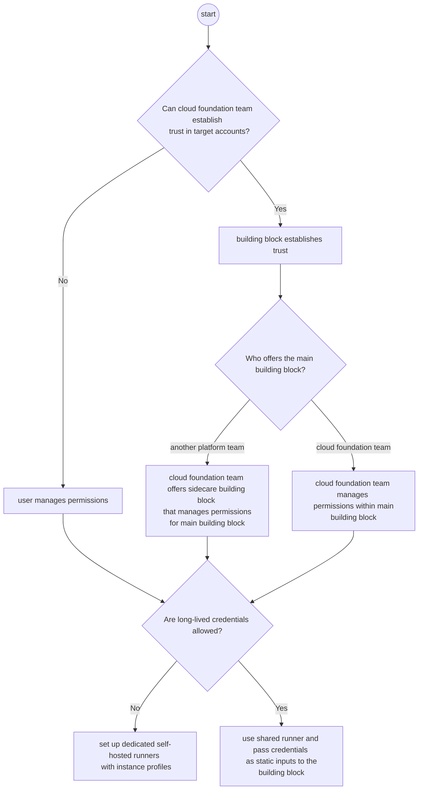
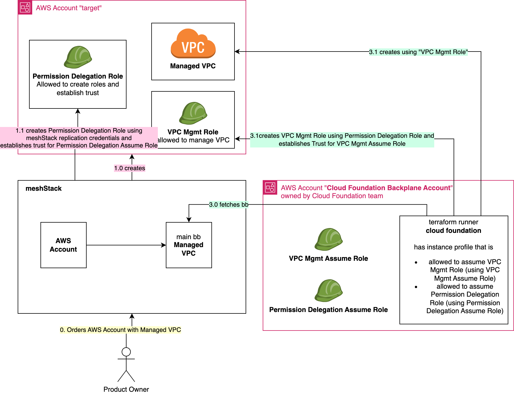
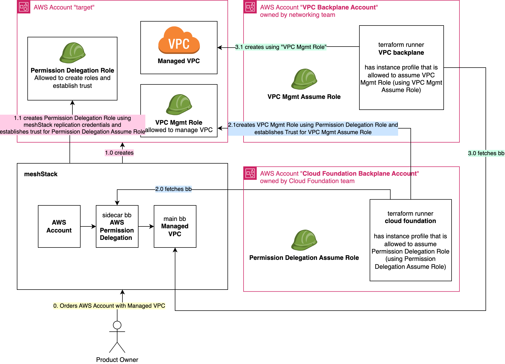
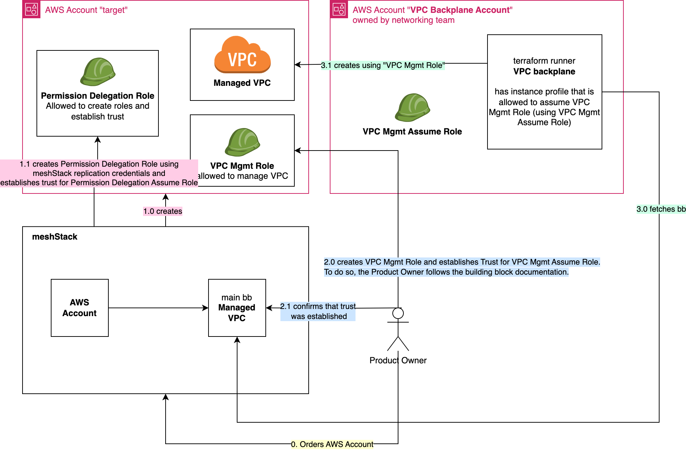

Building blocks are often managing resources in tenants that are owned by application teams.
As with any high privileged access, this access needs to be handled with great care.

Managing permissions to AWS accounts are always managed within the individual account, whereas in other platforms permissions can be inherited via a resource hierarchy. 
When providing a centralised service to application teams, you therefore have to design permission delegation explicitly.
In AWS permissions are granted using resource-based policy or cross-account IAM role that includes trust policy allowing one AWS account to access to resources in another account by assuming cross account role. We this document we describe the latter option.
## Deciding on a pattern

Depending on your requirements, we recommend different reference architectures.
Use this decision tree to find out the recommended reference architecture given your requirements.

## Reference Architectures

The decision trees implies six possible combinations, each with a different reference architecture.
The diagrams in this section depict the three combinations where no long lived secrets are allowed for a building block "Managed VPC" in this example.
If long lived secrets are allowed, you can simplify the terraform runner setup, the rest stays the same.

### Cloud Foundation Team has the permission to manage cross-account trust

When the cloud foundation team has the permission to establish trust, create a dedicated role for managing the main building block later on.

#### Cloud Foundation Team offers main building block

If the cloud foundation team offers the main building block, this building block should manage the necessary access.

To summarize, in this reference architecture

1. the cloud foundation team has the permission to establish trust
2. the cloud foundation team offers the "Managed VPC" building block
3. no long lived secrets are allowed

#### Another Team offers main building block

To summarize, in this reference architecture

1. the cloud foundation team has the permission to establish trust
2. a dedicated networking team offers the "Managed VPC" building block
3. no long lived secrets are allowed

### Cloud Foundation Team does not have the permission to manage trust

To summarize, in this reference architecture

1. the cloud foundation team does not have the permission to establish trust
2. either the cloud foundation team or a dedicated networking team offers the "Managed VPC" building block
3. no long lived secrets are allowed
4. Product/tenant owner reviews and provides the required cross-account trust

