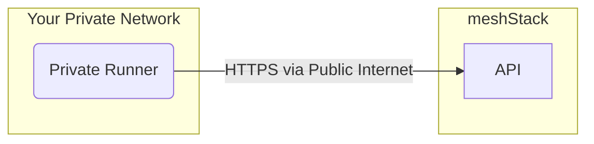

Private runners execute building blocks within your own cloud environment.
This is ideal for managing resources that are not accessible from the public internet.
While the runner operates within your infrastructure, it is still fully managed by meshcloud operators.

The private runner functions just like a regular runner.
It connects to your meshStack's API to receive and execute building block runs.

## How It Works

The private runner initiates a secure, outbound connection to your meshStack to poll for new jobs.
This means no inbound connections from the internet to the private runner are required, simplifying your network security configuration.

## Prerequisites

To set up a private runner, meshcloud operators need permissions within your target cloud environment to provision and manage the necessary infrastructure.
The goal is to create a secure, isolated environment for the runner.

The exact roles and permissions required will depend on your specific cloud platform (e.g., AWS, Azure, GCP).
Access should be scoped according to the principle of least privilege, providing just enough access to manage the runner's lifecycle.

The environment provisioned for the private runner must have:

- **Connectivity to meshStack**: The runner needs outbound network access to the meshStack API.
- **Internet Access**: The runner requires outbound internet access to download necessary dependencies, such as building block source code and Terraform providers.
- **Container Orchestration**: A service capable of running container-based workloads is required (e.g., Kubernetes).
- **Automated Updates**: meshcloud must be able to automatically update the runner to ensure it stays current with the latest features and security patches.
