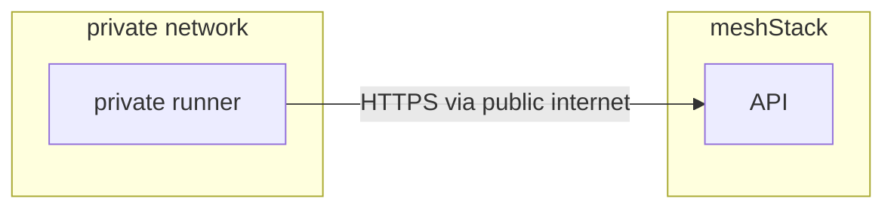

Private runners can be used to execute building blocks in your own cloud environment to enable access to resources that are not publicly accessible.

These runners are still operated by meshcloud but run outside of your meshStack.
Otherwise private runners operate like regular runners and connects to meshStack via meshStack API. 

When using a private runner it will run all building blocks from your meshStack.

## Requirements for private runners

To use private runners meshcloud operators need access to an environment with

- network access to your meshStack,
- internet access for sourcing building block code and requirements (e.g. Terraform providers),
- a way to run container based workloads (e.g. Kubernetes),
- a way to facilitate automatic updates to the runner.

## Communication between private runners and meshStack

The private runner connects to the parent meshStack to receive building block executions.
Since the private runner opens a connection to your meshStack, inbound connections to the runner are not needed.

