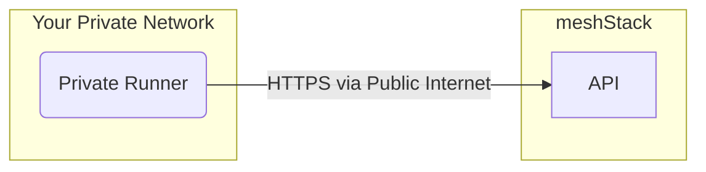

A building block runner is a component responsible for executing a specific type of building block (e.g. Terraform, GitLab). The typical workflow for a runner is:

1.  **Poll for Jobs**: The runner connects to your meshStack's API to receive building block runs.
2.  **Execute**: It prepares the execution environment (e.g. by downloading source code and tools) and executes the job.
3.  **Report back**: After execution, it posts back the result (success or failure) to meshStack.

meshcloud-hosted runners are fully managed by meshcloud and run in our cloud environment.

Private runners are also managed by meshcloud, but they run within your own cloud environment.
This gives you control over the execution environment's networking and security posture.
This is ideal for managing resources that are not accessible from the public internet.
While a private runner operates within your infrastructure, it is still fully managed by meshcloud operators.

You should consider using a private runner if you have specific requirements such as:

- **Accessing on-premises resources**: Provisioning infrastructure in your on-premises data centers.
- **Private source code repositories**: Your building block source code is hosted in a private version control system (e.g. GitLab) that is not reachable from the public internet.

> **Advisory**: For most use cases, the meshcloud-hosted SaaS runners are sufficient and easier to use. We recommend using the SaaS runners unless your requirements can only be met by a private runner.

## How It Works

The private runner initiates a secure, outbound connection to your meshStack to poll for new jobs.
After executing a building block the results will be posted back to meshStack.
This means no inbound connections from the internet to the private runner are required, simplifying your network security configuration.

## Prerequisites

To set up a private runner, meshcloud operators need permissions within your target cloud environment to provision and manage the necessary infrastructure.
The goal is to create a secure, isolated environment for the runner.

The exact roles and permissions required will depend on your specific cloud platform (e.g. AWS, Azure, GCP).
Access should be scoped according to the principle of least privilege, providing just enough access to manage the runner's lifecycle.

The environment provisioned for the private runner must have:

- **Connectivity to meshStack**: The runner needs outbound network access to the meshStack API.
- **Internet access**: The runner requires outbound internet access to download necessary dependencies, such as building block source code and Terraform providers.
- **Container orchestration**: A service capable of running container-based workloads is required. Supported services include:
  - Managed Kubernetes: Amazon EKS, Azure Kubernetes Service (AKS), Google Kubernetes Engine (GKE), or other Kubernetes distributions.
  - Container-as-a-Service: AWS Elastic Container Service (ECS), Azure Container Instances (ACI), or Google Cloud Run.
- **Automated updates**: meshcloud must be able to automatically update the runner to ensure it stays current with the latest features and security patches.

## Shared Responsibility Model

| Area                  | meshcloud Responsibility                                                      | Customer Responsibility                                                                                            |
| --------------------- | ----------------------------------------------------------------------------- | ------------------------------------------------------------------------------------------------------------------ |
| Runner Application    | Installation, configuration, maintenance, and updates of the runner software. |                                                                                                                    |
| Execution Environment | Provisioning of required tools (e.g., Terraform) inside the runner.           |                                                                                                                    |
| Cloud Infrastructure  |                                                                               | Provisioning and managing the underlying cloud infrastructure (e.g., Kubernetes cluster, networking, IAM).         |
| Networking            |                                                                               | Ensuring the runner has outbound connectivity to meshStack API and other required services (e.g., private GitLab). |
| Security              | Securing the runner application and its dependencies.                         | Securing the cloud infrastructure and network. Granting least-privilege access to meshcloud operators.             |

## FAQ

**How is the connection to meshStack secured?**

All communication between the private runner and the meshStack API is secured using HTTPS/TLS and API keys.
Any sensitive data, like secrets used by building blocks, are encrypted both in transit and at rest using asymmetric encryption.

**Why can't I host the runner myself?**

We are tracking the request for self-hosted runners on our public roadmap.
However, ensuring the security and reliability of building block execution is our top priority.
We have prioritized building other capabilities first while we design a secure self-hosting model.
For now, private runners offer a balance between a managed service and execution in a private environment.
