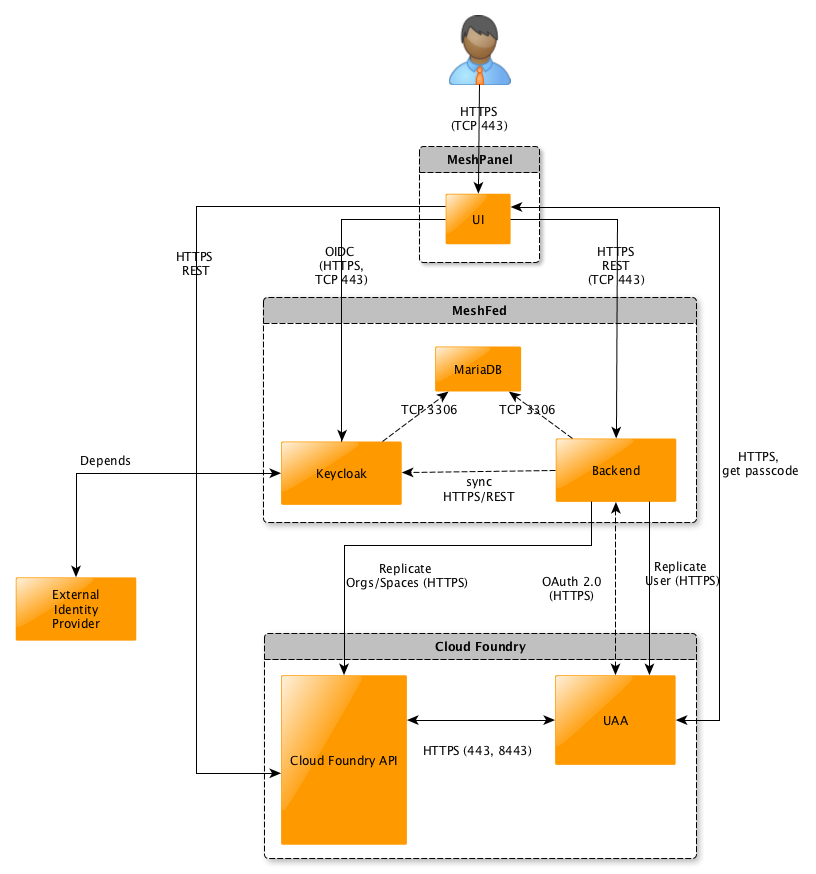
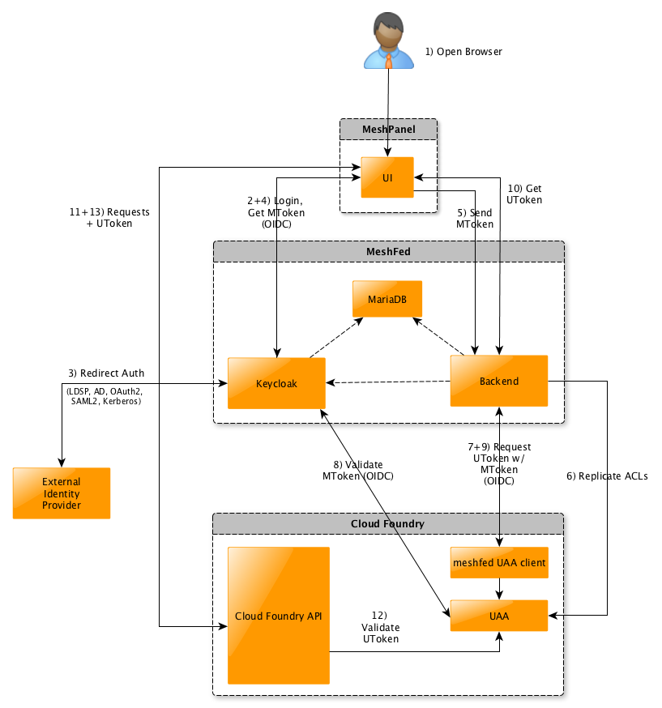

## Architektur

Der Zugriff auf Cloud Foundry Plattformen erfolgt durch die Authentifizierung über OIDC (OpenID Connect-Protokoll) und die Autorisierung über replizierte Berechtigungen.

Beim Zugriff auf die Cloud bringt der Nutzer ein Token mit (JWT), das vom Meshstack-Keycloak ausgestellt wurde und vom UAA validiert wird (s. Ablauf beim Zugriff). Der Meshstack-Keycloak wiederum greift auf eine externe Identitätsquelle zurück (z.B. LDAP, Cloud IdP).

Das Meshpanel-Frontend validiert die JWT-Token ebenfalls gegen Keycloak, um dem Nutzer den notwendigen Zugriff einzuräumen.

Das Backend nutzt ebenfalls das JWT-Token, um die Berechtigungen des Users zu prüfen.

Die Replizierung im Backend stellt sicher, dass beim Zugriff auf Cloud Foundry die Spaces und Orgs in CF angelegt und der aktuelle Benutzer mit den entsprechenden Berechtigungen auf seine Spaces im UAA versehen ist.

Werden die Berechtigungen auf die Cloud für Nutzer über den Meshstack geändert, aktualisiert das Backend die im UAA hinterlegten Berechtigungen für diesen User.

## Cloud Foundry Access

Der Zugriff eines Users auf Cloud Foundry läuft nun nach dem folgenden Schema ab:

1. Der User greift über den Browser auf den Meshstack zu.
2. Im ausgeloggten Zustand wird der User auf Keycloak weitergeleitet, um seine Credentials einzugeben.
3. Diese Credentials werden ggf. gegen den angeschlossenen externen IdP abgeglichen (z.B. LDAP).
4. Bei erfolgreicher Anmeldung stellt Keycloak dem User ein OIDC-Token (JWT, hier MToken) aus und gibt es dem User mit in das Meshpanel, so dass der User angemeldet ist und damit arbeiten kann.
5. Für einen Cloud-Zugriff über das Panel, wird mit dem OIDC-Token ein entsprechender Request an das Backend gestellt.
6. Bevor der Zugriff an den UAA weitergeleitet wird, stellt der Meshstack sicher, dass die korrekten Berechtigungen auf die Spaces für den aktuellen Benutzer in den UAA repliziert sind.
7. Das Backend nutzt das mitgeschickte OIDC-Token, um beim UAA (an der Cloud) wiederum ein UAA-Token (UToken) zu erhalten. Es erfolgt also ein Token-Tausch. Dieser Token Austausch erfordert die Aktivierung des jwt-bearer Auth-Grants auf dem UAA client. Um nicht den allgemeinen "CF" UAA-Client dafür zu öffnen, liegt im UAA ein spezfiischer "meshfed" UAA-Client vor, der nur diesen jwt-bearer Grant erlaubt. Da er durch ein Secret abgesichert ist kann er nur vom Meshstack Backend aus genutzt werden. Es ist also nur dem Meshstack Backend möglich ein MToken gegen ein UToken mittels API Request gegen den UAA auszutauschen.
8. Der Token Exchange Request gegen UAA führt dazu, dass dieser das OIDC-Token validiert (Zeitliche Gültigkeit, Signatur des Keycloaks).
9. Ist das OIDC-Token gültig, leitet der UAA ein UAA-Token (UToken) an das Backend zurück.
10. Das Backend schickt das erhaltene UToken an das Panel, so dass dieses direkt auf die jeweiligen Cloud Foundry APIs zugreifen kann.
11. Beim Zugriff auf die Cloud Foundry API wird nun das UToken eingesetzt.
12. Die Cloud Foundry API validiert das UToken gegen den UAA.
13. Ist es valide und hat der Benutzer die Berechtigungen, um auf die angefragte Ressource zuzugreifen, werden die angeforderten Requests beantwortet und der Zugriff auf die Cloud Foundry Dienste ist abgeschlossen.

Läuft das UToken ab, muss der OIDC/UAA Token Exchange (7-9) erneut durchgeführt werden. Ist das OIDC-Token abgelaufen, muss der User sich erneut gegenüber dem Keycloak authentifizieren.

