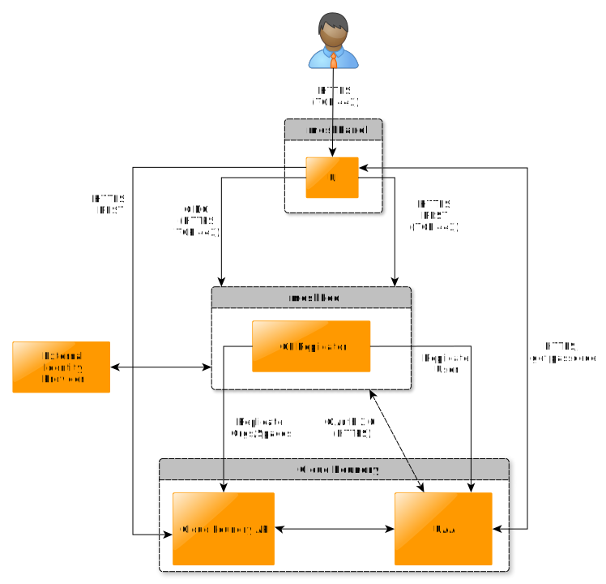

meshStack supports access to Cloud Foundry platforms which provide convienent application hosting capabilities to software and DevOps engineers. Usually, there are also many backing services available within the platforms marketplace such as database, data processing, queueing, and many more (depending on the platform operators choice of services).

For Cloud Foundry, meshStack provides org and space creation and configuration, user management and SSO via Cloud Foundry's UAA.

## Integration Overview

To enable integration with Cloud Foundry, operators deploy and configure the meshStack Cloud Foundry connector to make Cloud Foundry platforms available at their meshStack instance.

meshStack provides users access to Cloud Foundry (CF) instances via the OIDC protocol for authentication while it replicates permission rights directly to authorize correct access.

When accessing the platform the user carrises an OIDC Token (JWT) which is issued by the meshIdB (and, potentially, by an upstream corporate identity provider, cf. [Identity Federation](meshstack.identity-federation.md)). Cloud Foundry's Auth component UAA validates the token upon access. Also for CF access within meshPanel the token is used to request status information about apps and services to display within meshPanel.

The meshFed replication ensures spaces and orgs are created within the CF platform and appropriate permission rights are set when users access the CF platform. If a user's meshProject permissions are modified, meshStack updates the permissions for this user accordingly within the CF platform.

## Cloud Foundry Access Workflow

The full workflow to access the Cloud Foundry platform is as follows:

1. User accesses the meshPanel via browser.
2. If logged out the user is forwarded to the meshIdB component to enter his credentials.
3. If there is an external identity provider connected, the user or his credentials are forwarded for authentication purposes.
4. Upon successful authentication, the meshIdB issues an OIDC token (meshToken) which provides the user authorized access to the meshPanel and the cloud platform tenants he is authorized to access.
5. If the user accesses a cloud platform via meshPanel, meshStack ensures full replication of the current tenant configuration including permissions.
6. The meshStack backend exchanges the user's meshToken against an UAA token for the user.
7. When accessing CF, the UAA validates the token and grants access if it is valid (time, issuer).
8. The meshPanel also uses the UAA token to access and display status information about the CF space in focus.
9. Every time the user accesses the CF API, CF's UAA validates the token to ensure authorized access to the requested resource.
10. If the UAA token is expired, the meshToken/UAA token exchange must be executed again via the meshStack backend. If the meshToken is expired, the user must re-authenticate against the meshIdB and/or the delegated enterprise SSO system.

## Prequisites

### UAA configuration

UAA needs to have jwt-bearer Auth grants enabled which is configured against a corresponding OIDC client configuration within the meshIdB.