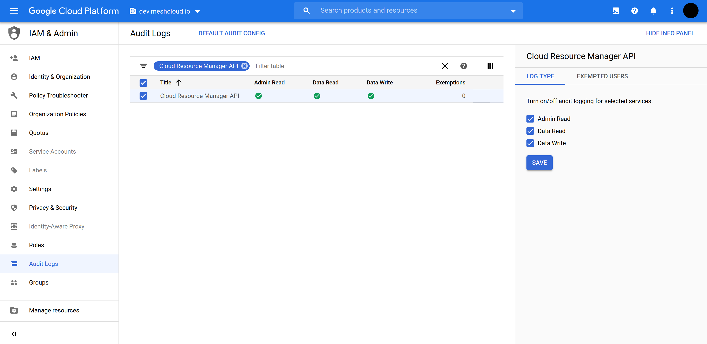

meshcloud can automatically provision GCP Projects as Tenants for [meshProjects](./meshcloud.project.md) and configure them according to your organiziations policies using [Landing Zones](./meshcloud.landing-zones.md).

## Integration Overview

To enable integration with GCP, operators need to deploy and configure the meshStack GCP Replicator. Operators can configure one or multiple `PlatformInstance`s of `PlatformType.GCP`. This makes GCP available to meshProjects like any other cloud platform in meshStack.

Google Cloud Platform relies on [Google Cloud Identity (GCI)](https://cloud.google.com/identity/) for authentication and authorization. meshStack can seamlessly integrate with GCI and various hybrid identity setups.
Organizations already using Google Cloud Directory Sync or G-Suite can use meshStack with an [externally provisioned identities](./meshstack.identity-federation.md) configuration.

meshcloud helps organizations implement Google Cloud Platform in line with [governance best-practices](https://cloud.google.com/docs/enterprise/best-practices-for-enterprise-organizations) by integrating with the GCP [Organization Resource Hierarchy](https://cloud.google.com/resource-manager/docs/cloud-platform-resource-hierarchy) and [Organization Policy Service](https://cloud.google.com/resource-manager/docs/organization-policy/overview) using [Landing Zones](./meshstack.gcp.landing-zones.md).

In order to plan and execute a successful integration of GCP using meshcloud, organizations need to consider the following parts described in the sections below.

> As part of an integration project meshcloud typically delivers a configuration tailored to your organization's specific requirements using infrastructure as code (IaC) tools. The descriptions below serve as a general reference.

## Cloud Identity Setup

Cloud Identity "Free" is sufficient for automated GCP IAM management through meshStack. meshStack does not require Cloud Identity Premium nor G-Suite features.

We recommend using [externally provisioned identities](./meshstack.identity-federation.md) with GCP.

## Organization Setup

Operators need to setup a GCP Organization to be used by meshStack. Please review the official GCP documentation on [creating and managing organizations](https://cloud.google.com/resource-manager/docs/creating-managing-organization).

### Service Account Configuration

meshStack needs a well-defined set of permissions for its automation. meshStack is designed so that it **does not require
access to workload**. We highly recommend that permissions are configured according to the "least privilege" principle.

Operators need to define a [Custom IAM Role](https://cloud.google.com/iam/docs/understanding-custom-roles) called `meshfed-service` at the **Organization Level** with the following permissions

```text
resourcemanager.folders.get
resourcemanager.folders.list
resourcemanager.organizations.get
resourcemanager.projects.create
resourcemanager.projects.get
resourcemanager.projects.getIamPolicy
resourcemanager.projects.list
resourcemanager.projects.move
resourcemanager.projects.setIamPolicy
resourcemanager.projects.update
resourcemanager.projects.createBillingAssignment
resourcemanager.projects.deleteBillingAssignment
billing.resourceAssociations.create
serviceusage.services.enable
serviceusage.services.get
deploymentmanager.deployments.delete
deploymentmanager.deployments.create
deploymentmanager.deployments.update
deploymentmanager.deployments.get
```

## Root Project Configuration

For some resources we need a “root” project for meshStack in GCP. This project is reserved for use by meshstack and operators. For this guide, we’ll call the root project `meshstack-root`.

### Enable APIs

Enable the following APIs on the `meshstack-root` project from the API Library

- [Admin SDK](https://console.cloud.google.com/apis/api/admin.googleapis.com/overview)
- [Cloud Resource Manager API](https://console.cloud.google.com/apis/api/cloudresourcemanager.googleapis.com/overview)
- [Cloud Billing API](https://console.cloud.google.com/apis/library/cloudbilling.googleapis.com/overview)

### meshfed-service Service Account

Create a `meshfed-service` [Service Account](https://cloud.google.com/iam/docs/service-accounts) in the `meshstack-root` project.

- Enable the Service Account for “G Suite Domain-wide Delegation” and note the generated `Client Id`
- Generate and Download a [Service Account Key](https://cloud.google.com/iam/docs/creating-managing-service-account-keys)

The Service Account will be identified by an email address like

```text
meshfed-service@meshstack-root.iam.gserviceaccount.com
```

#### Granting Resource Permissions

The Service Account will be used by meshStack to perform project replication. Operators thus need to grant it the permissions of the
`meshfed-service` IAM role on those folders of the [GCP resource hierarchy](https://cloud.google.com/resource-manager/docs/cloud-platform-resource-hierarchy)
that make up the [Landing Zones](meshstack.gcp.landing-zones.md) for client projects.

> It's a best practice to segregate "user" and "infrastructure" projects in GCP using the resource hierarchy.
> By setting granular permissions (instead of organization-wide permissions) this can limit the access of meshStack's replicator
> to only the parts of the resource hierarchy that it needs to actively manage (principle of least privilege).

#### Grant Billing Account Permissions to the Service Account

In order to associate created projects with a Billing Account, the replicator needs to be granted the
`billing.resourceAssociations.create` permission on the Billing Account. This is best achieved by assigning the
`meshfed-service` IAM Role to the `meshfed-service` Service Account on the Billing Account in [the Billing Account's permissions](https://cloud.google.com/billing/docs/how-to/billing-access#update-cloud-billing-permissions).

## Cloud Identity Configuration

### Authorizing the Service Account

In order to perform certain group related administrative tasks the previosly created service account needs an additional role from the Admin Console (G Suite). In order to add this role you need to get the `unique ID` of the Service Account first.

Please follow the official [Google guide](https://cloud.google.com/identity/docs/how-to/setup#auth-no-dwd) in order to:

1. Find the `roleID` of the `Group Administrator` role in your Admin SDK.
2. Use the [Role Assignments API](https://developers.google.com/admin-sdk/directory/v1/reference/roleAssignments/insert) and assign this role to the service account with help of its unique id. The HTTP POST payload looks like:

```json
{
  "assignedTo": "SERVICE_ACCOUNT_UNIQUE_ID",
  "roleID": "ROLE_ID",
  "scopeType": "CUSTOMER"
}
```

## Configuration Reference

This section describes the configuration of a GCP Platform Instance in the meshStack [configuration model](./meshstack.index.md#configuration)
at `mesh.platforms`.

For easier reference the following sections break down the configuration model in multiple parts. The union of these
defines the full configuration model.

<!--snippet:mesh.platforms.gcp#type-->


<!--DOCUSAURUS_CODE_TABS-->
<!--Dhall Type-->
```dhall
let GcpPlatform =
        GcpPlatformCoreConfiguration
      ⩓ GcpPlatformCredentialConfiguration
      ⩓ GcpPlatformRoleMappingConfiguration
```
<!--END_DOCUSAURUS_CODE_TABS-->

### Core Configuration

<!--snippet:mesh.platforms.gcp.core#type-->


<!--DOCUSAURUS_CODE_TABS-->
<!--Dhall Type-->
```dhall
let GcpPlatformCoreConfiguration =
    {-
      platform:
        The meshPlatform identifier

      domain:
        The domain used for cloud identity directory-groups created and managed by meshStack. meshStack maintains separate
        groups for each meshProject role on each managed GCP project.

      customerId:
        A Google Customer Id. You can find this id via google cloud shell https://cloud.google.com/resource-manager/docs/organization-policy/restricting-domains#gcloud_2
        Or alternatively following the instructions at https://support.google.com/a/answer/9039510?hl=en

      billingAccountId:
        The id of the billing account to associate with all GCP projects managed by meshStack

      projectNamePattern:
        All the usual available replicator string template properties are available.
        (see: http://docs.meshcloud.io/docs/meshstack.replication-configuration.html#string-templating)
        The result must be 4 to 30 characters.
        Allowed characters are: lowercase and uppercase letters, numbers, hyphen, single-quote, double-quote, space,
        and exclamation point.
        When length restrictions are applied, the abbreviation will be in the middle and marked by a single-quote

      projectIdPattern:
        All the usual available replicator string template properties are available.
        The resulting string must not exceed a total length of 30 characters. Only alphanumeric + hyphen are allowed.
        We recommend that configuration include at least 3 characters of the random parameter to reduce the chance of
        naming collisions.

      groupNamePattern:
        All the usual available replicator string template properties are available.
        (see: http://docs.meshcloud.io/docs/meshstack.replication-configuration.html#string-templating)
        The additional property is available:

          1. platformGroupAlias (configurable via Landing Zone and can be used as a role name suffix)

      allowHierarchicalFolderAssignment:
        Configuration flag to enable or disable hierarchical folder assignment in GCP. This means
        projects can be assigned to sub folders of the defined resource manager folder in a landing zone.
        If this config flag is disabled the replicator forces to create projects only directly under the resource manager folder.
        Every project which is not directly attached to the resource manager folder will be then moved via gcp function to the right folder.

      tenantTags:
        Configures how to map tags coming from meshfed to project labels in GCP. For more information please look into
        the TenantTags type documentation.
    -}
      { platform : Text
      , domain : Text
      , customer-id : Text
      , billing-account-id : Text
      , project-name-pattern : Text
      , project-id-pattern : Text
      , group-name-pattern : Text
      , allow-hierarchical-folder-assignment : Bool
      , tenant-tags : TenantTags
      }
```
<!--Example-->
```dhall
let example
    : GcpPlatformCoreConfiguration
    = { platform = "gcp.mylocation"
      , domain = "myorg.example.com"
      , customer-id = " Cxxxx123"
      , billing-account-id = "123456-1234ABCD-1234FF"
      , project-name-pattern =
          "\${customerIdentifier:%.14s} \${projectIdentifier:%.15s}"
      , project-id-pattern =
          "\${customerIdentifier:%.15s}-\${projectIdentifier:%.10s}-\${rand:%.3s}"
      , group-name-pattern =
          "\${customerIdentifier}.\${projectIdentifier}-\${platformGroupAlias}"
      , allow-hierarchical-folder-assignment = True
      , tenant-tags =
        { namespace-prefix = "meshstack_"
        , tag-mappers =
          [ { key = "cident"
            , value-pattern = "prefix-\${customerIdentifier}"
            }
          ]
        }
      }
```
<!--END_DOCUSAURUS_CODE_TABS-->

#### Multiple Billing Accounts

In order to maintain symmetry to other public cloud platforms, meshStack consolidates billing of all GCP projects managed
under the same GCP Platform Instance to a single Google Cloud Billing Account. The billing account id is thus configured
on the platform level. To use multiple billing accounts consider configuring multiple GCP meshPlatforms in meshStack.


#### Billing Account owned by a different organization

In order to use a billing account that is owned by a different organization the permissons for `meshfed-service` user need to be adjusted.

Operators create a custom role `meshfed-billing-creator` in the organization that owns the target billing account with the following permisson

```text
billing.resourceAssociations.create
```

The `meshfed-service` user needs to be granted the `meshfed-billing-creator` role in the organization that owns the target billing account.

Following the principle of least privilege, operators should remove the `billing.resourceAssociations.create` permisson from the custom role `meshfed-service` created in [meshfed-service IAM Role](#meshfed-service-iam-role).

### Credentials

Configure the [meshfed-service Service Account](#meshfed-service-Service Account) and [meshfed-service Service User](#meshfed-service-user)
using the following options.

<!--snippet:mesh.platforms.gcp.credentials#type-->


<!--DOCUSAURUS_CODE_TABS-->
<!--Dhall Type-->
```dhall
let GcpPlatformCredentialConfiguration =
    {-
      serviceAccountCredentialsB64:
        base64 encoded credentials.json file for a GCP ServiceAccount. The replicator uses this Service Account
        to automate GCP API operations (IAM, ResourceManager etc.).
    -}
      { service-account-credentials-b64 : Secret }
```
<!--Example-->
```dhall
let example
    : GcpPlatformCredentialConfiguration
    = { service-account-credentials-b64 = Secret.Native "b123" }
```
<!--END_DOCUSAURUS_CODE_TABS-->

### GCP Role Mapping

The [project roles](meshcloud.project.md#project-roles) are mapped to user roles in GCP.
This mapping is fully customizable and can use custom as well as built-in roles.

Operators can also override these role mappings per [Landing Zone](meshstack.gcp.landing-zones.md). This also offers
more granular control over possible role mappings. Any role mappings
defined in the Landing Zone take precedence over the role mappings defined on the platform level.

<!--snippet:mesh.platforms.gcp.rolemappings#type-->


<!--DOCUSAURUS_CODE_TABS-->
<!--Dhall Type-->
```dhall
let GcpPlatformRoleMappingConfiguration =
    {-
      roleMappings:
        A list of mappings from meshProjecRole identifiers to GCP role ids (e.g. roles/editor).
        The replicator uses these to derive IAM Role bindings for meshProject roles in GCP.

        Operators can override these default role mappings in Landing Zones.
    -}
      { role-mappings : List { mapKey : Text, mapValue : Text } }
```
<!--Example-->
```dhall
let example
    : GcpPlatformRoleMappingConfiguration
    = { role-mappings =
        [ { mapKey = "admin", mapValue = "roles/editor" }
        , { mapKey = "user"
          , mapValue = "organizations/123456/roles/custom-role"
          }
        ]
      }
```
<!--END_DOCUSAURUS_CODE_TABS-->

## Audit Logs for meshfed-service User

The actions of the `meshfed-service` User can be monitored via [Audit Logs](https://cloud.google.com/logging/docs/audit/). This allows an in-depth view meshStack activities for GCP project at any moment.

### Enable Audit Logs

> Enabling Audit Logs may incur charges.

meshcloud recommends to enable Audit Logs on the organizational level for monitoring `meshfed-service` User. This is achivied by following these steps:

1. Navigate to the organizational level in [GCP Cloud Console](https://console.cloud.google.com/)
2. Navigate to [IAM & Admin --> Audit logs](https://console.cloud.google.com/iam-admin/audit)
3. Filter the table for `Cloud Resource Manager API` and select the resulting entry
4. Enable all log types

You may want to check the [official Google instructions](https://cloud.google.com/logging/docs/audit/configure-data-access#config-console-enable) on enabling Auit Logs for further information.

The below screen shot show how to set up the Audit Logs for the organization `dev.meshcloud.io`



### Query Audit Logs in Google Cloud Console

Please consult [Google docs](https://cloud.google.com/logging/docs/audit#viewing_audit_logs) for options to querying Audit Logs.
