By following these steps, you can easily add Platform Services to your Workspace, create Tenants, and manage your cloud environments efficiently.

Prerequisites:

- To add Platform Services, you must possess the role of Workspace Owner or Workspace Manager.
- Ensure you have at least one Workspace before proceeding to add Platform Services.

Step by Step guide:

1. **Choose a Workspace:**
    
    Navigate to the upper left corner of your screen and select the Workspace for which you want to add a platform service.
    
    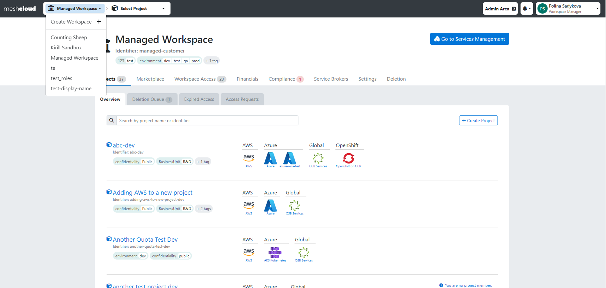
    
2. **Access Marketplace:**
    
    Within the chosen Workspace, go to the "Marketplace" tab.
    
    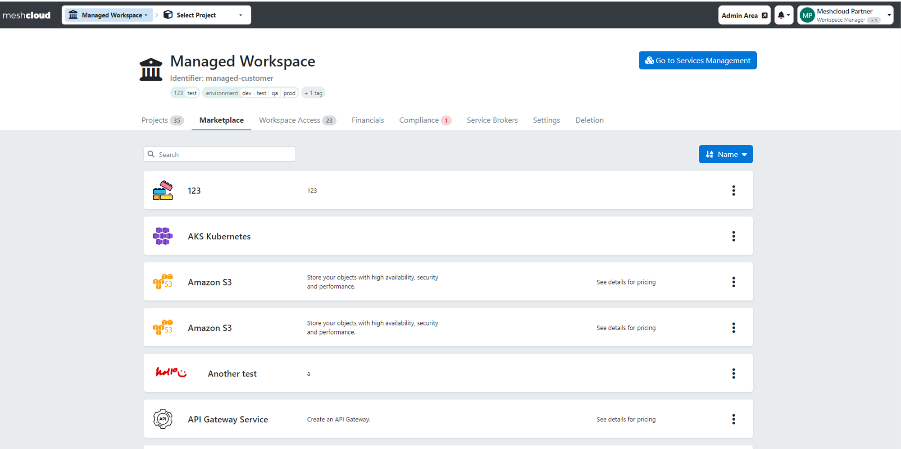
    
3. **Select Platform Services:**
    
    From the list of available services, choose the desired Platform Service. This could be a platform like AWS or any DevOps tool or service like AzureVnet (see examples below). The main distinction between a Service and a Platform lies in the fact that a Service you choose always necessitates a specific Platform to function. In other words, a Service requires the existence of a Tenant or the creation of one to be added to your Project. 
    
     
    
    - example of a Platform
    
    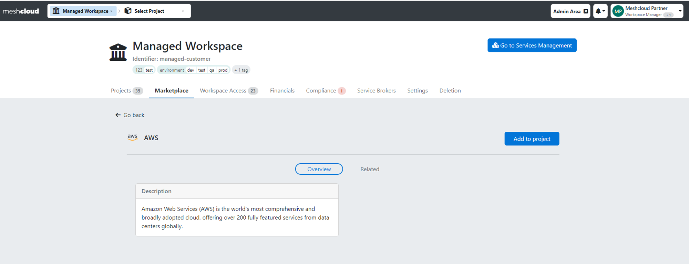
    

- example of a Service

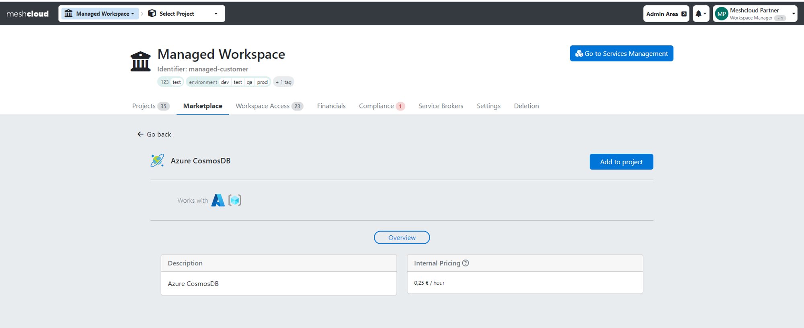

**4.1. Adding a Platform:**

Adding a Platform to a Project creates a Tenant, which is an isolated cloud environment within that Project (e.g., AWS account, Azure subscription).

If you selected a Platform, decide whether to

- [create a new Project for it](#guide-for-adding-platform-to-new-project)
- [add it to an existing Project](#guide-for-adding-platform-to-new-project)

**4.2. Adding Service**

The distinction between creating a Service and a Platform lies in the fact that a chosen Service always requires a specific Platform to function, thus requiring the existence of a Tenant or the creation of one to add the Service successfully. Details regarding the required Tenant type for a particular Service are displayed on the service details screen. 

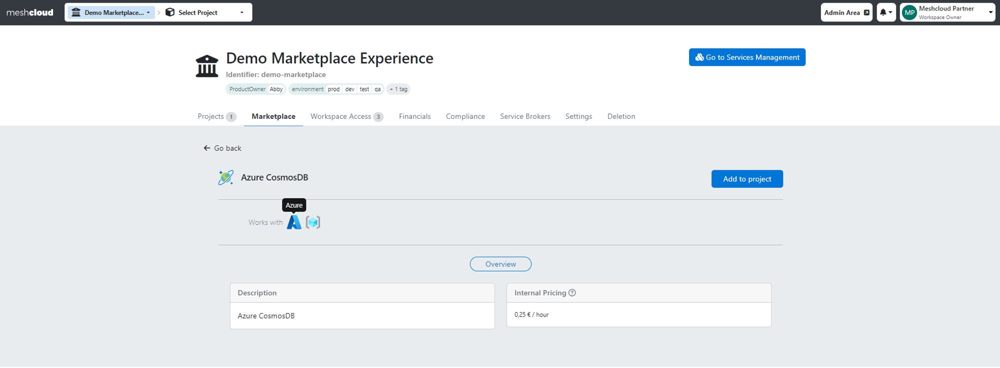

You have the flexibility to choose whether to add Service to:

- [a new Project (Create a Project and Tenant, together with adding a Service)](#guide-for-adding-service-to-a-new-project)
- [an existing Project](#guide-for-adding-service-to-an-existing-project)

**4.3 Adding a Service (Open Service Brocker)** 

> To avoid any confusion, we recommend to our customer with upgraded Marketplace considering a name change for meshMarketplace Platforms from "Marketplace" to "OSB Services" to ensure clarity and clear separation of concept names within your meshStack.

The Open Service Brocker (OSB) Service type only differs from the previously mentioned Services in that it exclusively operates with the “OSB Services” (deprecated naming “Marketplace”) Platform type. This means you must have or create an “OSB Services” Tenant in your Project to be able to add your Service Instance.

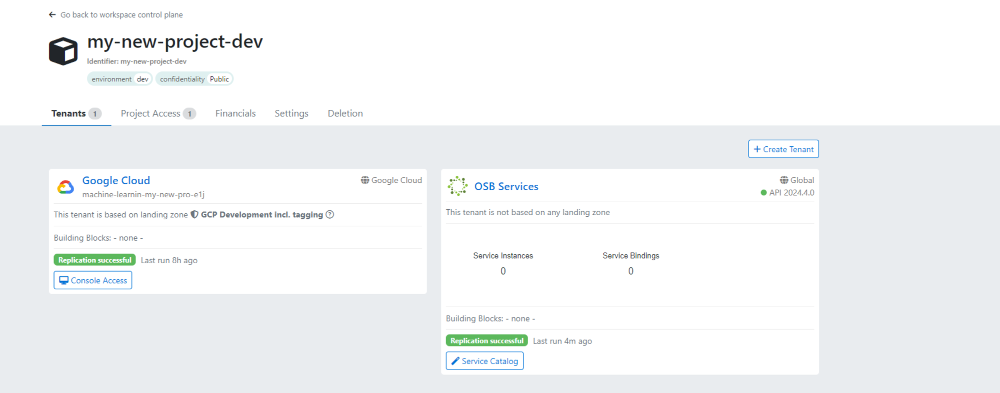

All available Service Instances will be shown on the Service Catalog and you can simply add them from the Service Catalog to Project with “OSB Services” Tenant. For OSB Services you have the same flexibility to choose whether to add Service to:

- [a new Project (Create a Project and Tenant, together with adding a Service)](#guide-for-adding-service-to-a-new-project)
- [an existing Project](#guide-for-adding-service-to-an-existing-project)

### Guide for adding Platform to new Project:

**Step 1:** If you decide to create a new Project with a Platform, after choosing it from the Service Catalog click on “Create a Project”  and simply follow the on-screen steps for Project creation. 

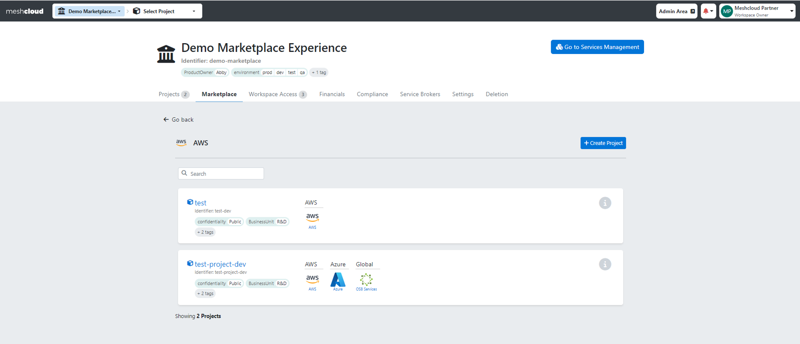

**Step 2:** The previously chosen Platform will be preselected for you and you will need to configure it by choosing the appropriate Landing Zone.

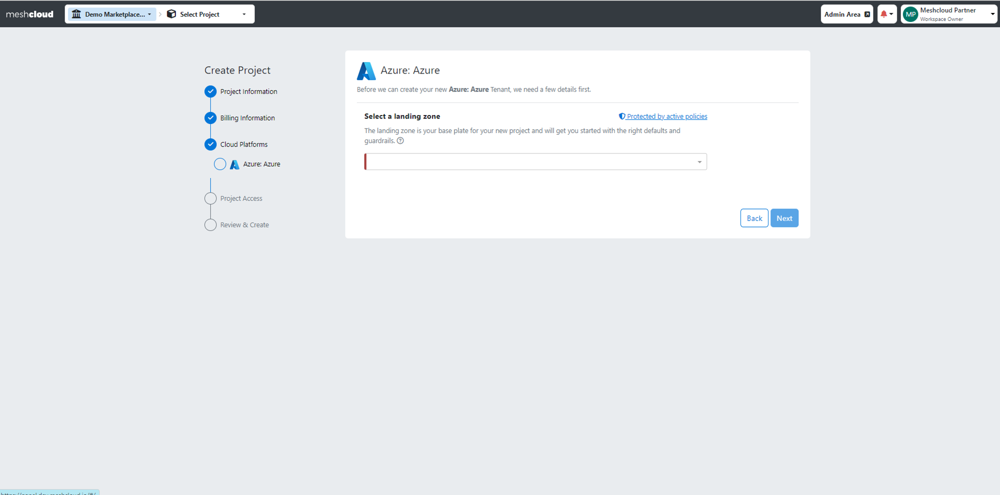

**Step 3:** Upon reviewing your Project information and clicking on "Create a Project" the Tenant will be automatically created alongside the Project.

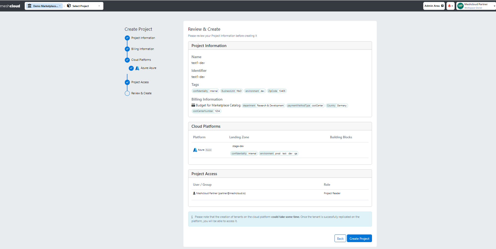

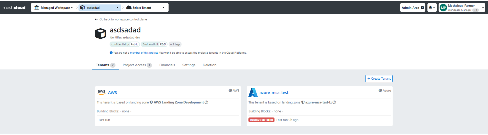

### Guide for adding Platform to existing Project:

**Step 1:** Choose a Platform from the Service Catalog and select an existing Project from the list. Please be aware that only one Tenant per platform type can be created in the Project. For example, if you already have an Azure Tenant in a Project, you can´t add another Azure Tenant to the same Project.

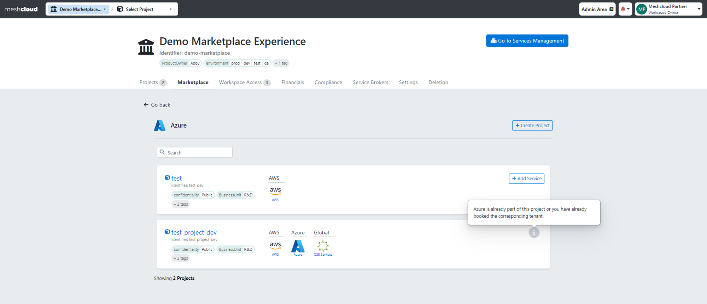

**Step 2:** After choosing the Project, proceed with “Create Tenant”.

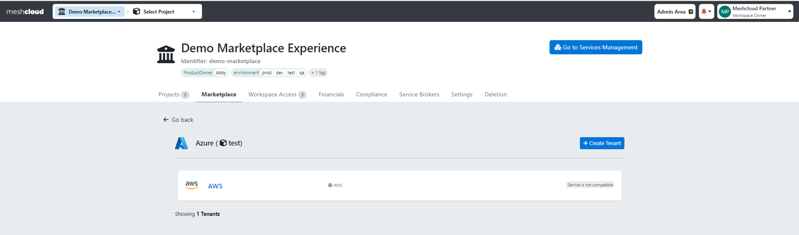

**Step 3:** Then configure it by choosing the appropriate Landing Zone and clicking “Create a new Tenant”. At this step, you also have the option to add Services (Building Block) to your Tenant.

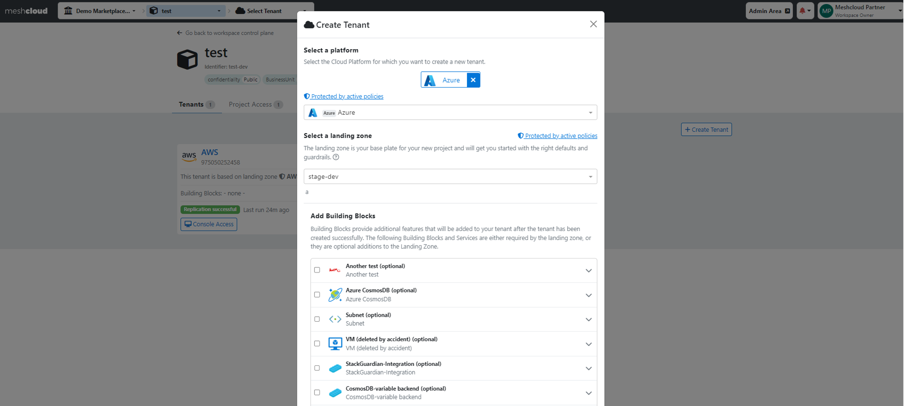

**Step 4:** Congratulations! You've successfully added a Tenant and you can click on it to check Services available to add and other info.

### Guide for adding Service to a new Project:

**Step 1:** If you decide to create a new Project with a Service, after choosing it from the Service Catalog, click on “Create a Project”, agree to create a Project with your Service, and simply follow the on-screen steps for Project creation. 

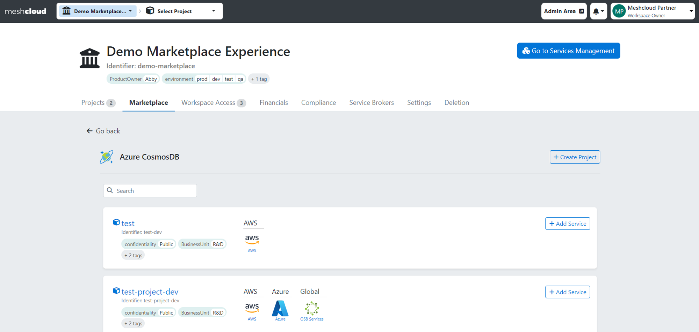

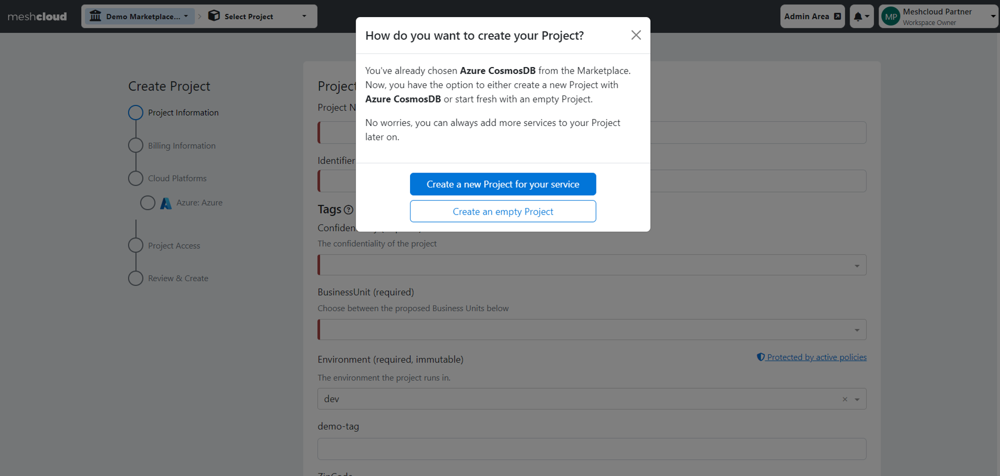

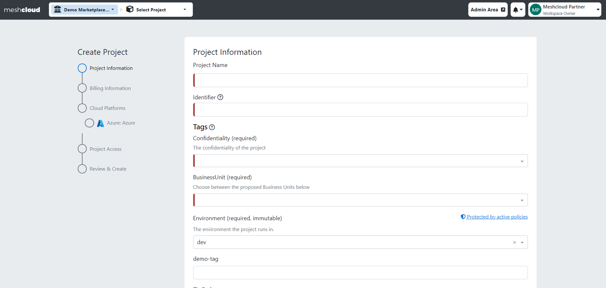

**Step 2:** The previously chosen Service will be preselected for you including the Platform for this Service. If a Service can work with more than one Platform type, you will need to pick one from the list.

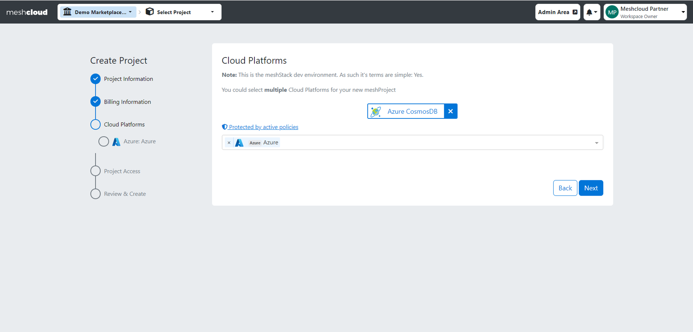

**Step 3:** After selecting a Platform for your Service, the next step involves choosing a **Landing Zone** and configuring your Service by providing the required input. For OSB Services, no Landing Zone needs to be chosen. 

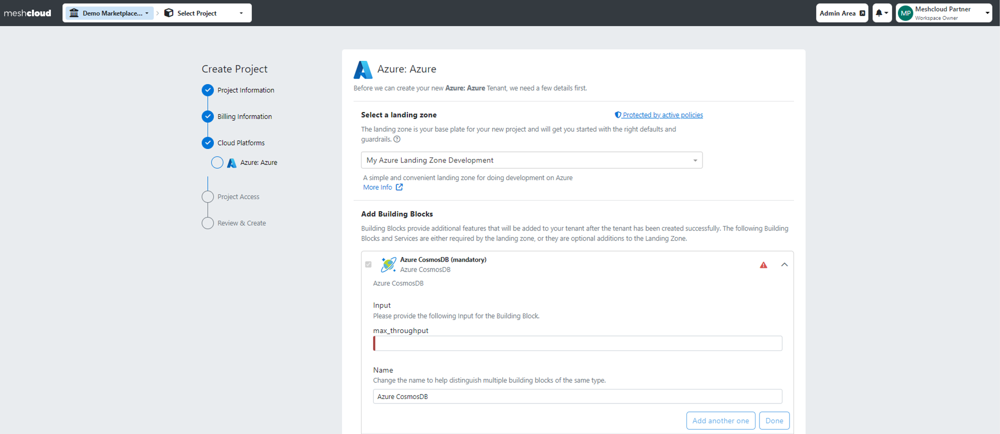

**Step 4:** Upon reviewing your Project information and clicking on "Create a Project" the Tenant including the Service will be automatically created alongside the Project!

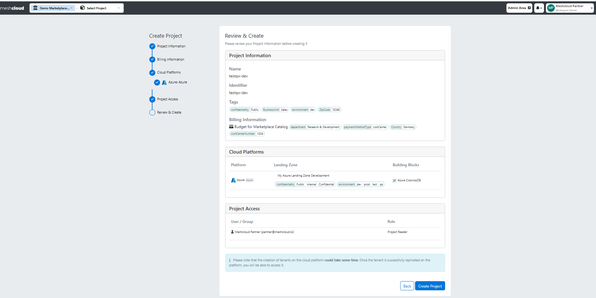

### Guide for adding Service to an existing Project:

**Step 1:** Navigate to the Service Catalog and select the Service that you want to add to your existing Project.

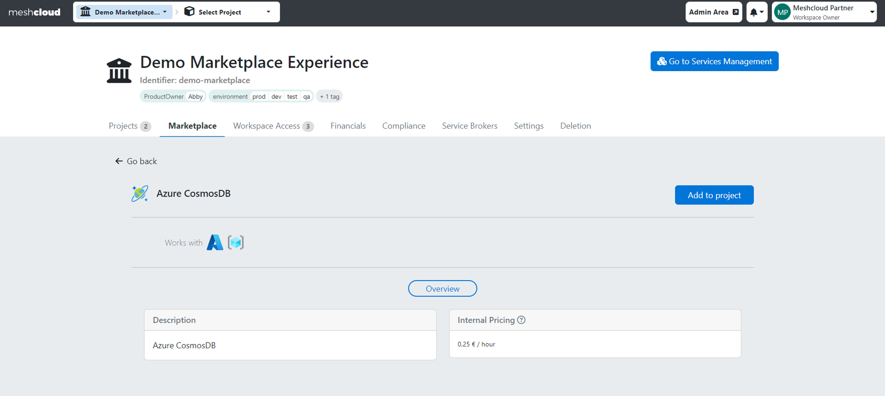

**Step 2:** From the Project overview, click on the "Add Service" button for the Project in which you would like to add Service.

**Step 3:** After selecting the Project choose a compatible Tenant and afterwards configure your Service. If you do not have a compatible Tenant for your chosen Project to add your Service, please check step 5.  

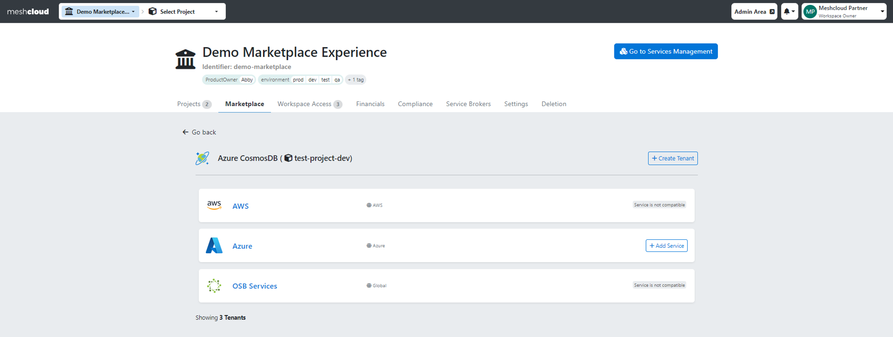
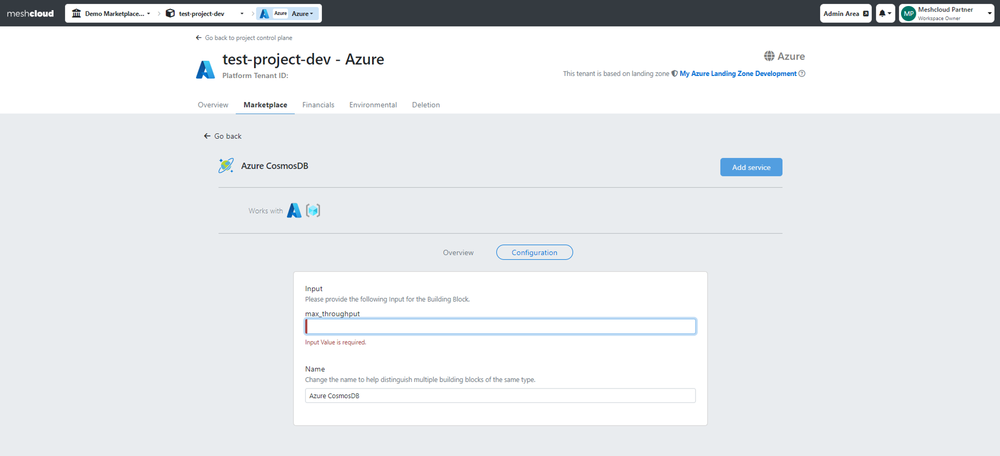

**Step 4:** Congratulations! You've successfully added a Service! You can now click on the Tenant to check on your Services under the Building Block section (see added). In the case of OSB Service, it will be shown in the OSB Service section.

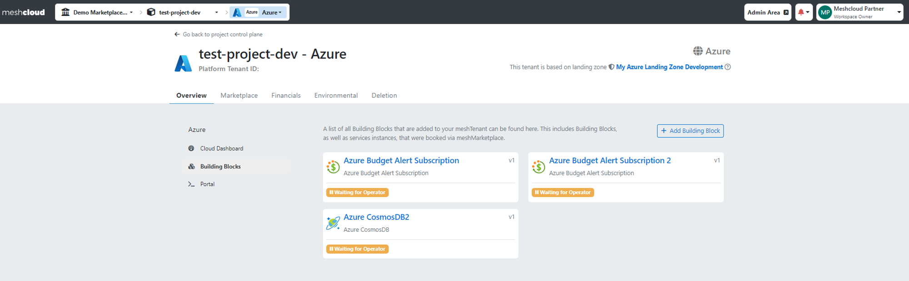
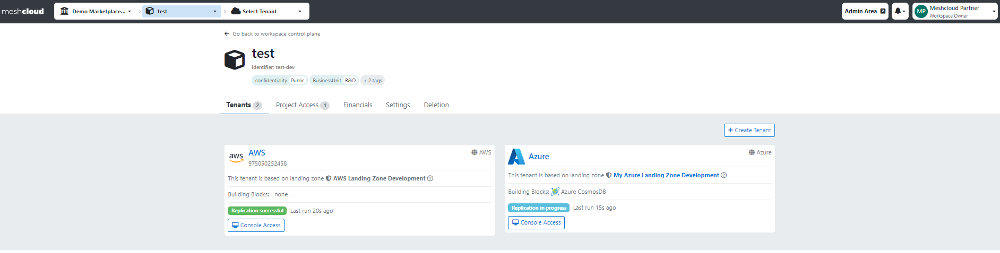
**Step 5:** In case you don´t have a compatible Tenant for your Service like in the example below, please click on "Create a New Tenant”, choose the desired Platform for your Service, choose a Landing Zone, and provide the necessary input to configure your Service according to your needs. Afterward, click on the "Create" button to finalize the addition of your Service to the new Tenant. Congratulations, you've successfully added a Service!

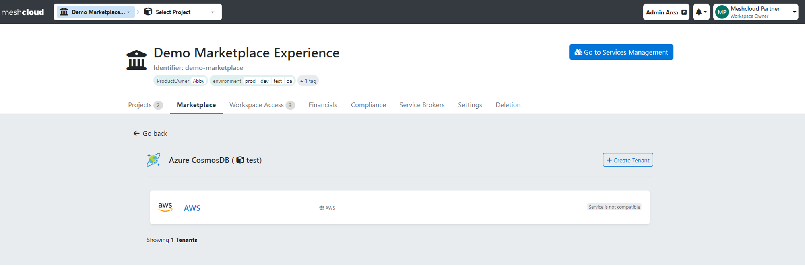

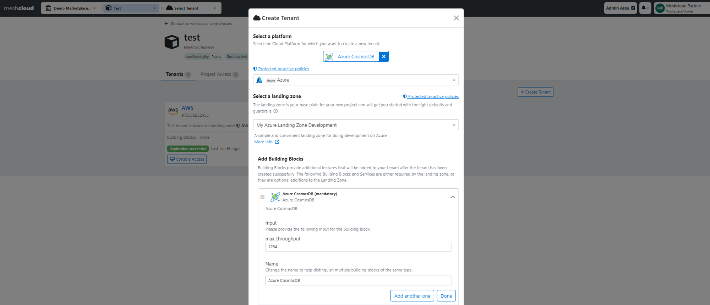