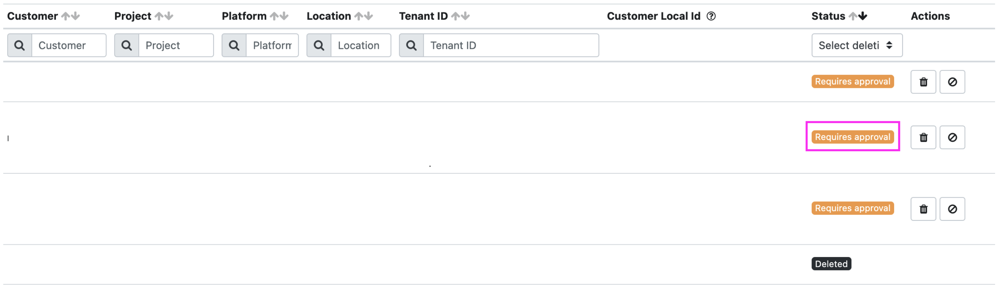
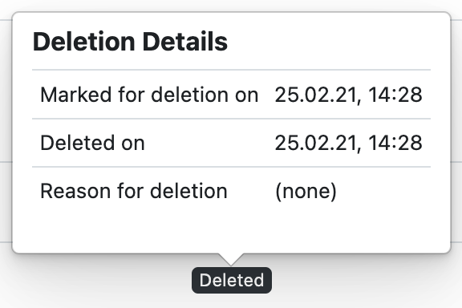

If you are not familiar with what a Partner User is, read more [here](administration.index.md).

## Pre-Requisites

- Permissions: Your user needs the appropriate privileged role in the Partner account to approve meshTenant deletions.
  Please check the [Partner Role overview](administration.index.md).
  Usually meshTenant deletions are approved by the Cloud Foundation Team or the Platform Team.

## Step to Step Guide

1. Login into the meshPanel and navigate to the Administration Area. Open the Admin Area by clicking on the `ADMIN AREA` button in the top navigation.

2. You now need to go to the Deleted Tenants view where you can see the overview of meshTenants pending for deletion.
   You find the Deleted Tenants view in the sidebar on the left under the "Platforms" section.
3. All the meshTenants that are awaiting deletion approval are at the top of the list with a "Requires Approval" status.
   Confirm the meshTenant deletion by clicking on the bin icon. A pop-up for the meshTenant deletion will show an
   overview of the meshTenant and the possibility to add a comment for the meshTenant deletion.
   Ticking the checkbox is required to confirm the deletion.

## Declining Deletion

You can also decline the meshTenant deletion request and bounce it back to the customer
e.g. if they forgot to clean up certain resources in the cloud tenant.

## Additional

If you want to know which tenants have been deleted in the past, you can see all already deleted tenants
in the same "Deleted Tenants" screen, including their deletion date & reason, when hovering over the "Deleted" label.

