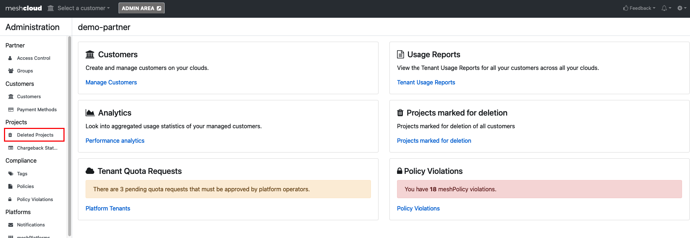
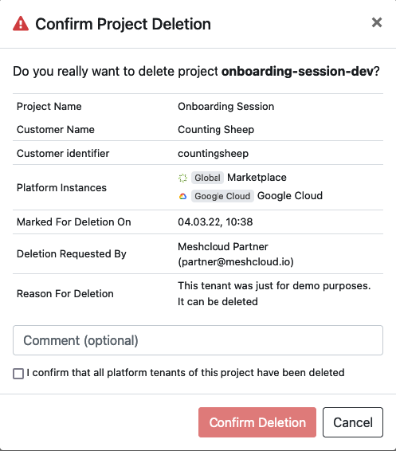
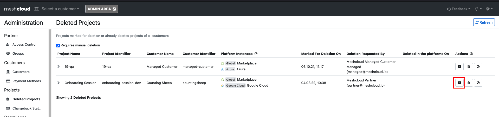
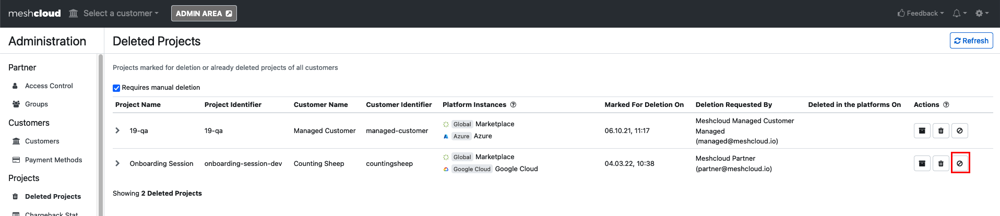
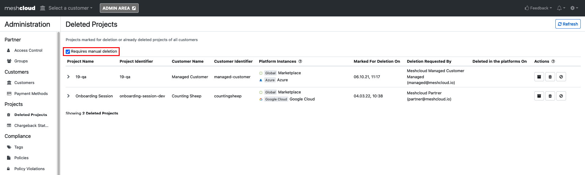

If you are not familiar with what a Partner User is, please check the [official meshcloud documentation](https://docs.meshcloud.io/docs/administration.index.html#docsNav).

## Pre-Requisites

- Permissions: Your user needs the appropriate privileged role in the Partner account to approve the meshProject deletion. Please check the [Partner Role overview](https://docs.meshcloud.io/docs/administration.index.html#docsNav). Usually meshProject deletions are approved by the Cloud Foundation Team or the Platform Team.

## Step to Step Guide

1. Login into the meshPanel and navigate to the Administration Area. You can access the Admin section but clicking on the "ADMIN AREA" button in the top navigation.

2. You now need to go to the Project Deleted Projects view where see the overview of meshProjects pending for deletion.

3. Confirm the meshProject deletion by clicking on the bin icon. A pop-up for the meshProject deletion will be show a overview of the meshProject and the possibility to add a comment for the meshProject deletion. The checkbox is required to be checked to confirm the deletion.

## Optional

You can also take other actions besides the meshProject deletion:

- Project Histroy: View the meshProject History which contains all relevant logged information for the project like user assignments and meshTenant assignment

- Decline Deletion: You can also decline the meshProject deletion request and bounce it back to the customer e.g. if they forgot to clean up certain ressources in the Cloud Account.

## Additional

You can also uncheck the "Required manual deletion" checkbox to see all already confirmed or automatically deleted meshProjects.

