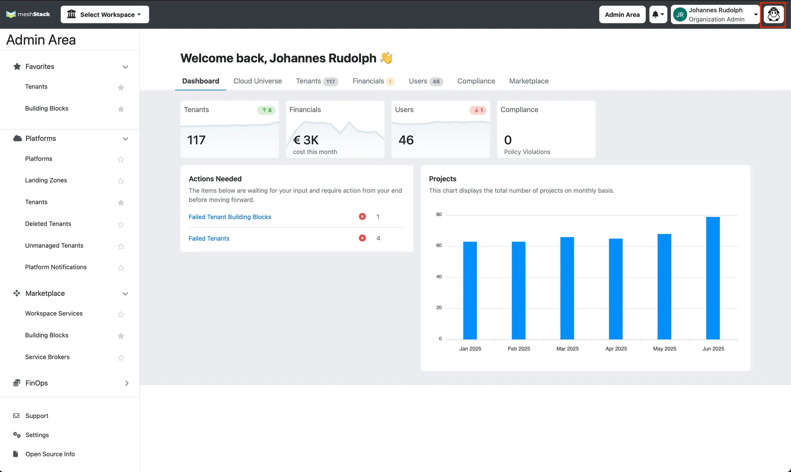
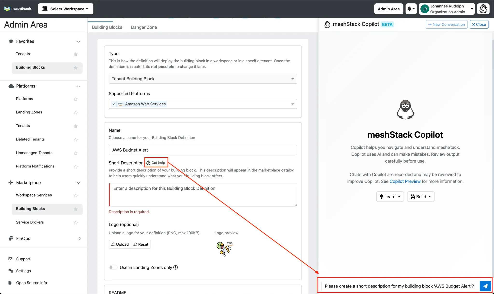

## How to Use meshStack Copilot

meshStack Copilot is your AI-powered assistant, ready to help you get the most
out of your platform. Whether you're an application developer looking for the
right tool or a platform engineer aiming to provide top-notch services, Copilot
is here to help.

Here are a few things you can do with meshStack Copilot:

- [Discover Platform Services](#discovering-platform-services)
- [Generate Service Documentation](#generating-service-documentation)
- [Improve Services with User Insights](#improving-services-with-user-insights)
- [Customize Copilot's Responses](#customizing-copilots-responses)

Copilot appears as a chat assistant in the meshPanel UI and is available on
every screen. You can find the Copilot sheep icon at the top right corner of
your screen. 

You can ask questions in natural language—just like you would with a colleague.
Copilot responds instantly with relevant information based on your meshStack
data.

Whenever there is the opportunity for Copilot to help you directly in context of
the task you are trying to fulfil click the “Get help” icon to have Copilot
suggest questions you could ask to speed up your work.



## Enabling meshStack Copilot

To enable meshStack Copilot, you need to be an Organization Admin.
In the Admin Area, navigate to **Settings** → **Copilot** to enable meshStack Copilot.

You can enable Copilot selectively for individual users or for the entire organization.

## Discovering Platform Services

As an application developer, you're always looking for the best services to
build your software. With meshStack Copilot, you can quickly find what you need.

Let's say you need an API key for a large language model, like Claude, to use
with your favorite coding agent in VS Code. You're not sure what your company's
policy is on this.

1. **Go to meshStack Copilot**: Open meshStack and click on the "Copilot" tab in
   the navigation menu. You'll find a chat interface ready for your questions.
2. **Ask your question**: Type in what you're looking for. For example: "How can
   I get a Claude API key for using with VS Code?"
3. **Get an answer**: meshStack Copilot will look through the platform's
   services and documentation to give you the best recommendation. It might
   suggest a service like "Agentic Coding Sandbox" and tell you why it's a good
   fit.

The Copilot can also guide you on how to request access, so you can get up and
running in no time.

## Generating Service Documentation

If you're on a platform team, you know how important good documentation is.
meshStack Copilot can help you create clear and consistent documentation for
your services.

When you're defining a building block for a new service, like an
`Agentic Coding Sandbox` that allows developers to get a Claude API key:

1. **Use the "Get help" button**: In the building block definition interface,
   click the "Get help" button. This will open meshStack Copilot.
2. **Generate comprehensive docs**: meshStack Copilot will ask a few questions
   from you to help generate a best-practices documentation including
   - Clear service descriptions
   - Step-by-step usage instructions
   - A detailed shared responsibility model
   - Troubleshooting guides and FAQs

This makes it easy for application teams to understand and use your services.
And the best part: it will also help meshStack Copilot understand your
platform's service offering better, which in turn means it can recommend
services more accurately to application teams.

## Improving Services with User Insights

To build a great platform, you need to understand what your users need. In
essence, this is product management for platforms. meshStack Copilot gives you
valuable insights into how developers are using the platform.

1. **Review Copilot conversations**: In the admin area, you can see the
   questions that users are asking.
2. **Identify patterns**: You might notice that many developers are asking about
   a specific tool, like "Aider," which isn't mentioned in your current
   documentation for the `Agentic Coding Sandbox`.
3. **Take action**: Based on this insight, you can:
   - Update your service documentation to include new keywords (like "Aider").
   - Expand your service description to mention support for more tools.
   - Create new quick-start guides for popular use cases.

By paying attention to what users are asking, you can make your platform
services even better and easier to discover.

## Customizing Copilot's Responses

To further customize meshStack Copilot, you can edit its system prompts. System
prompts define how Copilot responds to users and can be tailored to reflect your
organization's tone, policies, and terminology. meshStack includes default
prompts built from our extensive experience of working with platform teams in
enterprise organisations. These provide a good starting point, but even a little
tailoring will go a long way to make copilot feel much more "at home" with your
own platform.

To edit system prompts:

1. Navigate to the Copilot configuration section in the meshPanel admin area.
2. Locate the "System Prompts" settings.
3. Edit the prompt text to include your organization's guidelines, preferred
   terminology, and any specific instructions for Copilot's behavior.
4. Save your changes. Copilot will now use your customized prompt for all future
   interactions.

For guidance on writing effective prompts, see
[this guide to prompt engineering](https://docs.anthropic.com/claude/docs/prompt-engineering)
which covers generic best practices and examples for crafting clear, helpful
instructions for AI assistants.

A good first step is to teach Copilot about the name of your company's Internal
Developer Platform (IDP) that you're building with meshStack. For example, you
can add the general system prompt

```text
You are helping developers and platform engineers use Likvid Bank's Internal Developer Platform (IDP).
The team responsible for this IDP is the "Cloud Foundation Team", which is part of the Core IT Services department.
```

By providing documentation about your IDP, you can make sure Copilot gives
accurate guidance using terms your users are familiar with.
