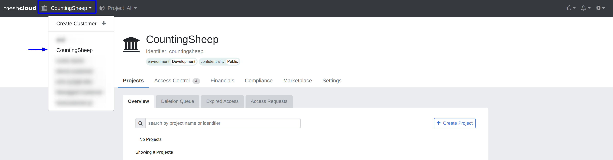
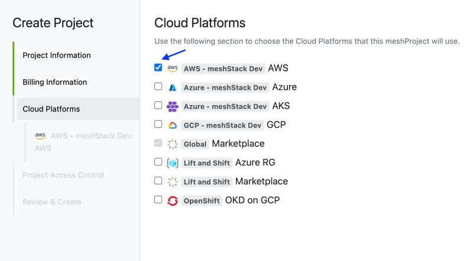
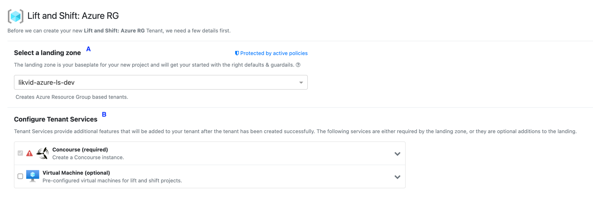

If you are not familiar with what a meshProject is, please check the [official meshcloud documentation](meshcloud.project.md).

## Prerequisites

- Permissions: Your user needs either the Workspace Manager or Workspace Owner role in the meshWorkspace for which you want to create the meshProject.
- Valid Payment Method: Your meshWorkspace has a payment method that is not expired.

## Step-by-Step Guide

> Check out the [video tutorial](https://www.youtube.com/watch?v=NYQa-WVtfDM) version of this guide.

 1. Make sure you are in the meshWorkspace the new meshProject will belong to. Do this by checking the drop-down in the upper-left corner.
    
 2. Start the meshProject creation by clicking the `Create Project` button, either in the navigation bar at the top (A) or
    in the workspace control plane under **Projects** > **Overview** (B).
    
    A project creation wizard will appear.
    
 3. First you have to give your project a name. The best practice is to use the name of the application, product,
    or project plus the environment type. The identifier is automatically generated but can be modified by you.
    We recommend to keep the identifier as it is.
    
 4. The lower part of the first page allows you to tag your meshProject. Some tags are required to be specified by you. You can recognize the required tags by the red line on the left side of the input field. Some of the tags you choose might have an impact on the landing zone you are allowed to choose. This happens if there is a policy that might restrict the usage. Click next
 5. Select the payment method provided via the meshWorkspace and click Next.
 6. Now we come to the most important part. Choose at least one of the platforms for your future meshProject.
    If you want to have for example an AWS account, pick AWS. Click next.
    
 7. We now have to configure any possible platform configuration. For public cloud platforms & Kubernetes-based platforms
    this means picking a landing zone (A).
    Additionally, for some landing zones there might be services included as part of the landing zone (B). These can be
    either required, meaning you have to book them, or they can be optional, which means you can consider booking the
    service, but you can also decide to skip it. If you would like to have multiple instances of a service, you can
    click on 'Add another one' and another instance of the service will be included.
    Once all values are filled in, a green box should appear at the bottom,
    and you will be able to continue to the next step by clicking Next.
    
 8. Now add any team members who should have access to the new meshProject and the corresponding cloud tenants.
    You can also add yourself by clicking the `Add myself` button. The access of your team members to the project can be
    changed at any point in the project control plane under **Project Access** > **Current Access**. Click Next to continue
    
 9. At last, a 'Review & Create' page will be shown. You can verify here whether your about-to-be-created project is
    looking as you want it to be. If everything looks good, hit 'Create Project' and your project will be created!
10. You will land on the project control plane of your new project. It might take a while to replicate the tenant(s) of
    your project. You can check the replication status of your tenant(s) in the project control plane.
    

### Congratulations, you are done
