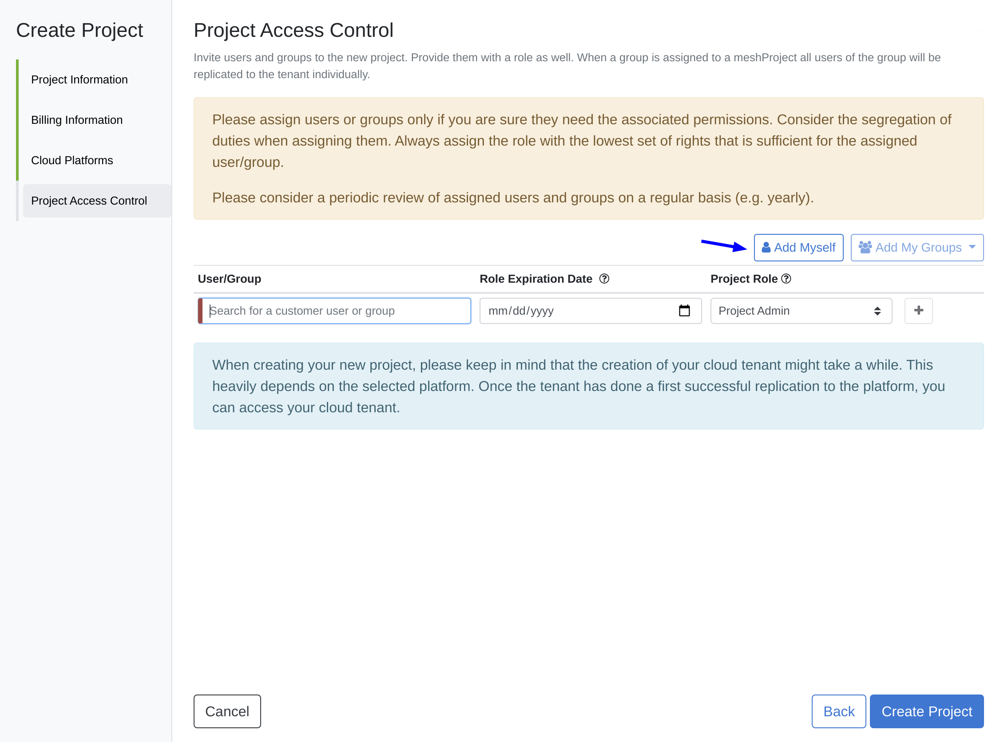

If you are not familiar with what a meshProject is, please check the [official meshcloud documentation](https://docs.meshcloud.io/docs/meshcloud.index.html).

## Pre-Requisites

- Permissions: Your user needs either the Customer Admin or Customer Owner role in the meshCustomer you want to create the meshProject in
- Valid Payment Method: meaning the payment method is not expired and assigned to your customer

## Step to Step Guide

 1. Make sure you are in the meshCustomer the new meshProject will belong to. Do this by checking the drop-down in the upper-left corner.

 2. Start the meshProject creation by clicking the `Create Project` button, either in the navigation bar at the top (A) or
 in the customer control plane under **Projects** > **Overview** (B).
 
A project creation wizard will appear.
.
 3. First you have to give your project a name. The best practice is to use the name of the application, product, or project plus the environment type. The identifier is automatically generated but can be modified by you. We recommend to keep the identifier as it is. 
 4. The lower part of the first page provides you the possibility to tag your meshProject. Some tags are required to be specified by you. You can recognize the required tags by the red line on the left side of the input field. Some of the tags you chose might have an impact on the landing zone you are allowed to chose if a policy exists that might restricts the usage. Click next
 5. Select the payment method provided via the meshCustomer. Click next
 6. Now we come to the most important part. Choose at least one of the platforms for your future meshProject. The marketplace with interesting services provided by your organization is selected by default. If you want to have for example an AWS account pick AWS and select a provided meshLZ as well. Click next  
 7. Now add any team members who should have access to the new meshProject and the corresponding cloud tenants. You can also add yourself by clicking the `Add myself` button. The access of your team members to the project can be changed at any point in the project control plane under **Access Control** > **Current Access** 
 8. Finally! The moment has come and you can create your project. Click the `Create Project` button to confirm your new project. After confirming the project creation, you will land on the project control plane of your new project. It will take a while to replicate the tenant(s) of your project. You can check the replication status of your tenant(s) in the project control plane.

### Congratulations, you are done
